# 学习笔记

## 三大核心理念

1. 多核执行：发掘程序的并行性，将可以并行的部分交给不同的处理器核执行
2. SIMD执行：通过向量化，让一个处理器核一条指令对一个向量执行相同的操作
3. 硬件多线程：在一个处理器核中维护多个上下文，当一个线程停顿时(如cache miss)，进行上下文切换执行其它线程，提高利用率

## 并行化程序的过程

### Decomposition

发掘程序的并行性，将问题分解为可并行计算的多个小部分

**Amdahl's law**：设 $S$为程序中可以并行执行的部分，运行在$p$个处理器上，那么有加速比$speedup \leq \frac{1}{(1-S)+\frac{S}{p}}$

由此可见，设计的程序的可并行性是加速的决定性因素

**ISPC** 基本语法

### Assignment

并行计算完成的时间，取决于最慢的那个线程

所以每个线程(或每个处理器核)执行的任务量越平均(即负载越平均)，理论上花费的时间就越短

可以将任务按照粒度依次分配给每个进程，粒度越小进程的负载越平均，但是进程间通信的开销也会变大

**Cilk** 语法

### Orchestration

通信是广义的，节点间存在通信，线程间存在通信，线程对内存的访问也是一种通信

共享地址空间系统(多线程共享内存)：所有线程对同一个地址空间进行读写，缓存一致性由硬件自动维护，通过锁和屏障完成同步

消息传递系统(分布式系统)：每个处理核或节点有独立的内存地址空间，需要通过显式发送和接受消息来通信

以下以消息传递系统为例，节点间的通信分为同步通信和异步通信

同步通信采用了阻塞发送/接收的方式达到同步，即一直阻塞直到消息发送/接收成功，编程简单，但是并发度低

异步通信采用非阻塞发送/接收，发送时将消息复制并暂存在缓冲区内，需要接收时再取走消息，高并发，但是编程复杂

**算数强度**：计算次数与通信次数的比例

按照通信的类型，可以分为**固有通信**和**人为通信**，前者由算法固有的性质决定，后者由机器工作方式决定

通过改进算法(如使用分块技术)可以减少固有通信

### mapping

并行任务被映射到对应的硬件上，可以由系统/程序员或者两者都有进行指定

## GPU与CUDA

GPU的作用：给定一个场景的数学描述，经过模拟生成这个场景的图片，例如对每个像素计算一些输入，然后在每个像素上独立运行来计算一些颜色

在NVIDIA推出`CUDA`之前，操纵GPU进行科学计算需要将数据包装成图形渲染问题，这是相等低效且复杂的

GPU由很多个小的计算核心组成，所以可以很好地处理逻辑简单的并行计算

`SM Processing Block`组成如下


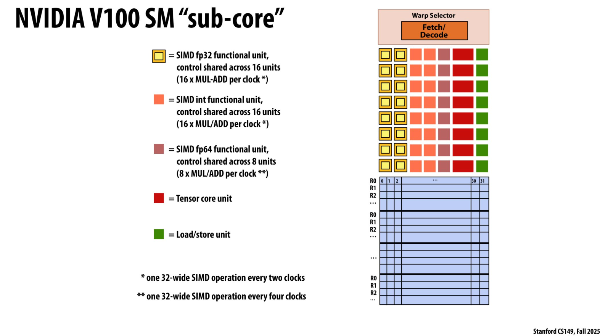


多个`SMP`组成了一个`Stream Multi-processor(SM)`，一个`SM`内的`SMP`共享内存


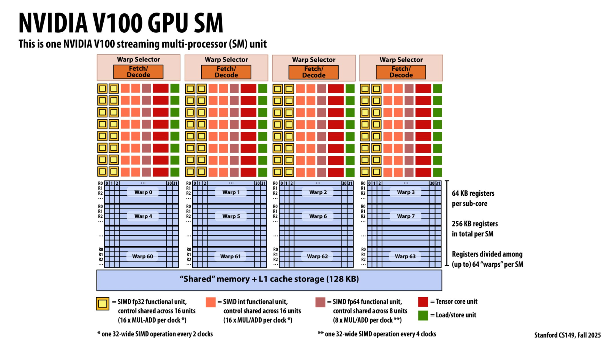


在CPU上，由编译器在软件层面实现SIMD；GPU上则是在硬件层面，每个SMP对于它的一个**wrap**(多个连续的PC相同的Cuda进程)执行隐式SIMD

**CUDA** 语法

## 序列数据并行

### map


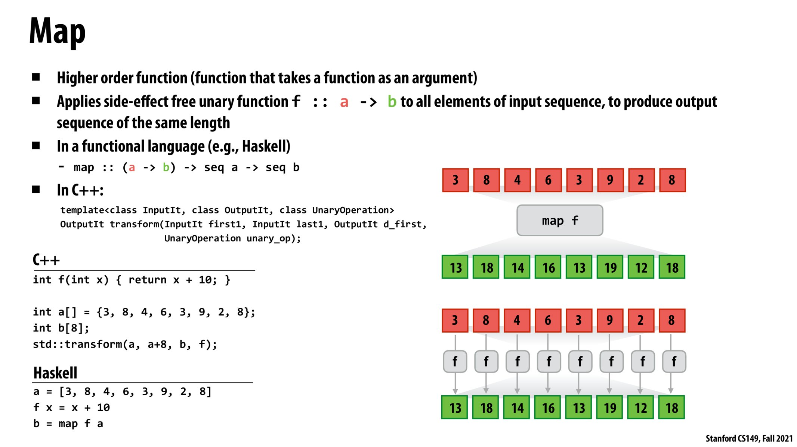


将某个函数作用于序列，得到一个等长的序列

可并行化的`map`：要求函数的结果相互之间没有依赖

### fold(reduce)


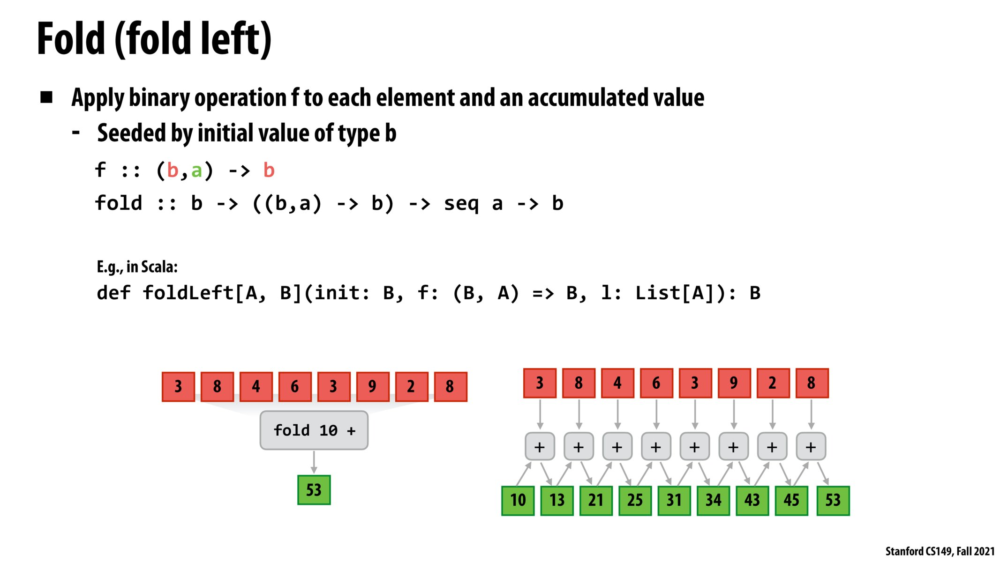


从左到右对序列进行二元操作，得到一个标量

可并行化的`fold`：运算与合并顺序无关，满足交换律

### scan

对序列每个进行前缀`fold`，得到的所有标量组合起来，形成一个序列


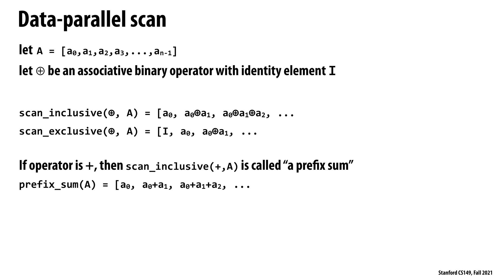


`inclusive scan`:对$[0,i]$做`scan`  `exclusive scan`:对$[0,i-1]$做`scan`

求前缀和就是一种`scan`，下面讨论前缀和的并行性，以下假设序列长度为`n`，处理器数为`p`

#### 分段并行前缀和


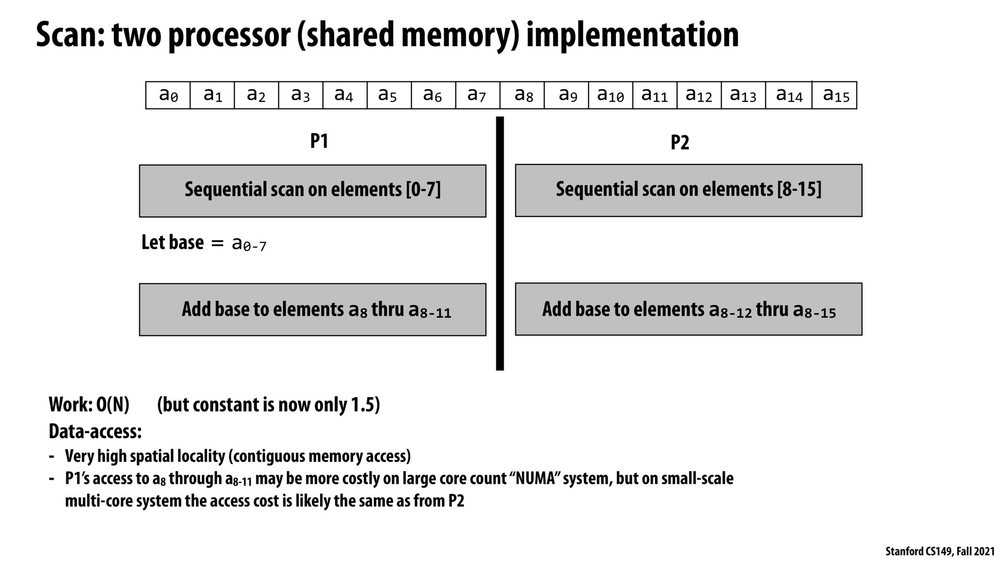


将原序列连续尽量均匀分为`p`块，每块串行计算内部前缀和，再串行地对于每一块，将该块最后一个前缀和并行地加到下一块的每个前缀和上

时间复杂度为$O(\frac{n}{p}+p)$，显然有$p = \sqrt{n}$的时候最优，复杂度为$O(\sqrt{n})$，但是访存连续，有较好的缓存友好性

实际上本质是分块算法

#### Blelloch 前缀和算法


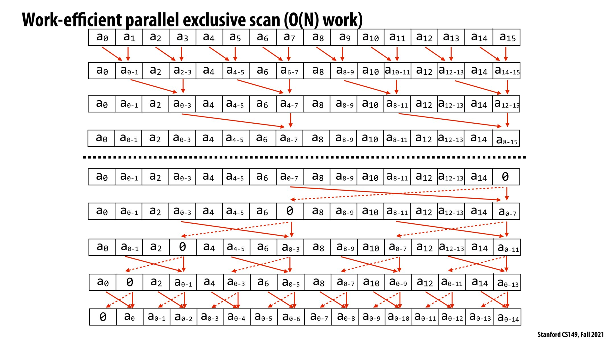


`Blelloch`算法要求序列大小是2的次幂，不满足则需要进行填充

该算法分为两部分，`Up-Sweep`向上扫描和`Down-Sweep`向下扫描

向上扫描部分类似于`fenwick tree`的建树(沟槽的数据结构还在追我)，对于`1-index`，`c[i]`保存$[i-lowbit(i)+1, i]$的和

向下扫描部分则是每层分成若干个2的幂次的子区间，这些子区间的最后一个数第一次被赋值为非0的数时，都保存着$[0,该子区间左端点)$的和，向下递归的时候进行传播

先假设处理器足够多，每一层都能$O(1)$处理，时间复杂度与递归层数同阶为$O(\log_2n)$

总工作量为$O((\frac{n}{2}+\frac{n}{4}+...+2)\times2)=O(n)$，解得处理器数量$P \leq \frac{O(n)}{O(\log_2n)}=O(\frac{n}{log_2n})$，即当处理器数量至少为$O(\frac{n}{log_2n})$时可以达到最优复杂度，但是访存不连续，对缓存不友好

### segmented scan

我们可以用`start-flag`法来表示一个序列的序列，具体来说，用第一个序列来按顺序存储所有序列的所有元素，用第二个布尔序列来表示第一个序列对应位置的元素是否是一个新序列的第一个元素


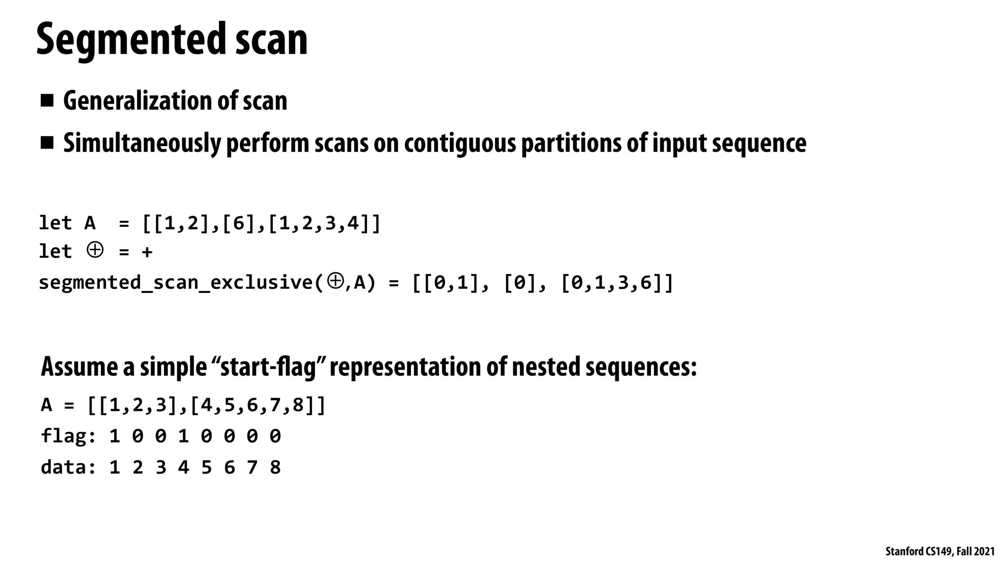


序列反而序列同样可以进行`scan`操作，在`Blelloch`算法中根据`flag`位决定是否进行传播即可


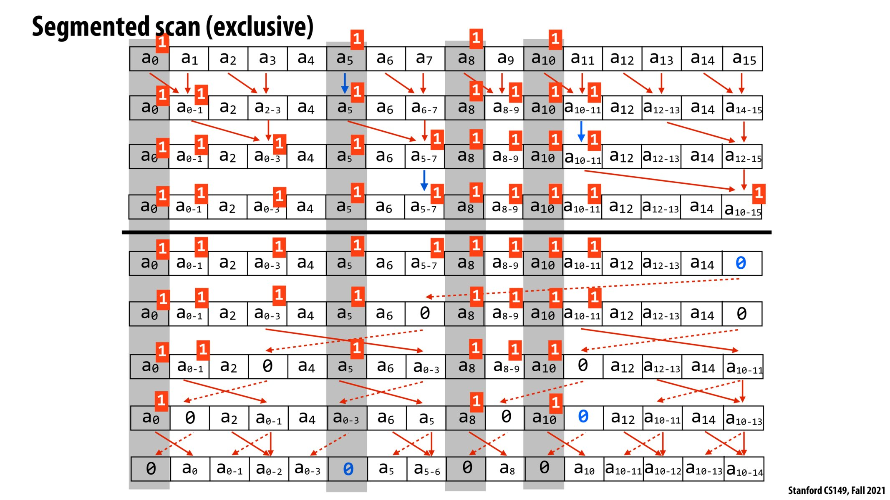


基于此，我们可以设计并行的稀疏矩阵乘法


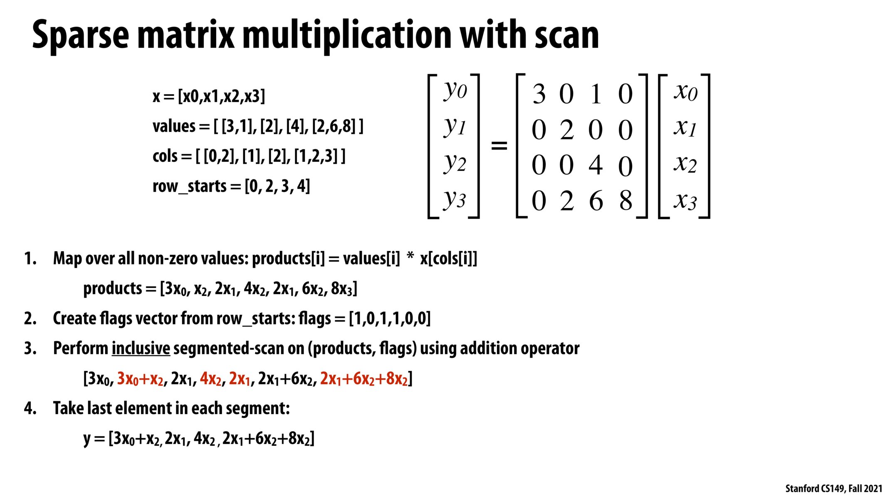


### gather/scatter

`gather`：`output[i]=input[index[i]]`

`scatter`：`output[index[i]]=input[i]`


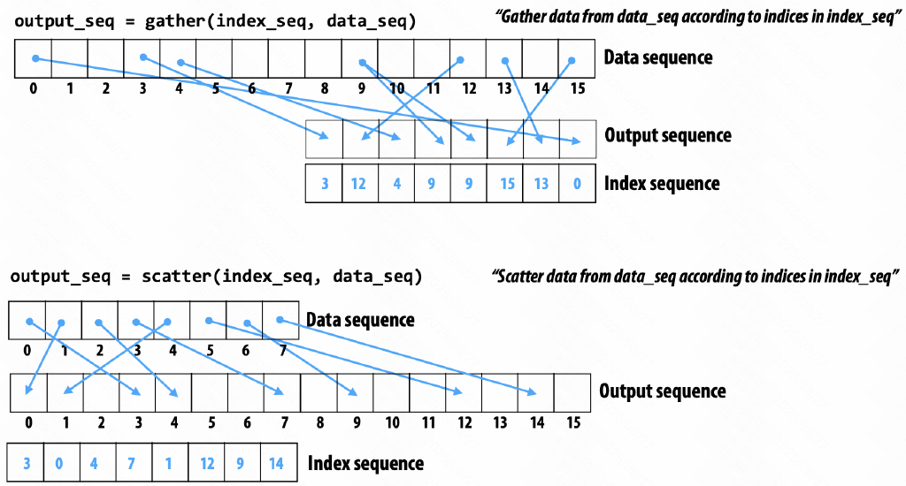


注意`scatter`可以通过`sort+map+gather`得到

### 其他序列操作


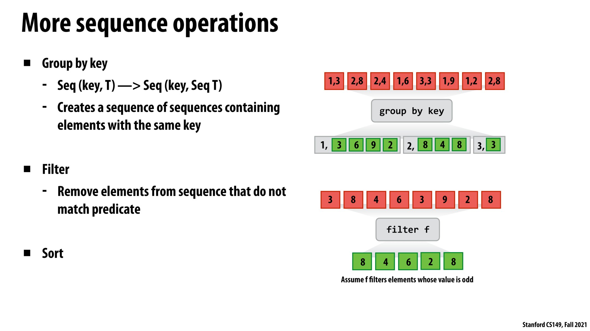


## 分布式系统与并行计算

现代分布式系统的结构如下，通信的瓶颈一般在于网络带宽


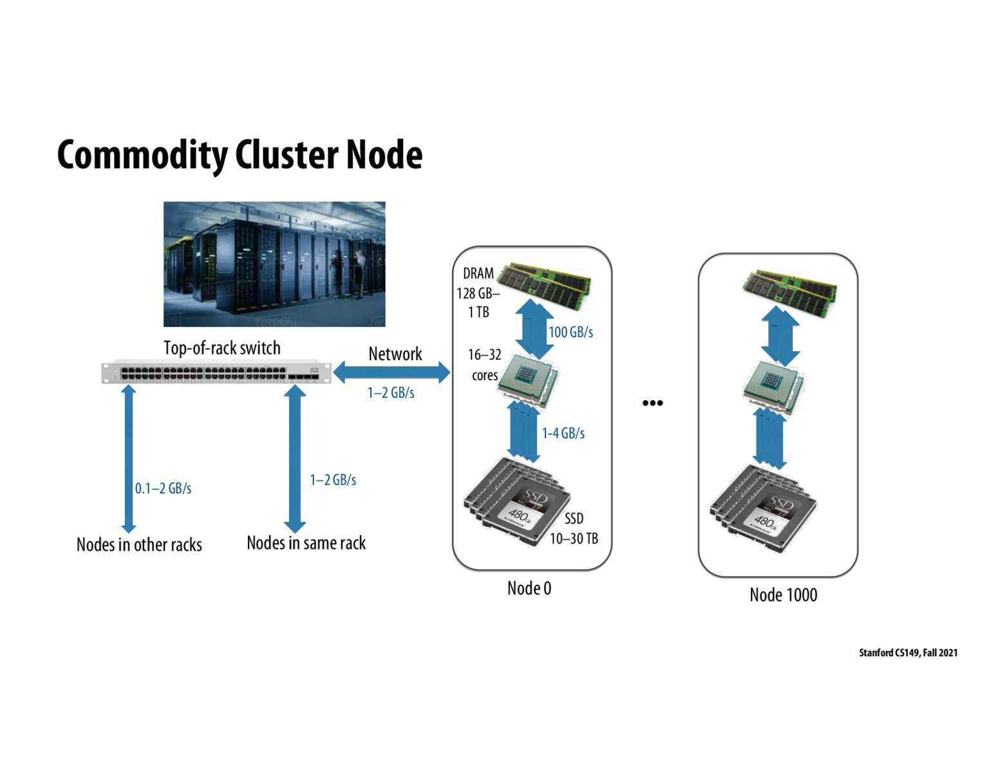


相同机架内的节点一般通信较快，而不同机架内的节点则比较缓慢

### 分布式文件系统 (DFS)

对于一份数据，将其按照一定大小(如64-256MB)分割成多个小块，每一块保存多个副本，放入不同的节点中

系统中有一个主节点保存了元数据(所有数据的索引)

在对文件进行查询时，通过主节点中的信息访问任意一个存储了该文件的节点即可

在对文件进行修改时，通过主节点中的信息修改所有存储了该文件的节点

好处在于多个副本可以被并行地查询提高效率，同时也降低了故障率(多个节点同时出错概率极小)

### MapReduce编程模型

考虑以下串行代码　

```cpp
int key[], value[], result[];

for (int i = 0; i < n; i++) {
    value[i] = map(key[i]);
}
for (int i = 0; i < n; i++) {
    result[key[i]] = reduce(result[key[i]], value[i]);
}
```

即对于所有`key`相同的元素，将其`map`操作映射的值进行`reduce`

在考虑如何在分布式系统上并行地实现该代码，以下以`wordcount`为例，此时`map`映射结果恒为1，`reduce`操作为加法

对于分布式的每个节点，尽量在本地进行`map`操作得到对应的`value`，如果负载极度不均匀则需要先调度。此后进行屏障同步

按照一种保证同样的`key`值会被分配到相同`reduce`节点的分配方式(如`key`哈希值取模)，将所有的`<key, value>`传送到对应的`reduce`节点上进行`reduce`操作，得到结果后再写回分布式系统

### spark

咕咕嘎嘎

## DNN的并行优化

等后面学深度学习再来看，咕咕嘎嘎

## 一致性

### 缓存一致性

为了保持高带宽，一级缓存和二级缓存都由处理器核私有

当多个线程并行执行的时候，如果按照串行执行的缓存管理方式，内存的数据副本存放在处理器私有缓存中，当一个处理器核写数据时，如果不更新该数据在其他缓存中的副本，就会导致相同数据值不同，也就是缓存不一致

我们的目的是达到缓存一致性，即对于内存中的每一个地址，其并行访问的结果与不同线程按照时间排序后的顺序访问的结果相同

一种实现方式是采用嗅探法，以下以`MSI`缓存一致性协议为例

处理器核之间由一条总线连接起来，每时每刻处理器核都在监听总线，也可以向总线广播信息使得每个处理器核都接收到信息

对于缓存中的每一行，其脏位都存储了信息，表示这一行处于以下三种状态中的哪一种：

`M`(modified)：内存中该行对应的数据未被更新，更新后的数据仅存在于这一行中

`S`(shared)：内存中该行对应的数据已经被更新，并且存在于包含这一行的多行中

`I`(invalid)：这一行的内容已经失效

下面这张图表明了`MSI`协议下行状态的转移

其中转移条件`A/B`表示嗅探到了与当前处理器核中一个缓存行相关的广播`A`，接下来会进行措施`B`，并将这个缓存行的状态改为箭头指向的状态


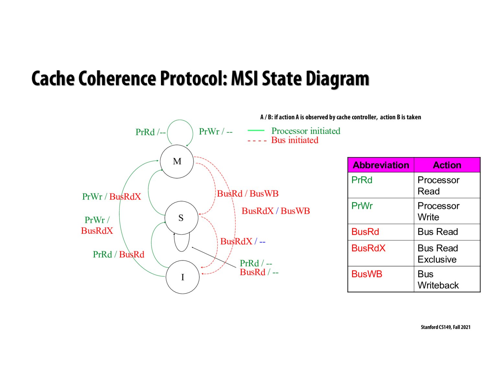


例如当处于`M`状态时，嗅探到发生了`BusRdX`总线读独占，说明是其他处理器核尝试更新该数据并独占，那么就将当前缓存行的数据写回内存，并转移到`I`状态，其他处理器核再根据内存的信息进行更新

**对外可见性的传播可能在不同核、不同 cache line 上表现出不同的生效时机**，所以当前的缓存状态不一定被及时更新，进而可能导致缓存信息不同

基于`MSI`协议，还有`MESI`，`MOESI`等协议通过加入更多状态，提高了性能

#### 伪共享

当我们创造了`num_thread`个`int`变量，每个线程访问其对应的变量，那么多个线程对不同变量的访问发生在同一缓存行内，导致一些缓存行被频繁地无效化，严重影响性能

解决方法是采用手动填充到缓存行大小，或者采用`alignas`内存强制对齐到缓存行大小

### 内存一致性

多线程系统中，不同核心观测到的顺序可能与期望的顺序不同，如编译器为了优化性能，执行指令的顺序可能会重排后乱序执行，导致多线程下因对内存访问顺序改变而出错

后面是真听不懂了

## 锁与原子变量

`死锁`：多个线程互相等待对方释放资源后才能执行，导致所有线程都无法继续执行

`活锁`：线程没有阻塞，但是重试运行一直失败，一直在运行但是没有进展

`饥饿`：一些线程取得了进展，但是其他线程因为资源被取得进程的线程占用而暂时无法取得进展

### 锁的实现

锁的本质是内存中一个用来记录当前线程是否应该继续进行的变量

考虑以下在硬件上被实现为原子操作的`test_and_set`指令

```cpp
int test_and_set(int *addr) {
    int x = *addr;
    *addr = 1;
    return x;
}
```

根据该指令，我们可以设计出$TAS$锁

```cpp
void Lock(int *lock) {
    while (test_and_set(lock));
}

void Unlock(int *lock) {
    *lock = 0;
}
```

在一个线程持有锁的时候，其它线程会反复地对锁尝试读写直到解锁，为保持缓存一致性，这带来了严重的效率问题

考虑以下改进`TTAS`锁

```cpp
void Lock(int *lock) {
	while (1) {
        while(*lock);
        if (test_and_set(lock) == 0) return;
	}   
}
```

这样，每次不持有锁的线程只会对锁进行读，减少了缓存不命中。直到解锁的时候，所有其它线程才会对锁进行一次读写尝试获得锁

注意以上两者这是非公平锁，即获得锁的顺序取决于操作系统的调度，可能导致线程饥饿

另一种思想被称为`ticket lock`，思想类似于生活中的拿号排队

```cpp
struct ticket_lock {
	int ticket;
    int serving;
};

void Lock(ticket_lock *l) {
	int t = atomic_increment(&l->ticket);
    while (l->serving < t);
}

void Unlock(ticket *l) {
    l->serving++;//注意同一时刻最多执行一次Unlock,无需使用原子操作
}
```

`ticket lock`被称为公平锁，它是`FIFO`的，避免了线程饥饿

### 原子操作

`cuda`内置了一系列的原子操作，以`atomicCAS`为例，其原子执行的逻辑如下

```cpp
void atomicCAS(int *addr, int compare, int val) {
    int old = *addr;
    *addr = (old == compare)? val : old;
    return old;
}
```

基于该函数，我们能实现许多原子操作，例如`atomicmin`

```cpp
void atomicmin(int *addr, int x) {
    int old, now;
    do {
		old = *addr, now = min(old, x);
    } while (atomicCAS(addr, old, now) != old);
}
```

C++的`atomic`类型在实现上，对于小类型采用原子操作，大类型采用锁实现

# assignments

环境：

OS:Windows11 wsl2 6.6.87.2-microsoft-standard-WSL2 Ubuntu 24.04.3 LTS

CPU: Intel Core i7 13620H 8 cores, 10 logic processors, AVX2

GPU:NVIDIA GeForce RTX 4060 Laptop

## [assignment1](/posts/cs149/assignment1/ "assignment1")

## [assignment2](/posts/cs149/assignment2/ "assignment2")

## [assignment3](/posts/cs149/assignment3/ "assignment3")