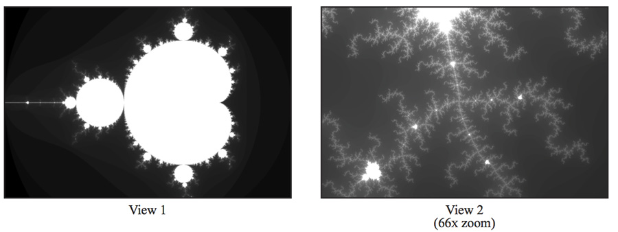
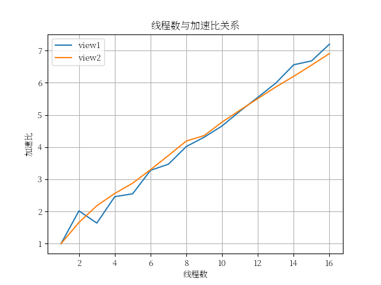
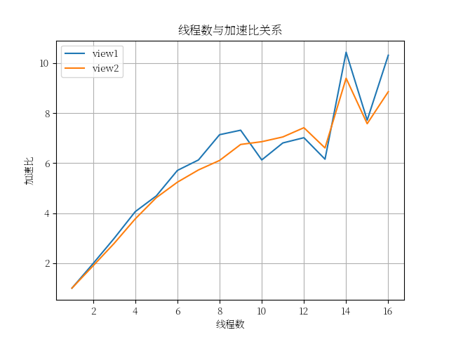
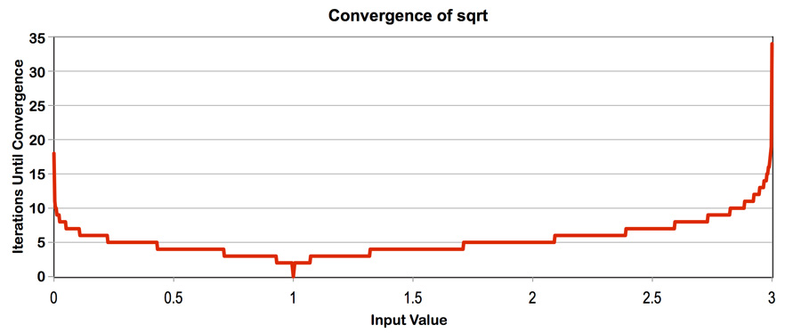

环境

OS:Windows11 wsl2 6.6.87.2-microsoft-standard-WSL2 Ubuntu 24.04.3 LTS

CPU: Intel Core i7 13620H 8 cores, 10 logic processors, AVX2  

GPU:NVIDIA GeForce RTX 4060 Laptop

## assignment1

https://github.com/stanford-cs149/asst1

### prog1_mandelbrot_threads

给定了计算并生成以下称为`mandelbrot_set`图像的代码，其中计算一个像素的时间与这个像素的亮度成正比

可以`sudo apt install feh`后，使用`feh <image-path> `查看生成的图像





给出的`mandelbrotSerial.cpp`实现了单线程的计算，我们需要在`mandelbrotThread.cpp`中修改`workerThreadStart`函数，使用`std::thread`加速这个过程

我们先采用朴素的分配方式，将空间从上到下分为线程数份，分别分配给每个线程执行

```cpp
void workerThreadStart(WorkerArgs * const args) {

    // TODO FOR CS149 STUDENTS: Implement the body of the worker
    // thread here. Each thread should make a call to mandelbrotSerial()
    // to compute a part of the output image.  For example, in a
    // program that uses two threads, thread 0 could compute the top
    // half of the image and thread 1 could compute the bottom half.

    printf("Hello world from thread %d\n", args->threadId);

    unsigned int num = args->height / args->numThreads;
    unsigned int st = args->threadId * num, ed = st + num;
    if (args->threadId == args->numThreads - 1) ed = args->height;

    mandelbrotSerial(args->x0, args->y0, args->x1, args->y1, args->width, args->height, st, ed - st, args->maxIterations, args->output);
}
```

`make`后使用`./mandelbort -t <线程数>`运行得到线程数与加速比的关系如下 第一次用matplotlib画图显示中文字符调了我半天:(





有意思的是，在`view1`中，使用3个线程加速比反而降低了，观察`view1`图像，中间部分计算量明显大于两边的计算量，因而负载不均匀导致加速比降低

一种有效的方式是讲整个图像划分为若干块，每个块内使用我们第一次的方式，因为相邻部分计算量差距较小，这就保证了负载尽量均匀，这被称为分块+线程内连续行分配的策略

```cpp
void workerThreadStart(WorkerArgs * const args) {

    // TODO FOR CS149 STUDENTS: Implement the body of the worker
    // thread here. Each thread should make a call to mandelbrotSerial()
    // to compute a part of the output image.  For example, in a
    // program that uses two threads, thread 0 could compute the top
    // half of the image and thread 1 could compute the bottom half.

    printf("Hello world from thread %d\n", args->threadId);

    static constexpr unsigned int BLOCKSIZE = 128;
    unsigned int blocks = args->height / BLOCKSIZE;
    for (unsigned int i = 0; i < blocks; i++) {
        unsigned int block_st = i * BLOCKSIZE, block_ed = block_st + BLOCKSIZE;
        if (i + 1 == blocks) block_ed = args->height;
        unsigned int block_len = block_ed - block_st, thread_len = block_len / args->numThreads;
        unsigned thread_st = block_st + args->threadId * thread_len, thread_ed = thread_st + thread_len;
        if (args->threadId + 1 == args->numThreads) thread_ed = block_ed;
        mandelbrotSerial(args->x0, args->y0, args->x1, args->y1, args->width, args->height, thread_st, thread_ed - thread_st, args->maxIterations, args->output);
    }
}
```

得到的结果如下：





对比发现生成两张图片的加速比都高于简单的空间划分，加速比的波动是由于块的大小这个参数造成的

### prog2_vecintrin

要求我们使用`intrinsics`向量化重写代码，但是为了简化，使用的是cs149提供的库函数(事实上库函数也是标量模拟向量化)

阅读`CS149intrin.cpp`源码，其中每个函数功能如下

`__cs149_mask _cs149_init_ones(int first=VECTOR_WIDTH)`：返回一个前`first`位为1，其余位为0的`mask`向量

`__cs149_mask _cs149_mask_not(__cs149_mask &maska)`：将`maska`向量取反

`__cs149_mask _cs149_mask_or(__cs149_mask &maska, __cs149_mask &maskb)`：返回两个向量`or`运算后的向量

`__cs149_mask _cs149_mask_and(__cs149_mask &maska, __cs149_mask &maskb)`： 返回两个向量`and`运算后的向量

`int _cs149_cntbits(__cs149_mask &maska)` ： 返回`maska`中1的个数

对于接下来传入的mask参数，当某一位为1时表示对该位进行写入，为0时表示不写入

`void _cs149_vset(__cs149_vec<T> &vecResult, T value, __cs149_mask &mask)`：将value尝试写入向量每一位

`void _cs149_vmove(__cs149_vec<T> &dest, __cs149_vec<T> &src, __cs149_mask &mask)`：将`src`每一位尝试按位写入`dest`中

`void _cs149_vload(__cs149_vec<T> &dest, T* src, __cs149_mask &mask)`：将`src`数组每个位置按位尝试写入`dest`中

`void _cs149_vstore(T* dest, __cs149_vec<T> &src, __cs149_mask &mask) `：将`src`每一位尝试写入数组`dest`中

`void _cs149_vadd(__cs149_vec<T> &vecResult, __cs149_vec<T> &veca, __cs149_vec<T> &vecb, __cs149_mask &mask)`：将`veca`和`vecb`每一位做加法之后尝试写入`vecResult`中，`vsub`，`vmult`，`vdiv`同理

`void _cs149_vabs(__cs149_vec<T> &vecResult, __cs149_vec<T> &veca, __cs149_mask &mask)`：将`veca`每一位取绝对值后，尝试写入`vecResult`中

`void _cs149_vgt(__cs149_mask &maskResult, __cs149_vec<T> &veca, __cs149_vec<T> &vecb, __cs149_mask &mask)`：将`veca`大于`vecb`按位比较得到的`bool`值尝试写入`maskResult`中，`vlt`，`veq`同理

`void _cs149_hadd(__cs149_vec<T> &vecResult, __cs149_vec<T> &vec)`：从0开始，计算相邻奇偶两项的和，直接写入`vecResult`的原位置中

`void _cs149_interleave(__cs149_vec<T> &vecResult, __cs149_vec<T> &vec)`：将`vec`中偶数索引放入`vecResult`前半部分，奇数索引放入后半部分

#### 补全absVector

提供的代码已经实现了`absVector`主体部分，但是没有处理`N % VECTOR_WIDTH != 0`的情况，需要我们补全对余数的处理

因为每次计算答案不会发生变化，一种比较简单的方法是对于最后`VECTOR_WIDTH`个元素再向量化处理一次

```cpp
// implementation of absSerial() above, but it is vectorized using CS149 intrinsics
void absVector(float* values, float* output, int N) {
  __cs149_vec_float x;
  __cs149_vec_float result;
  __cs149_vec_float zero = _cs149_vset_float(0.f);
  __cs149_mask maskAll, maskIsNegative, maskIsNotNegative;

//  Note: Take a careful look at this loop indexing.  This example
//  code is not guaranteed to work when (N % VECTOR_WIDTH) != 0.
//  Why is that the case?
  int i;
  for (i=0; i + VECTOR_WIDTH - 1 <N; i+=VECTOR_WIDTH) {

    // All ones
    maskAll = _cs149_init_ones();

    // All zeros
    maskIsNegative = _cs149_init_ones(0);

    // Load vector of values from contiguous memory addresses
    _cs149_vload_float(x, values+i, maskAll);               // x = values[i];

    // Set mask according to predicate
    _cs149_vlt_float(maskIsNegative, x, zero, maskAll);     // if (x < 0) {

    // Execute instruction using mask ("if" clause)
    _cs149_vsub_float(result, zero, x, maskIsNegative);      //   output[i] = -x;

    // Inverse maskIsNegative to generate "else" mask
    maskIsNotNegative = _cs149_mask_not(maskIsNegative);     // } else {

    // Execute instruction ("else" clause)
    _cs149_vload_float(result, values+i, maskIsNotNegative); //   output[i] = x; }

    // Write results back to memory
    _cs149_vstore_float(output+i, result, maskAll);
  }
  if (N % VECTOR_WIDTH == 0) return;
  i = N - VECTOR_WIDTH;
  maskAll = _cs149_init_ones();
  maskIsNegative = _cs149_init_ones(0);
  _cs149_vload_float(x, values + i, maskAll);
  _cs149_vlt_float(maskIsNegative, x, zero, maskAll);
  _cs149_vsub_float(result, zero, x, maskIsNegative);
  _cs149_mask_not(maskIsNegative);
  _cs149_vmove_float(result, x, maskIsNegative);
  _cs149_vstore_float(output, result, maskAll);
}
```

#### 实现clampedExpVector

要求你使用`intrinsics`实现朴素的$values[i]$的$exponents[i]$次方计算，当结果与`9.999999f`取$min$

直接实现即可

```cpp
void clampedExpVector(float* values, int* exponents, float* output, int N) {

  //
//   CS149 STUDENTS TODO: Implement your vectorized version of
  // clampedExpSerial() here.
  //
  // Your solution should work for any value of
  // N and VECTOR_WIDTH, not just when VECTOR_WIDTH divides N
  //
    __cs149_mask maskAll = _cs149_init_ones();
    __cs149_vec_int zero = _cs149_vset_int(0);
    __cs149_vec_int one = _cs149_vset_int(1);
    
    auto calc = [&] (int i) {
        __cs149_vec_int count;
        _cs149_vload_int(count, exponents + i, maskAll);
        __cs149_vec_float base;
        _cs149_vload_float(base, values + i, maskAll);
        __cs149_vec_float result = _cs149_vset_float(1.f);
        __cs149_mask Ispositive;
        _cs149_vgt_int(Ispositive, count, zero, maskAll);
        while (_cs149_cntbits(Ispositive) > 0) {    //while(count > 0)
            _cs149_vmult_float(result, result, base, Ispositive);   //if (count[i] > 0) result[i] *= values[i] 
            _cs149_vsub_int(count, count, one, maskAll);    //count--
            _cs149_vgt_int(Ispositive, count, zero, maskAll);
        }

        __cs149_vec_float bound = _cs149_vset_float(9.999999f);
        _cs149_vgt_float(Ispositive, result, bound, maskAll);   //if (result[i] > bound)
        _cs149_vmove_float(result, bound, Ispositive);  //result[i] = bound
        _cs149_vstore_float(output + i, result, maskAll); //output[i] = result[i] 
    };

    for (int i = 0; i + VECTOR_WIDTH - 1 < N; i += VECTOR_WIDTH) {
        calc(i);
    }
    if (N % VECTOR_WIDTH == 0) return;
    calc(N - VECTOR_WIDTH);
}
```

在工作集大小为10000时，测试结果如下

```
CLAMPED EXPONENT (required) 
Results matched with answer!
****************** Printing Vector Unit Statistics *******************
Vector Width:              4
Total Vector Instructions: 97070
Vector Utilization:        90.4%
Utilized Vector Lanes:     350981
Total Vector Lanes:        388280
************************ Result Verification *************************
Passed!!!
```


按照要求改动`VECTOR_WIDTH`参数，发现从2到16，向量利用率依次下降。当向量大小增大的时候，一个向量中出现分歧`divergence`的概率增加，导致部分向量空转，从而降低了平均向量利用率

#### arraySumVector(bonus)

要求实现数组求和的向量化版本，保证了数组长度一定是`VECTOR_WIDTH`的倍数，并且`VECTOR_WIDTH`为2的幂

$O(\frac{n}{VECTOR\_WIDTH}+VECTOR\_WIDTH)$的做法是`trivial`的，考虑$O(\frac{n}{VECTOR\_WIDTH}+ \log_2{VECTOR\_WIDTH})$的做法

在使用向量累加数组中的元素后，考虑怎么优化向量内部求和的过程，由于已经提供了`hadd`和`interleave`两个内置函数，考虑每次`hadd`之后再`interleave`，此后向量前半部分的和就是原向量的总和，这样我们只需要$O(log_2{VECTOR\_WIDTh})$次迭代即可

```cpp
// returns the sum of all elements in values
// You can assume N is a multiple of VECTOR_WIDTH
// You can assume VECTOR_WIDTH is a power of 2
float arraySumVector(float* values, int N) {
  
  //
  // CS149 STUDENTS TODO: Implement your vectorized version of arraySumSerial here
  //
    __cs149_vec_float acc = _cs149_vset_float(0.f);  
    __cs149_mask maskAll = _cs149_init_ones();

    for (int i=0; i<N; i+=VECTOR_WIDTH) {
        __cs149_vec_float vec_values;
        _cs149_vload_float(vec_values, values + i, maskAll);
        _cs149_vadd_float(acc, acc, vec_values, maskAll);
    }
    for (int i = 1; i < VECTOR_WIDTH; i <<=1) {
        _cs149_hadd_float(acc, acc);
        _cs149_interleave_float(acc, acc);
    }
    float *ptr = new float[VECTOR_WIDTH];
    _cs149_vstore_float(ptr, acc, maskAll);
    float result = ptr[0];
    delete ptr;
    return result;
}
```

### prog3_mandelbrot_ispc

首先需要安装`ispc`, `sudo snap install ispc`即可

`mandelbrot`的`ispc`代码已经给出，我们只需要`make`后运行即可，结果如下

```
[mandelbrot serial]:            [140.509] ms
Wrote image file mandelbrot-serial.ppm
[mandelbrot ispc]:              [39.913] ms
Wrote image file mandelbrot-ispc.ppm
                                (3.52x speedup from ISPC)
```

发现实际只加速了3.5倍左右，与理论的`AVX2`8倍加速相差较大，究其原因是`mandelbrot`计算中每个点的迭代次数不同，导致了`divergence`，拉低了有效利用率，同时对于内存的访问可能同样是性能的瓶颈

注意到此处，我们只使用了数据级并行，还可以使用多线程进行任务级并行，`ispc`提供了`launch`机制，是用户级线程池，相较`std::thread`开销更低，采取工作窃取方式进行调度，更为高效

虽然理论上当使用`launch`创建的任务数与逻辑处理器数相等的时候加速比最高，但是实际上更高的任务数尽管增加了线程通信的成本，却可能使得任务负载更加均衡，进而提高效率。本地测试在任务数为50左右最为高效

```cpp
[mandelbrot serial]:            [140.531] ms
Wrote image file mandelbrot-serial.ppm
[mandelbrot ispc]:              [40.018] ms
Wrote image file mandelbrot-ispc.ppm
[mandelbrot multicore ispc]:    [4.202] ms
Wrote image file mandelbrot-task-ispc.ppm
                                (3.51x speedup from ISPC)
                                (33.45x speedup from task ISPC)
```

### prog4_sqrt

已经完成了牛顿迭代法求解平方根倒数的`ispc`代码，其中需要求解的数据在$(0,3)$中，并且迭代次数与求解数据存在以下关系





#### 最好/最坏加速比的构造

你需要构造两组输入的数据，使得`ispc`加速比最大/最小

这是随机生成状态下的加速比

```
[sqrt serial]:          [633.462] ms
[sqrt ispc]:            [168.335] ms
[sqrt task ispc]:       [13.948] ms
                                (3.76x speedup from ISPC)
                                (45.42x speedup from task ISPC)
```

为了使得加速比最大化，我们既需要让指令级并行加速，既尽可能让`divergence`发生少，同时也需要加速任务级并行，即让每个任务负载尽量平均

一个很好的想法是输入值全部相同，这样不会发生`divergence`，同时任务的负载也是相当均匀的

注意到为了尽量提高加速比，在其他部分耗时不变的情况下，我们需要提高计算在总时间中的占比，取所有值都接近于3.0即可，此时运算最多，加速比也最大

```
[sqrt serial]:          [2752.093] ms
[sqrt ispc]:            [573.343] ms
[sqrt task ispc]:       [50.224] ms
                                (4.80x speedup from ISPC)
                                (54.80x speedup from task ISPC)
```

要构造最坏加速比，我们不难联想到课程中的提问，只需要让8位向量中出现`divergence`，其他7位很快计算完毕后。空转，1位执行非常多的计算即可，使得CPU达到最坏利用率

所以考虑每隔8个数，构造一个为计算次数最多的接近于3.0，其它都为无需计算的1.0

```cpp
[sqrt serial]:          [420.101] ms
[sqrt ispc]:            [547.059] ms
[sqrt task ispc]:       [49.483] ms
                                (0.77x speedup from ISPC)
                                (8.49x speedup from task ISPC
```

有意思的是，ISPC向量化之后反而比标量执行更慢了，这可能是因为向量化引入的额外指令开销（如掩码操作、数据打包等）而变得更慢

#### 手写intrinsics实现牛顿迭代法求平方根倒数(bonus)

完成以下ISPC代码的AVX2实现

```cpp
export void sqrt_ispc(uniform int N,
                      uniform float initialGuess,
                      uniform float values[],
                      uniform float output[])
{
    foreach (i = 0 ... N) {

        float x = values[i];
        float guess = initialGuess;

        float pred = abs(guess * guess * x - 1.f);

        while (pred > kThreshold) {
            guess = (3.f * guess - x * guess * guess * guess) * 0.5f;
            pred = abs(guess * guess * x - 1.f);
        }

        output[i] = x * guess;
        
    }
}
```

请输入文本

```cpp
static void AVX2_invsqrt(int n, float initialGuess, float values[], float outputs[]) {
    __m256 vec_one = _mm256_set1_ps(1.0f);
    __m256 vec_three = _mm256_set1_ps(3.0f);
    __m256 vec_half = _mm256_set1_ps(0.5f);
    __m256 vec_neg = _mm256_set1_ps(-0.0f);
    __m256 vec_threshold = _mm256_set1_ps(kThreshold);

    auto calc = [&](int i) {
        __m256 vec_x = _mm256_loadu_ps(values + i);
        __m256 vec_guess = _mm256_set1_ps(initialGuess);

        __m256 vec_pred = _mm256_mul_ps(vec_guess, vec_guess);
        vec_pred = _mm256_mul_ps(vec_pred, vec_x);
        vec_pred = _mm256_sub_ps(vec_pred, vec_one);
        vec_pred = _mm256_andnot_ps(vec_neg, vec_pred);
        
        __m256 mask = _mm256_cmp_ps(vec_pred, vec_threshold, _CMP_GT_OQ);
        while (_mm_popcnt_u32(_mm256_movemask_ps(mask))) {
            __m256 vec_sub, new_guess;
            new_guess = _mm256_mul_ps(vec_guess, vec_three);
            vec_sub = _mm256_mul_ps(vec_guess, vec_guess);
            vec_sub = _mm256_mul_ps(vec_sub, vec_guess);
            vec_sub = _mm256_mul_ps(vec_sub, vec_x);
            new_guess = _mm256_sub_ps(new_guess, vec_sub);
            new_guess = _mm256_mul_ps(new_guess, vec_half);
            vec_guess = _mm256_blendv_ps(vec_guess, new_guess, mask);

            __m256 new_pred;
            new_pred = _mm256_mul_ps(vec_guess, vec_guess);
            new_pred = _mm256_mul_ps(new_pred, vec_x);
            new_pred = _mm256_sub_ps(new_pred, vec_one);
            new_pred = _mm256_andnot_ps(vec_neg, new_pred);
            vec_pred = _mm256_blendv_ps(vec_pred, new_pred, mask);

            mask = _mm256_cmp_ps(vec_pred, vec_threshold, _CMP_GT_OQ);
        }
        
        _mm256_storeu_ps(outputs + i, _mm256_mul_ps(vec_guess, vec_x));
    };
    for (int i = 0; i + 7 < n; i += 8) calc(i);
    if (n % 8 == 0) return;
    calc(n - 8);
}
```

实际性能如下：

```cpp
[sqrt serial]:          [425.807] ms
[sqrt ispc]:            [541.254] ms
[sqrt AVX2]:            [520.926] ms
[sqrt task ispc]:       [53.460] ms
                                (0.79x speedup from ISPC)
                                (0.82x speedup from AVX2)
                                (7.96x speedup from task ISPC)
```

发现相较`ISPC`没有显著提升，~~所以没事别来写这一坨~~

### prog5_saxpy

给了我们使用`ISPC`加速`saxpy`计算`result=scale*X+Y`，其中`result,X,Y`为$2\times10^7$大小的向量，`scale`为标量

运行后结果如下：

```
[saxpy serial]:         [10.404] ms     [28.644] GB/s   [3.845] GFLOPS
[saxpy ispc]:           [8.441] ms      [35.306] GB/s   [4.739] GFLOPS
[saxpy task ispc]:      [4.405] ms      [67.656] GB/s   [9.081] GFLOPS
                                (1.92x speedup from use of tasks)
                                (1.23x speedup from ISPC)
                                (2.36x speedup from task ISPC)
```

我们发现加速效果相当差，远低于理论加速。不难发现，每两次运算(一次乘法和加法)需要访问内存四次(读取X,读取Y,对result读取所有权，写入result)共32字节，这与每访问字节进行10至20次运算的理想访存计算比相差极大，所以性能瓶颈在内存访问上，而不是计算上，无法通过并行计算达到近线性的加速

附加题：尝试有效地加速该程序 不会:(

### prog6_kmeans

`K-Means`算法实现了将一堆散乱的数据点分为`k`簇，所有数据点到其所属簇中心的距离平方和是一个局部最小值

给出你一段`K_Means`的正确但未优化的代码，要求自行找到性能热点并加速，要求至少达到2.1倍加速比

在`main.cpp`中去掉部分注释，本地生成数据，原始代码效率如下(运行时可能稍有波动)

```
Reading data.dat...
Running K-means with: M=1000000, N=100, K=3, epsilon=0.100000
[Total Time]: 6587.359 ms
```

在重复迭代直至收敛的过程中，执行了三个函数`computeAssignments`，`computeCentroids`，`computeCost`，使用课程提供的`CycleTimer::currentSeconds`发现耗时分别如下

```
Reading data.dat...
Running K-means with: M=1000000, N=100, K=3, epsilon=0.100000

computeAssignments: 4187.6ms
computeCentroids: 874.883ms
computeCost: 1277.58ms

assign_init: 28.4267ms assign_assign: 4158.83ms
centr_zero: 0.011599ms centr_sum: 874.803ms centr_compute: 0.003952ms
cost_zero: 0.008803ms cost_sum: 1277.49ms cost_update: 0.014024ms
[Total Time]: 6340.125 ms
```

发现性能瓶颈在`computeAssignments`中的分配部分，源代码如下

```cpp
  for (int k = args->start; k < args->end; k++) {
    for (int m = 0; m < args->M; m++) {
      double d = dist(&args->data[m * args->N],
                      &args->clusterCentroids[k * args->N], args->N);
      if (d < minDist[m]) {
        minDist[m] = d;
        args->clusterAssignments[m] = k;
      }
    }
  }
```

考虑对这部分进行优化，阅读发现是对于每一个点，求离k个簇中哪个簇距离最近并更新

我们发现这`k`次更新具有并行性，可以考虑使用`k`个线程

```cpp
std::mutex mtx;

void assign(double *minDist, WorkerArgs *const args, int k) {
    for (int m = 0; m < args->M; m++) {
      mtx.lock();
      double d = dist(&args->data[m * args->N],
                      &args->clusterCentroids[k * args->N], args->N);
      if (d < minDist[m]) {
        minDist[m] = d;
        args->clusterAssignments[m] = k;
      }
      mtx.unlock();
    }
}

double assign_init = 0, assign_assign = 0;
void computeAssignments(WorkerArgs *const args) {
  double *minDist = new double[args->M];
  
  // Initialize arrays
  double timer; Set_timer(timer);
  for (int m =0; m < args->M; m++) {
    minDist[m] = 1e30;
    args->clusterAssignments[m] = -1;
  }
  assign_init += Get_timer(timer);

  // Assign datapoints to closest centroids
  Set_timer(timer);
  static constexpr int SIZE = 3;
  std::thread workers[SIZE];
  for (int k = args->start + 1; k < args->end; k++) {
    workers[k] = std::thread(assign, minDist, args, k);
  }
  assign(minDist, args, args->start);
  for (int k = args->start + 1; k < args->end; k++) {
    workers[k].join();
  }
  assign_assign += Get_timer(timer);

  delete[] minDist;
}
```

注意会产生多个线程对于`minDist`和`args->clusterAssignments`的更新，需要上锁

效率如下：(我自己都要蚌埠住了)

```
Reading data.dat...
Running K-means with: M=1000000, N=100, K=3, epsilon=0.100000

computeAssignments: 10419.6ms
computeCentroids: 843.017ms
computeCost: 1184.35ms

assign_init: 25.4263ms assign_assign: 10393.9ms
centr_zero: 0.009089ms centr_sum: 842.949ms centr_compute: 0.004045ms
cost_zero: 0.007699ms cost_sum: 1184.28ms cost_update: 0.009066ms
[Total Time]: 12447.063 ms
```

效率严重下降，因为加锁的代价大于线程的收益

于是考虑将`m`个任务分配给多个线程进行并行计算，这样保证了同一个资源只会被一个线程访问

```cpp
void assign(double *minDist, WorkerArgs *const args, int l, int r) {
    for (int k = args->start; k < args->end; k++) {
        for (int m = l; m < r; m++) {
        double d = dist(&args->data[m * args->N],
                        &args->clusterCentroids[k * args->N], args->N);
        if (d < minDist[m]) {
            minDist[m] = d;
            args->clusterAssignments[m] = k;
        }
        }         
    }
}

double assign_init = 0, assign_assign = 0;
void computeAssignments(WorkerArgs *const args) {
  double *minDist = new double[args->M];
  
  // Initialize arrays
  double timer; Set_timer(timer);
  for (int m =0; m < args->M; m++) {
    minDist[m] = 1e30;
    args->clusterAssignments[m] = -1;
  }
  assign_init += Get_timer(timer);

  // Assign datapoints to closest centroids
  Set_timer(timer);
  static constexpr int THREADS = 32;
  std::thread workers[THREADS];
  int len = args->M / THREADS;
  for (int i = 1; i < THREADS; i++) {
      int l = i * len, r = l + len;
      if (i == THREADS - 1) r = args->M;
      workers[i] = std::thread(assign, minDist, args, l, r);
  }
  int l = 0, r = len; 
  assign(minDist, args, l, r);
  for (int i = 1; i < THREADS; i++) workers[i].join();
  assign_assign += Get_timer(timer);

  delete[] minDist;
}
```

结果如下，刚好达到了要求的加速比，代码的其他部分也可以类似地并行化来提高效率，但是题目只要求了并行化一处

```
Reading data.dat...
Running K-means with: M=1000000, N=100, K=3, epsilon=0.100000

computeAssignments: 1067.84ms
computeCentroids: 872.724ms
computeCost: 1160.83ms

assign_init: 25.0641ms assign_assign: 1042.34ms
centr_zero: 0.009931ms centr_sum: 872.655ms centr_compute: 0.004261ms
cost_zero: 0.008192ms cost_sum: 1160.75ms cost_update: 0.012866ms
[Total Time]: 3101.462 ms
```
