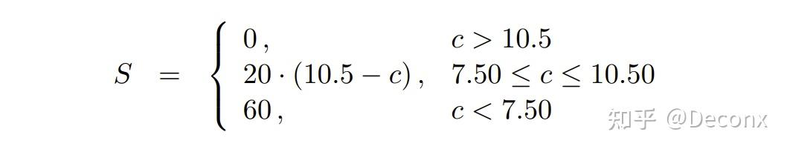

## Archlab

### Part A Y86-64程序

规则：给定你一段C语言代码，需要使用$Y86-64$汇编代码写出与其函数上等价的代码

由于$Y86-64$功能有限，你需要将测试的输入也写在代码中

目录下使用 `./yas test.ys` 编译 `./yis test.yo`得到运行的结果

要求对于一个链表进行元素求和，其中C代码如下

```c++
/* $begin examples */
/* linked list element */
typedef struct ELE {
    long val;
    struct ELE *next;
} *list_ptr;

/* sum_list - Sum the elements of a linked list */
long sum_list(list_ptr ls)
{
    long val = 0;
    while (ls) {
	val += ls->val;
	ls = ls->next;
    }
    return val;
}

/* rsum_list - Recursive version of sum_list */
long rsum_list(list_ptr ls)
{
    if (!ls)
	return 0;
    else {
	long val = ls->val;
	long rest = rsum_list(ls->next);
	return val + rest;
    }
}
```


比较简单，直接实现即可

```asm
##################################################################
#initialization

.pos 0
irmovq stack, %rsp
call main
halt


#sample linked list

.align 8
ele1:
    .quad 0x00a
    .quad ele2
ele2:
    .quad 0x0b0
    .quad ele3
ele3:
    .quad 0xc00
    .quad 0

#main function

main:
    irmovq ele1, %rdi
    call sum_list
    ret

#sum_list function

sum_list:
    irmovq $0, %rax
    jmp test

loop:
    mrmovq (%rdi), %rsi
    addq %rsi, %rax
    mrmovq 8(%rdi), %rdi

test:
    andq %rdi, %rdi
    jne loop
    ret

#set initial adress of %rsp

    .pos 0x200
stack:

```

最后需要多打一个换行才能过编译，我也不知道为什么（

```asm
##################################################################
#initialization

.pos 0
irmovq stack, %rsp
call main
halt


#sample linked list

.align 8
ele1:
    .quad 0x00a
    .quad ele2
ele2:
    .quad 0x0b0
    .quad ele3
ele3:
    .quad 0xc00
    .quad 0

#main function
main:
    irmovq ele1, %rdi
    irmovq $0, %rax
    call rsum_list
    ret

#recursively calculate the sum of a list

rsum_list:
    pushq %rbp
    andq %rdi, %rdi
    je return
    mrmovq (%rdi), %rbp
    addq %rbp, %rax
    mrmovq 8(%rdi), %rdi
    call rsum_list
return:
    popq %rbp
    ret

#set initial adress of %rsp

    .pos 0x200
stack:

```

注意递归结束的时候，需要恢复被调用者保存寄存器的原始值

```c
/* copy_block - Copy src to dest and return xor checksum of src */
long copy_block(long *src, long *dest, long len)
{
    long result = 0;
    while (len > 0) {
	long val = *src++;
	*dest++ = val;
	result ^= val;
	len--;
    }
    return result;
}
/* $end examples */
```

```asm
##################################################################
#initialization

.pos 0
irmovq stack, %rsp
call main
halt

#sample

.align 8
# Source block
src:
    .quad 0x00a
    .quad 0x0b0
    .quad 0xc00
# Destination block
dest:
    .quad 0x111
    .quad 0x222
    .quad 0x333

#main function

main:
    irmovq src, %rdi
    irmovq dest, %rsi
    irmovq $3, %rdx
    irmovq $0, %rax
    irmovq $8, %rcx
    irmovq $1, %r8
    call copy_block
    ret

#copy function

copy_block:
    pushq %rbx
test:
    andq %rdx, %rdx
    je return
loop:
    mrmovq (%rdi), %rbx
    xorq %rbx, %rax
    rmmovq %rbx, (%rsi)
    addq %rcx, %rdi
    addq %rcx, %rsi
    subq %r8, %rdx
    jmp test
return:
    popq %rbx
    ret

    .pos 0x200
stack:

```

### Part B `iaddq`的实现

给定你SEQ的实现，要求你补充`iaddq`指令(即将寄存器加上一个立即数)的实现

按照SEQ的步骤，一步一步判断每个相关信号的值就行

shell中使用以下指令进行测试

```
make  VERSION=full
./ssim -t ../y86-code/asumi.yo
cd ../y86-code; make testssim
```


```
#/* $begin seq-all-hcl */
####################################################################
#  HCL Description of Control for Single Cycle Y86-64 Processor SEQ   #
#  Copyright (C) Randal E. Bryant, David R. O'Hallaron, 2010       #
####################################################################

## Your task is to implement the iaddq instruction
## The file contains a declaration of the icodes
## for iaddq (IIADDQ)
## Your job is to add the rest of the logic to make it work

####################################################################
#    C Include's.  Don't alter these                               #
####################################################################

quote '#include <stdio.h>'
quote '#include "isa.h"'
quote '#include "sim.h"'
quote 'int sim_main(int argc, char *argv[]);'
quote 'word_t gen_pc(){return 0;}'
quote 'int main(int argc, char *argv[])'
quote '  {plusmode=0;return sim_main(argc,argv);}'

####################################################################
#    Declarations.  Do not change/remove/delete any of these       #
####################################################################

##### Symbolic representation of Y86-64 Instruction Codes #############
wordsig INOP 	'I_NOP'
wordsig IHALT	'I_HALT'
wordsig IRRMOVQ	'I_RRMOVQ'
wordsig IIRMOVQ	'I_IRMOVQ'
wordsig IRMMOVQ	'I_RMMOVQ'
wordsig IMRMOVQ	'I_MRMOVQ'
wordsig IOPQ	'I_ALU'
wordsig IJXX	'I_JMP'
wordsig ICALL	'I_CALL'
wordsig IRET	'I_RET'
wordsig IPUSHQ	'I_PUSHQ'
wordsig IPOPQ	'I_POPQ'
# Instruction code for iaddq instruction
wordsig IIADDQ	'I_IADDQ'

##### Symbolic represenations of Y86-64 function codes                  #####
wordsig FNONE    'F_NONE'        # Default function code

##### Symbolic representation of Y86-64 Registers referenced explicitly #####
wordsig RRSP     'REG_RSP'    	# Stack Pointer
wordsig RNONE    'REG_NONE'   	# Special value indicating "no register"

##### ALU Functions referenced explicitly                            #####
wordsig ALUADD	'A_ADD'		# ALU should add its arguments

##### Possible instruction status values                             #####
wordsig SAOK	'STAT_AOK'	# Normal execution
wordsig SADR	'STAT_ADR'	# Invalid memory address
wordsig SINS	'STAT_INS'	# Invalid instruction
wordsig SHLT	'STAT_HLT'	# Halt instruction encountered

##### Signals that can be referenced by control logic ####################

##### Fetch stage inputs		#####
wordsig pc 'pc'				# Program counter
##### Fetch stage computations		#####
wordsig imem_icode 'imem_icode'		# icode field from instruction memory
wordsig imem_ifun  'imem_ifun' 		# ifun field from instruction memory
wordsig icode	  'icode'		# Instruction control code
wordsig ifun	  'ifun'		# Instruction function
wordsig rA	  'ra'			# rA field from instruction
wordsig rB	  'rb'			# rB field from instruction
wordsig valC	  'valc'		# Constant from instruction
wordsig valP	  'valp'		# Address of following instruction
boolsig imem_error 'imem_error'		# Error signal from instruction memory
boolsig instr_valid 'instr_valid'	# Is fetched instruction valid?

##### Decode stage computations		#####
wordsig valA	'vala'			# Value from register A port
wordsig valB	'valb'			# Value from register B port

##### Execute stage computations	#####
wordsig valE	'vale'			# Value computed by ALU
boolsig Cnd	'cond'			# Branch test

##### Memory stage computations		#####
wordsig valM	'valm'			# Value read from memory
boolsig dmem_error 'dmem_error'		# Error signal from data memory


####################################################################
#    Control Signal Definitions.                                   #
####################################################################

################ Fetch Stage     ###################################

# Determine instruction code
word icode = [
	imem_error: INOP;
	1: imem_icode;		# Default: get from instruction memory
];

# Determine instruction function
word ifun = [
	imem_error: FNONE;
	1: imem_ifun;		# Default: get from instruction memory
];

bool instr_valid = icode in 
	{ INOP, IHALT, IRRMOVQ, IIRMOVQ, IRMMOVQ, IMRMOVQ,
	       IOPQ, IJXX, ICALL, IRET, IPUSHQ, IPOPQ, IIADDQ};

# Does fetched instruction require a regid byte?
bool need_regids =
	icode in { IRRMOVQ, IOPQ, IPUSHQ, IPOPQ, 
		     IIRMOVQ, IRMMOVQ, IMRMOVQ , IIADDQ};

# Does fetched instruction require a constant word?
bool need_valC =
	icode in { IIRMOVQ, IRMMOVQ, IMRMOVQ, IJXX, ICALL , IIADDQ};

################ Decode Stage    ###################################

## What register should be used as the A source?
word srcA = [
	icode in { IRRMOVQ, IRMMOVQ, IOPQ, IPUSHQ  } : rA;
	icode in { IPOPQ, IRET } : RRSP;
	1 : RNONE; # Don't need register
];

## What register should be used as the B source?
word srcB = [
	icode in { IOPQ, IRMMOVQ, IMRMOVQ, IIADDQ  } : rB;
	icode in { IPUSHQ, IPOPQ, ICALL, IRET } : RRSP;
	1 : RNONE;  # Don't need register
];

## What register should be used as the E destination?
word dstE = [
	icode in { IRRMOVQ } && Cnd : rB;
	icode in { IIRMOVQ, IOPQ, IIADDQ} : rB;
	icode in { IPUSHQ, IPOPQ, ICALL, IRET } : RRSP;
	1 : RNONE;  # Don't write any register
];

## What register should be used as the M destination?
word dstM = [
	icode in { IMRMOVQ, IPOPQ } : rA;
	1 : RNONE;  # Don't write any register
];

################ Execute Stage   ###################################

## Select input A to ALU
word aluA = [
	icode in { IRRMOVQ, IOPQ } : valA;
	icode in { IIRMOVQ, IRMMOVQ, IMRMOVQ , IIADDQ} : valC;
	icode in { ICALL, IPUSHQ } : -8;
	icode in { IRET, IPOPQ } : 8;
	# Other instructions don't need ALU
];

## Select input B to ALU
word aluB = [
	icode in { IRMMOVQ, IMRMOVQ, IOPQ, ICALL, 
		      IPUSHQ, IRET, IPOPQ , IIADDQ} : valB;
	icode in { IRRMOVQ, IIRMOVQ } : 0;
	# Other instructions don't need ALU
];

## Set the ALU function
word alufun = [
	icode == IOPQ : ifun;
	1 : ALUADD;
];

## Should the condition codes be updated?
bool set_cc = icode in { IOPQ , IIADDQ};

################ Memory Stage    ###################################

## Set read control signal
bool mem_read = icode in { IMRMOVQ, IPOPQ, IRET };

## Set write control signal
bool mem_write = icode in { IRMMOVQ, IPUSHQ, ICALL };

## Select memory address
word mem_addr = [
	icode in { IRMMOVQ, IPUSHQ, ICALL, IMRMOVQ } : valE;
	icode in { IPOPQ, IRET } : valA;
	# Other instructions don't need address
];

## Select memory input data
word mem_data = [
	# Value from register
	icode in { IRMMOVQ, IPUSHQ } : valA;
	# Return PC
	icode == ICALL : valP;
	# Default: Don't write anything
];

## Determine instruction status
word Stat = [
	imem_error || dmem_error : SADR;
	!instr_valid: SINS;
	icode == IHALT : SHLT;
	1 : SAOK;
];

################ Program Counter Update ############################

## What address should instruction be fetched at

word new_pc = [
	# Call.  Use instruction constant
	icode == ICALL : valC;
	# Taken branch.  Use instruction constant
	icode == IJXX && Cnd : valC;
	# Completion of RET instruction.  Use value from stack
	icode == IRET : valM;
	# Default: Use incremented PC
	1 : valP;
];
#/* $end seq-all-hcl */

```

### Part C Y86-64程序性能优化

#### 写在前面

这个lab给定了你流水线化的控制代码以及一段代码的C和Y86-64实现，要求你优化流水线的控制代码和汇编代码，提高其运行效率

```
make  VERSION=full
cd ../ptest; make SIM=../pipe/psim
cd ../ptest; make SIM=../pipe/psim TFLAGS=-i
```

可以对修改后的处理器进行测试

`../misc/yas ncopy.ys && ./check-len.pl < ncopy.yo` 检查汇编代码是否超过1000Byte的限制

`./correctness.pl`检查汇编代码的正确性

`make drivers && ./benchmark.pl`进行本地跑分，计算CPE

得分细则如下





C代码如下，函数的功能是将src开始的len个元素全部拷贝到dst对应地址中，并返回源数据中正数个数

```c
/* $begin ncopy */
/*
 * ncopy - copy src to dst, returning number of positive ints
 * contained in src array.
 */
word_t ncopy(word_t *src, word_t *dst, word_t len)
{
    word_t count = 0;
    word_t val;

    while (len > 0) {
	val = *src++;
	*dst++ = val;
	if (val > 0)
	    count++;
	len--;
    }
    return count;
}
/* $end ncopy */
```

Y86-64汇编原始代码

```asm
##################################################################
# %rdi = src, %rsi = dst, %rdx = len
# You can modify this portion
	# Loop header
	xorq %rax,%rax		# count = 0;
	andq %rdx,%rdx		# len <= 0?
	jle Done		# if so, goto Done:

Loop:	
    mrmovq (%rdi), %r10	# read val from src...
	rmmovq %r10, (%rsi)	# ...and store it to dst
	andq %r10, %r10		# val <= 0?
	jle Npos		# if so, goto Npos:
	irmovq $1, %r10
	addq %r10, %rax		# count++
Npos:	
	irmovq $1, %r10
	subq %r10, %rdx		# len--
	irmovq $8, %r10
	addq %r10, %rdi		# src++
	addq %r10, %rsi		# dst++
	andq %rdx,%rdx		# len > 0?
	jg Loop			# if so, goto Loop:
```

跑分结果如下：

`Average CPE     15.18
Score   0.0/60.0`

你都交原始代码了还想得分？(

#### 使用iaddq指令

我们用Part B中相同的步骤，修改 `pipe-full.hcl`引入`iaddq`指令，减少向寄存器反复写入常数的开销

```asm
##################################################################
# You can modify this portion
	# Loop header
	xorq %rax,%rax		# count = 0;
	andq %rdx,%rdx		# len <= 0?
	jle Done		# if so, goto Done:

Loop:	
    mrmovq (%rdi), %r10	# read val from src...
	rmmovq %r10, (%rsi)	# ...and store it to dst
	andq %r10, %r10		# val <= 0?
	jle Npos		# if so, goto Npos:	
    iaddq $1, %rax      # count++
Npos:
    iaddq $-1, %rdx     # len--
	irmovq $8, %r10
	iaddq $8, %rdi		# src++
	iaddq $8, %rsi		# dst++
	andq %rdx,%rdx		# len > 0?
	jg Loop			# if so, goto Loop:
```

`Average CPE     13.70
Score   0.0/60.0`

优化后结果如下，性能略有提升，但仍然是0分

#### 循环展开以及用条件传送替换条件跳转

考虑对源代码进行 $8 \times 8$的循环展开，同时使用不同的寄存器存储拷贝的值，减少循环判断和数据相关性

同时，对于统计正数这一部分，我们可以简单地使用条件传送而非条件跳转，避免分支预测错误带来的巨大性能损失

```asm
##################################################################
	xorq %rax,%rax		# count = 0;
	andq %rdx,%rdx		# len <= 0?
	jle Done		# if so, goto Done:
    irmovq $1, %r8  #store const 1 in %r8

Judge:
    iaddq $-8, %rdx
    jl Endloop

Loop:
    mrmovq (%rdi), %rbx
    mrmovq 8(%rdi), %rbp
    mrmovq 16(%rdi), %r9
    mrmovq 24(%rdi), %r10
    mrmovq 32(%rdi), %r11
    mrmovq 40(%rdi), %r12
    mrmovq 48(%rdi), %r13
    mrmovq 56(%rdi), %r14

    irmovq $0, %rcx
    andq %rbx, %rbx
    cmovg %r8, %rcx
    addq %rcx, %rax

    irmovq $0, %rcx
    andq %rbp, %rbp
    cmovg %r8, %rcx
    addq %rcx, %rax

    irmovq $0, %rcx
    andq %r9, %r9
    cmovg %r8, %rcx
    addq %rcx, %rax

    irmovq $0, %rcx
    andq %r10, %r10
    cmovg %r8, %rcx
    addq %rcx, %rax

    irmovq $0, %rcx
    andq %r11, %r11
    cmovg %r8, %rcx
    addq %rcx, %rax

    irmovq $0, %rcx
    andq %r12, %r12
    cmovg %r8, %rcx
    addq %rcx, %rax

    irmovq $0, %rcx
    andq %r13, %r13
    cmovg %r8, %rcx
    addq %rcx, %rax

    irmovq $0, %rcx
    andq %r14, %r14
    cmovg %r8, %rcx
    addq %rcx, %rax

    rmmovq %rbx, (%rsi)
    rmmovq %rbp, 8(%rsi)
    rmmovq %r9, 16(%rsi)
    rmmovq %r10, 24(%rsi)
    rmmovq %r11, 32(%rsi)
    rmmovq %r12, 40(%rsi)
    rmmovq %r13, 48(%rsi)
    rmmovq %r14, 56(%rsi)

	iaddq $64, %rdi		# src+=8
	iaddq $64, %rsi		# dst+=8
	jmp Judge

Endloop:
    iaddq $8, %rdx

Judge2:
    andq %rdx, %rdx
    jle Done
Loop2:
    mrmovq (%rdi), %rbx
    irmovq $0, %rcx
    andq %rbx, %rbx
    cmovg %r8, %rcx
    addq %rcx, %rax
    rmmovq %rbx, (%rsi)
    iaddq $8, %rdi
    iaddq $8, %rsi
    iaddq $-1, %rdx
    jmp Judge2
```

CPE以及得分如下

`Average CPE     9.98
Score   10.5/60.0`

我们发现，在拷贝的数量比较少的时候，CPE的值相当大，甚至比最原始的汇编代码性能还要差，同时，在注释掉对于剩下 $len \%8$个数的拷贝与统计的时候，CPE下降到了6.79，足以得到满分，说明该程序性能的瓶颈在于对余数的处理

#### 对于余数的处理

考虑对于最后8个数不采用循环，直接类似循环展开依次拷贝并统计

```asm
##################################################################
Endloop:
    iaddq $8, %rdx
    jle Done

    mrmovq (%rdi), %rbx
    irmovq $0, %rcx
    andq %rbx, %rbx
    cmovg %r8, %rcx
    addq %rcx, %rax    
    iaddq $-1, %rdx
    rmmovq %rbx, (%rsi)
    jle Done

    mrmovq 8(%rdi), %rbp
    irmovq $0, %rcx
    andq %rbp, %rbp
    cmovg %r8, %rcx
    addq %rcx, %rax    
    iaddq $-1, %rdx
    rmmovq %rbp, 8(%rsi)
    jle Done

    mrmovq 16(%rdi), %r9
    irmovq $0, %rcx
    andq %r9, %r9
    cmovg %r8, %rcx
    addq %rcx, %rax    
    iaddq $-1, %rdx
    rmmovq %r9, 16(%rsi)
    jle Done

    mrmovq 24(%rdi), %r10
    irmovq $0, %rcx
    andq %r10, %r10
    cmovg %r8, %rcx
    addq %rcx, %rax    
    iaddq $-1, %rdx
    rmmovq %r10, 24(%rsi)
    jle Done

    mrmovq 32(%rdi), %r11
    irmovq $0, %rcx
    andq %r11, %r11
    cmovg %r8, %rcx
    addq %rcx, %rax    
    iaddq $-1, %rdx
    rmmovq %r11, 32(%rsi)
    jle Done

    mrmovq 40(%rdi), %r12
    irmovq $0, %rcx
    andq %r12, %r12
    cmovg %r8, %rcx
    addq %rcx, %rax    
    iaddq $-1, %rdx
    rmmovq %r12, 40(%rsi)
    jle Done

    mrmovq 48(%rdi), %r13
    irmovq $0, %rcx
    andq %r13, %r13
    cmovg %r8, %rcx
    addq %rcx, %rax    
    iaddq $-1, %rdx
    rmmovq %r13, 48(%rsi)
    jle Done

    mrmovq 56(%rdi), %r14
    irmovq $0, %rcx
    andq %r14, %r14
    cmovg %r8, %rcx
    addq %rcx, %rax
    iaddq $-1, %rdx
    rmmovq %r14, 56(%rsi)
```

`Average CPE     9.04
Score   29.3/60.0`

性能略有提升

再考虑到该处理器对于分支的预测是预测进入，而对于后八个数进入 `Done`的可能性更小，可能会导致分支预测出错导致性能下降，所以我们将跳转改为更可能的进入下一个数的处理

```asm
##################################################################
Endloop:
    iaddq $8, %rdx
    jle Done

    mrmovq (%rdi), %rbx
    irmovq $0, %rcx
    andq %rbx, %rbx
    cmovg %r8, %rcx
    addq %rcx, %rax    
    iaddq $-1, %rdx
    rmmovq %rbx, (%rsi)
    jg calc2
    jmp Done

calc2:
    mrmovq 8(%rdi), %rbp
    irmovq $0, %rcx
    andq %rbp, %rbp
    cmovg %r8, %rcx
    addq %rcx, %rax    
    iaddq $-1, %rdx
    rmmovq %rbp, 8(%rsi)
    jg calc3
    jmp Done

calc3:
    mrmovq 16(%rdi), %r9
    irmovq $0, %rcx
    andq %r9, %r9
    cmovg %r8, %rcx
    addq %rcx, %rax    
    iaddq $-1, %rdx
    rmmovq %r9, 16(%rsi)
    jg calc4
    jmp Done

calc4:
    mrmovq 24(%rdi), %r10
    irmovq $0, %rcx
    andq %r10, %r10
    cmovg %r8, %rcx
    addq %rcx, %rax    
    iaddq $-1, %rdx
    rmmovq %r10, 24(%rsi)
    jg calc5
    jmp Done

calc5:
    mrmovq 32(%rdi), %r11
    irmovq $0, %rcx
    andq %r11, %r11
    cmovg %r8, %rcx
    addq %rcx, %rax    
    iaddq $-1, %rdx
    rmmovq %r11, 32(%rsi)
    jg calc6
    jmp Done

calc6:
    mrmovq 40(%rdi), %r12
    irmovq $0, %rcx
    andq %r12, %r12
    cmovg %r8, %rcx
    addq %rcx, %rax    
    iaddq $-1, %rdx
    rmmovq %r12, 40(%rsi)
    jg calc7
    jmp Done

calc7:
    mrmovq 48(%rdi), %r13
    irmovq $0, %rcx
    andq %r13, %r13
    cmovg %r8, %rcx
    addq %rcx, %rax    
    iaddq $-1, %rdx
    rmmovq %r13, 48(%rsi)
    jg calc8
    jmp Done

calc8:
    mrmovq 56(%rdi), %r14
    irmovq $0, %rcx
    andq %r14, %r14
    cmovg %r8, %rcx
    addq %rcx, %rax
    iaddq $-1, %rdx
    rmmovq %r14, 56(%rsi)
```

`Average CPE     8.92
Score   31.5/60.0`

性能也有所提升

#### 一些奇怪的优化

发现从条件传送改回条件跳转效率反而增加了。。。可能是条件传送要求对 `%rcx`反复进行清零，传送，加法，相关性过高，操作数量也变多了，反而不如条件跳转（

```asm
##################################################################
    andq %rbx, %rbx
    jle Test2
    iaddq $1, %rax

Test2:
    andq %rbp, %rbp
    jle Test3
    iaddq $1, %rax
```

类似这样修改就行

`Average CPE     8.50
Score   40.0/60.0`

效率又提升了

然后发现实验驱动在进入`ncopy`时`%rax`的值初始为0，且测试数据中不存在负长度的情况，因此为了榨分可以省掉循环之前的初始化与检查（按一般调用约定，健壮写法仍应显式把返回值寄存器清零并处理`len <= 0`）

`Average CPE     8.13
Score   47.4/60.0`

#### 我很难受，叫基米来

现在代码的限制瓶颈是处理余数时由于不知道需要处理的个数，我们只能将数据从内存中加载到寄存器后就立即使用检查其是否大于0，这产生了数据依赖

到了这里已经燃尽了，尝试过将余数按照$2 \times 2$循环展开效率反而下降了，想着提前将余数从内存放进寄存器来减少数据相关，但是会超过编码长度限制，是时候询问伟大的哈基米3.0pro了（

Gemini3.0pro告诉我，可以用类似二叉树的结构高效地处理余数，具体来说，可以先将余数按照0-3和4-7分为左右儿子，对于右儿子，可以直接加载0-3的数进入寄存器中，进而减小了数据依赖，每个节点继续向下分，对于大小为2的右儿子也可以直接加载左儿子寄存器

同时发现循环展开中专门为循环判断设计函数进行跳转是不必要的，可以直接将判断写在循环的末尾

循环结尾改为

```asm
##################################################################
Test9:
	iaddq $64, %rdi		# src+=8
	iaddq $64, %rsi		# dst+=8
    iaddq $-8, %rdx
	jge Loop
```

使用二叉树结构处理余数部分汇编代码如下

```asm
##################################################################
Endloop:
    # -8 <= %rdx <= -1
    iaddq $4, %rdx
    jge Four_to_Seven
    iaddq $4, %rdx
    jmp Zero_to_Three
Four_to_Seven:
    mrmovq (%rdi), %rbx
    mrmovq 8(%rdi), %rbp
    mrmovq 16(%rdi), %r9
    mrmovq 24(%rdi), %r10

    rmmovq %rbx, (%rsi)
    rmmovq %rbp, 8(%rsi)
    rmmovq %r9, 16(%rsi)
    rmmovq %r10, 24(%rsi)

    andq %rbx, %rbx
    jle Notadd1
    iaddq $1, %rax
Notadd1:
    andq %rbp, %rbp
    jle Notadd2
    iaddq $1, %rax
Notadd2:
    andq %r9, %r9
    jle Notadd3
    iaddq $1, %rax
Notadd3:
    andq %r10, %r10
    jle Notadd4
    iaddq $1, %rax
Notadd4:
    iaddq $32, %rdi
    iaddq $32, %rsi

Zero_to_Three:
    # 0 <= %rdx <= 3
    iaddq $-2, %rdx
    jge Two_to_Three
    iaddq $2, %rdx
    jmp Zero_to_One

Two_to_Three:
    mrmovq (%rdi), %rbx
    mrmovq 8(%rdi), %rbp
    andq %rbx, %rbx
    jle Notadd1_2
    iaddq $1, %rax
Notadd1_2:
    andq %rbp, %rbp
    jle Notadd2_2
    iaddq $1, %rax
Notadd2_2:
    rmmovq %rbx, (%rsi)
    rmmovq %rbp, 8(%rsi)
    iaddq $16, %rdi
    iaddq $16, %rsi

Zero_to_One:
    andq %rdx, %rdx
    je Done
    mrmovq (%rdi), %rbx
    rmmovq %rbx, (%rsi)
    andq %rbx, %rbx
    jle Done
    iaddq $1, %rax
```

`Average CPE     7.90
Score   52.1/60.0`

尝试在余数为2和3的时候进行特判，避免进入左子树

```asm
##################################################################
Two_to_Three:
    mrmovq (%rdi), %rbx
    mrmovq 8(%rdi), %rbp
    je Handle_2
    mrmovq 16(%rdi), %r9
    rmmovq %r9, 16(%rsi)
    andq %r9, %r9
    jle Handle_2
    iaddq $1, %rax
Handle_2:
    rmmovq %rbx, (%rsi)
    andq %rbx, %rbx
    jle Notadd1_2
    iaddq $1, %rax
Notadd1_2:
    rmmovq %rbp, 8(%rsi)
    andq %rbp, %rbp
    jle Done
    iaddq $1, %rax
    jmp Done
```

`Average CPE     7.80
Score   54.0/60.0`

同时我们发现在处理的长度特别小的时候，CPE相当大

` ncopy
0       26
1       33      33.00
2       33      16.50
3       39      13.00
4       46      11.50
5       53      10.60`

由于处理器的分支预测逻辑是预测进入，所以我们尝试修改为预测进入左子树

```asm
##################################################################
Endloop:
    # -8 <= %rdx <= -1
    iaddq $4, %rdx
    jl Pre_Zero_to_Three

Four_to_Seven:
    mrmovq (%rdi), %rbx
    mrmovq 8(%rdi), %rbp
    mrmovq 16(%rdi), %r9
    mrmovq 24(%rdi), %r10

    rmmovq %rbx, (%rsi)
    rmmovq %rbp, 8(%rsi)
    rmmovq %r9, 16(%rsi)
    rmmovq %r10, 24(%rsi)
    
    andq %rbx, %rbx
    jle Notadd1
    iaddq $1, %rax
Notadd1:
    andq %rbp, %rbp
    jle Notadd2
    iaddq $1, %rax
Notadd2:
    andq %r9, %r9
    jle Notadd3
    iaddq $1, %rax
Notadd3:
    andq %r10, %r10
    jle Notadd4
    iaddq $1, %rax
Notadd4:
    iaddq $32, %rdi
    iaddq $32, %rsi
    jmp Zero_to_Three

Pre_Zero_to_Three:
    iaddq $4, %rdx

Zero_to_Three:
    # 0 <= %rdx <= 3
    iaddq $-2, %rdx
    jl Zero_to_One

Two_to_Three:
    mrmovq (%rdi), %rbx
    mrmovq 8(%rdi), %rbp
    je Handle_2
    mrmovq 16(%rdi), %r9
    rmmovq %r9, 16(%rsi)
    andq %r9, %r9
    jle Handle_2
    iaddq $1, %rax
Handle_2:
    rmmovq %rbx, (%rsi)
    andq %rbx, %rbx
    jle Notadd1_2
    iaddq $1, %rax
Notadd1_2:
    rmmovq %rbp, 8(%rsi)
    andq %rbp, %rbp
    jle Done
    iaddq $1, %rax
    jmp Done

Zero_to_One:
    iaddq $2, %rdx
    je Done
    mrmovq (%rdi), %rbx
    rmmovq %rbx, (%rsi)
    andq %rbx, %rbx
    jle Done
    iaddq $1, %rax
```

`Average CPE     7.65
Score   57.1/60.0`

调到这里已经产生生理性不适了，再写下去就要堆成屎山了，后面的区域以后再来探索吧（（（

遗憾离场

```asm
#/* $begin ncopy-ys */
##################################################################
# ncopy.ys - Copy a src block of len words to dst.
# Return the number of positive words (>0) contained in src.
#
# Include your name and ID here.
#
# Describe how and why you modified the baseline code.
#
##################################################################
# Do not modify this portion
# Function prologue.
# %rdi = src, %rsi = dst, %rdx = len
ncopy:

##################################################################
# You can modify this portion
	# Loop header
	# count = 0;
	# len <= 0?
	# if so, goto Done:

    iaddq $-8, %rdx
    jl Endloop

Loop:
    mrmovq (%rdi), %rbx
    mrmovq 8(%rdi), %rbp
    mrmovq 16(%rdi), %r9
    mrmovq 24(%rdi), %r10
    mrmovq 32(%rdi), %r11
    mrmovq 40(%rdi), %r12
    mrmovq 48(%rdi), %r13
    mrmovq 56(%rdi), %r14

    rmmovq %rbx, (%rsi)
    rmmovq %rbp, 8(%rsi)
    rmmovq %r9, 16(%rsi)
    rmmovq %r10, 24(%rsi)
    rmmovq %r11, 32(%rsi)
    rmmovq %r12, 40(%rsi)
    rmmovq %r13, 48(%rsi)
    rmmovq %r14, 56(%rsi)

    andq %rbx, %rbx
    jle Test2
    iaddq $1, %rax

Test2:
    andq %rbp, %rbp
    jle Test3
    iaddq $1, %rax

Test3:
    andq %r9, %r9
    jle Test4
    iaddq $1, %rax

Test4:
    andq %r10, %r10
    jle Test5
    iaddq $1, %rax

Test5:
    andq %r11, %r11
    jle Test6
    iaddq $1, %rax

Test6:
    andq %r12, %r12
    jle Test7
    iaddq $1, %rax

Test7:
    andq %r13, %r13
    jle Test8
    iaddq $1, %rax

Test8:
    andq %r14, %r14
    jle Test9
    iaddq $1, %rax

Test9:
	iaddq $64, %rdi		# src+=8
	iaddq $64, %rsi		# dst+=8
    iaddq $-8, %rdx
	jge Loop

# handle remainder
Endloop:
    # -8 <= %rdx <= -1
    iaddq $4, %rdx
    jl Pre_Zero_to_Three

Four_to_Seven:
    mrmovq (%rdi), %rbx
    mrmovq 8(%rdi), %rbp
    mrmovq 16(%rdi), %r9
    mrmovq 24(%rdi), %r10

    rmmovq %rbx, (%rsi)
    rmmovq %rbp, 8(%rsi)
    rmmovq %r9, 16(%rsi)
    rmmovq %r10, 24(%rsi)
    
    andq %rbx, %rbx
    jle Notadd1
    iaddq $1, %rax
Notadd1:
    andq %rbp, %rbp
    jle Notadd2
    iaddq $1, %rax
Notadd2:
    andq %r9, %r9
    jle Notadd3
    iaddq $1, %rax
Notadd3:
    andq %r10, %r10
    jle Notadd4
    iaddq $1, %rax
Notadd4:
    iaddq $32, %rdi
    iaddq $32, %rsi
    jmp Zero_to_Three

Pre_Zero_to_Three:
    iaddq $4, %rdx

Zero_to_Three:
    # 0 <= %rdx <= 3
    iaddq $-2, %rdx
    jl Zero_to_One

Two_to_Three:
    mrmovq (%rdi), %rbx
    mrmovq 8(%rdi), %rbp
    je Handle_2
    mrmovq 16(%rdi), %r9
    rmmovq %r9, 16(%rsi)
    andq %r9, %r9
    jle Handle_2
    iaddq $1, %rax
Handle_2:
    rmmovq %rbx, (%rsi)
    andq %rbx, %rbx
    jle Notadd1_2
    iaddq $1, %rax
Notadd1_2:
    rmmovq %rbp, 8(%rsi)
    andq %rbp, %rbp
    jle Done
    iaddq $1, %rax
    jmp Done

Zero_to_One:
    iaddq $2, %rdx
    je Done
    mrmovq (%rdi), %rbx
    rmmovq %rbx, (%rsi)
    andq %rbx, %rbx
    jle Done
    iaddq $1, %rax

##################################################################
# Do not modify the following section of code
# Function epilogue.
Done:
	ret
##################################################################
# Keep the following label at the end of your function
End:
#/* $end ncopy-ys */
    
```

