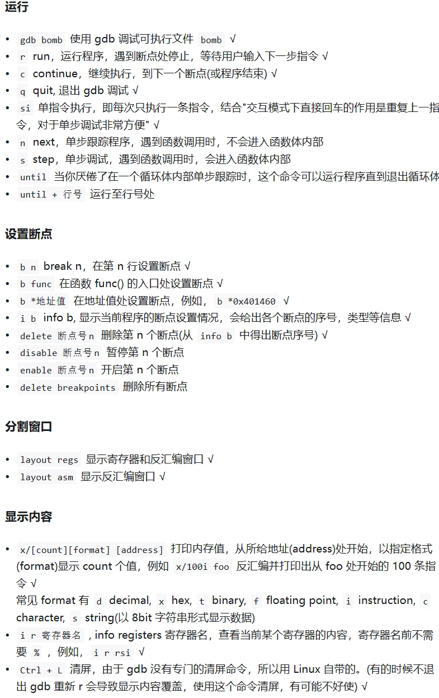
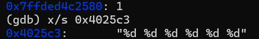
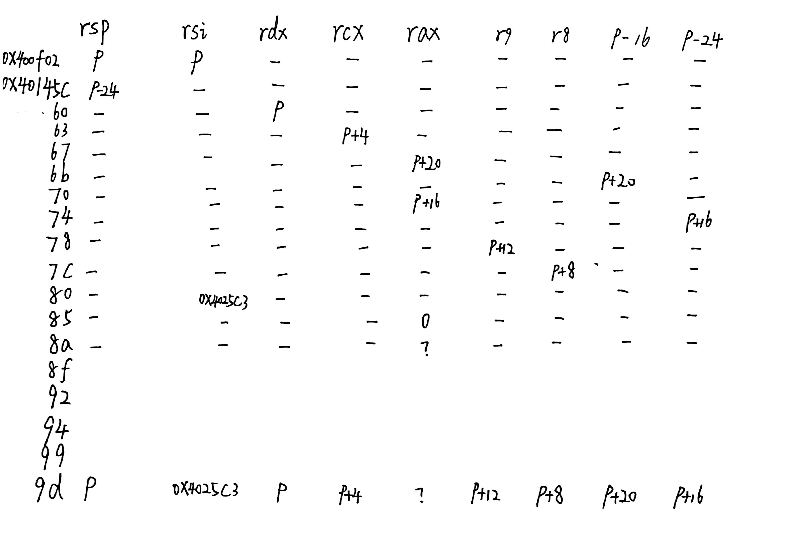
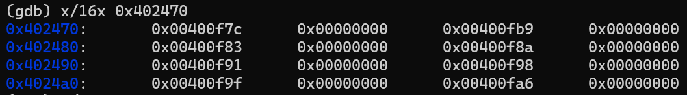
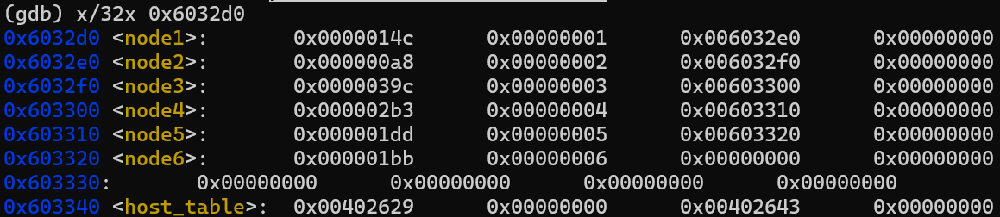
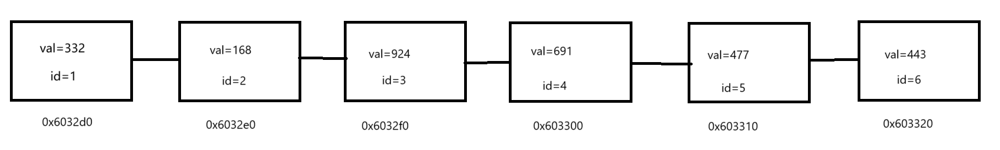
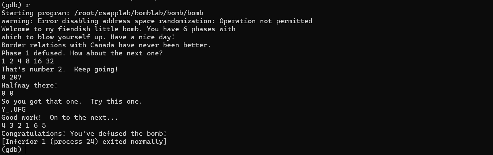

### 写在前面

规则：对于每个$phase$，你都需要输入一个字符串，使得$explode\_bomb$函数不被运行

在bomb目录下使用`objdump -d bomb > bomb.s`得到反汇编文件$bomb.s$

$shell$ 中使用 `gdb bomb`进入$gdb$调试





### phase_1

```asm
  0000000000400ee0 <phase_1>:
  400ee0:	48 83 ec 08          	sub    $0x8,%rsp
  400ee4:	be 00 24 40 00       	mov    $0x402400,%esi
  400ee9:	e8 4a 04 00 00       	call   401338 <strings_not_equal>
  400eee:	85 c0                	test   %eax,%eax
  400ef0:	74 05                	je     400ef7 <phase_1+0x17>
  400ef2:	e8 43 05 00 00       	call   40143a <explode_bomb>
  400ef7:	48 83 c4 08          	add    $0x8,%rsp
  400efb:	c3                   	ret
```

先是额外调整8字节栈空间以满足调用时的栈对齐要求，然后进入了$strings\_not\_equal$函数中；返回地址已经由调用`phase_1`时的`call`指令压栈

```asm
  0000000000401338 <strings_not_equal>:
  401338:	41 54                	push   %r12
  40133a:	55                   	push   %rbp
  40133b:	53                   	push   %rbx
  40133c:	48 89 fb             	mov    %rdi,%rbx
  40133f:	48 89 f5             	mov    %rsi,%rbp
  401342:	e8 d4 ff ff ff       	call   40131b <string_length>
  401347:	41 89 c4             	mov    %eax,%r12d
  40134a:	48 89 ef             	mov    %rbp,%rdi
  40134d:	e8 c9 ff ff ff       	call   40131b <string_length>
  401352:	ba 01 00 00 00       	mov    $0x1,%edx
  401357:	41 39 c4             	cmp    %eax,%r12d
  40135a:	75 3f                	jne    40139b <strings_not_equal+0x63>
  40135c:	0f b6 03             	movzbl (%rbx),%eax
  40135f:	84 c0                	test   %al,%al
  401361:	74 25                	je     401388 <strings_not_equal+0x50>
  401363:	3a 45 00             	cmp    0x0(%rbp),%al
  401366:	74 0a                	je     401372 <strings_not_equal+0x3a>
  401368:	eb 25                	jmp    40138f <strings_not_equal+0x57>
  40136a:	3a 45 00             	cmp    0x0(%rbp),%al
  40136d:	0f 1f 00             	nopl   (%rax)
  401370:	75 24                	jne    401396 <strings_not_equal+0x5e>
  401372:	48 83 c3 01          	add    $0x1,%rbx
  401376:	48 83 c5 01          	add    $0x1,%rbp
  40137a:	0f b6 03             	movzbl (%rbx),%eax
  40137d:	84 c0                	test   %al,%al
  40137f:	75 e9                	jne    40136a <strings_not_equal+0x32>
  401381:	ba 00 00 00 00       	mov    $0x0,%edx
  401386:	eb 13                	jmp    40139b <strings_not_equal+0x63>
  401388:	ba 00 00 00 00       	mov    $0x0,%edx
  40138d:	eb 0c                	jmp    40139b <strings_not_equal+0x63>
  40138f:	ba 01 00 00 00       	mov    $0x1,%edx
  401394:	eb 05                	jmp    40139b <strings_not_equal+0x63>
  401396:	ba 01 00 00 00       	mov    $0x1,%edx
  40139b:	89 d0                	mov    %edx,%eax
  40139d:	5b                   	pop    %rbx
  40139e:	5d                   	pop    %rbp
  40139f:	41 5c                	pop    %r12
  4013a1:	c3                   	ret
```

阅读地址在$401338$的$strings\_not\_equal$并结合函数名推断，该函数将$\%rdi$和$\%rsi$指向的地址的字符串进行比较，若相等则将$\%rax$设为0，反之将$\%rax$设为1

所以这段汇编代码在$\%edi$和$\%esi$指向的字符串相同的时候不会爆炸，只需输入内存$0x402400$中的字符串即可

`(gdb) x/s 0x402400`

得到 `Border relations with Canada have never been better.` 即为本题答案

### phase_2

```asm
 0000000000400efc <phase_2>:
  400efc:	55                   	push   %rbp
  400efd:	53                   	push   %rbx
  400efe:	48 83 ec 28          	sub    $0x28,%rsp
  400f02:	48 89 e6             	mov    %rsp,%rsi
  400f05:	e8 52 05 00 00       	call   40145c <read_six_numbers>
```

程序首先将$\%rbp$和$\%rbx$压入栈中保存状态，并为栈分配了40字节的空间，并将$\%rsp$栈指针放入$\%rsi$作为$read\_six\_numbers$的第二个参数

接下来我们来看$read\_six\_numbers$函数

```asm
 000000000040145c <read_six_numbers>:
  40145c:	48 83 ec 18          	sub    $0x18,%rsp
  401460:	48 89 f2             	mov    %rsi,%rdx //arg 3
  401463:	48 8d 4e 04          	lea    0x4(%rsi),%rcx //arg 4
  401467:	48 8d 46 14          	lea    0x14(%rsi),%rax
  40146b:	48 89 44 24 08       	mov    %rax,0x8(%rsp) //arg 8
  401470:	48 8d 46 10          	lea    0x10(%rsi),%rax
  401474:	48 89 04 24          	mov    %rax,(%rsp) //arg 7
  401478:	4c 8d 4e 0c          	lea    0xc(%rsi),%r9 //arg 6
  40147c:	4c 8d 46 08          	lea    0x8(%rsi),%r8 // arg 5
  401480:	be c3 25 40 00       	mov    $0x4025c3,%esi //arg 2
  401485:	b8 00 00 00 00       	mov    $0x0,%eax
  40148a:	e8 61 f7 ff ff       	call   400bf0 <__isoc99_sscanf@plt>
  40148f:	83 f8 05             	cmp    $0x5,%eax
  401492:	7f 05                	jg     401499 <read_six_numbers+0x3d>
  401494:	e8 a1 ff ff ff       	call   40143a <explode_bomb>
  401499:	48 83 c4 18          	add    $0x18,%rsp
  40149d:	c3                   	ret
```

查表发现其中部分寄存器为参数寄存器，已经在代码中标出

看到这里寄存器指向的地址有点混乱，于是我们进入gdb调试查看相关寄存器的值

通过`b explode_bomb`在爆炸函数前设置断点，得以保证在刚进入爆炸函数且还未爆炸之前得以停顿进而进行调试

我们随便输入一堆数，然后在断点处检查每个寄存器的值

发现

这类似C/C++中$scanf$的占位符，结合函数名和剩下6个参数寄存器，我们大胆推测这个函数以$\%esi$为占位符，读入六个$int$并存放在其他六个参数寄存器中，依次在$\%rdx$，$\%rcx$，$\%r8$，$\%r9$和栈中的两个位置 

我们手动模拟可以得到以下结果，设最初$\%rsp$指向的地址为$p$





可以使用gdb进行验证，同时访问$(\%rax)$的值发现是读入的数的个数

成功读入的个数传回$\%rax$中，当读入的个数小于等于5时炸弹会爆炸，否则函数正常退出

继续回到$phase\_2$中   

```asm
  400f0a:	83 3c 24 01          	cmpl   $0x1,(%rsp)
  400f0e:	74 20                	je     400f30 <phase_2+0x34>
  400f10:	e8 25 05 00 00       	call   40143a <explode_bomb>
  400f15:	eb 19                	jmp    400f30 <phase_2+0x34>
  400f17:	8b 43 fc             	mov    -0x4(%rbx),%eax
  400f1a:	01 c0                	add    %eax,%eax
  400f1c:	39 03                	cmp    %eax,(%rbx)
  400f1e:	74 05                	je     400f25 <phase_2+0x29>
  400f20:	e8 15 05 00 00       	call   40143a <explode_bomb>
  400f25:	48 83 c3 04          	add    $0x4,%rbx
  400f29:	48 39 eb             	cmp    %rbp,%rbx
  400f2c:	75 e9                	jne    400f17 <phase_2+0x1b>
  400f2e:	eb 0c                	jmp    400f3c <phase_2+0x40>
  400f30:	48 8d 5c 24 04       	lea    0x4(%rsp),%rbx
  400f35:	48 8d 6c 24 18       	lea    0x18(%rsp),%rbp
  400f3a:	eb db                	jmp    400f17 <phase_2+0x1b>
  400f3c:	48 83 c4 28          	add    $0x28,%rsp
  400f40:	5b                   	pop    %rbx
  400f41:	5d                   	pop    %rbp
  400f42:	c3                   	ret
```

根据上图可以发现，$\%rdx$指向的地址即为$\%rsp$，即检查第一个数是否为1，若不是1则直接爆炸

此后将$\%rbx$设置为$p+4$(指向第二个数)，$\%rbp$设置为$p+24$(指向最后一个数的下一个地址)，并将执行的指令跳转到$*0x400f17$

将$\%rax$设置为$\%rbx$指向的前一个数，将$p$指向的值乘2以后与$\%rbx$比较，若不相等直接爆炸

此后将$\%rbx$指向下一个数，检查其若超出了读入的6个数地址范围则安全退出这个函数，否则重复上一行和这一行的内容

可以发现，这一段代码等价于从第二个数开始直到第六个数，检查其是否为前一个数的两倍，全部满足则能安全退出

因此只需要第一个数为1，后面的数每个都为前一个数两倍即可

故答案为 `1 2 4 8 16 32`


### phase_3

```asm
 0000000000400f43 <phase_3>:
  400f43:	48 83 ec 18          	sub    $0x18,%rsp
  400f47:	48 8d 4c 24 0c       	lea    0xc(%rsp),%rcx
  400f4c:	48 8d 54 24 08       	lea    0x8(%rsp),%rdx
  400f51:	be cf 25 40 00       	mov    $0x4025cf,%esi
  400f56:	b8 00 00 00 00       	mov    $0x0,%eax
  400f5b:	e8 90 fc ff ff       	call   400bf0 <__isoc99_sscanf@plt>
  400f60:	83 f8 01             	cmp    $0x1,%eax
  400f63:	7f 05                	jg     400f6a <phase_3+0x27>
  400f65:	e8 d0 04 00 00       	call   40143a <explode_bomb>
  400f6a:	83 7c 24 08 07       	cmpl   $0x7,0x8(%rsp)
  400f6f:	77 3c                	ja     400fad <phase_3+0x6a>
  400f71:	8b 44 24 08          	mov    0x8(%rsp),%eax
  400f75:	ff 24 c5 70 24 40 00 	jmp    *0x402470(,%rax,8)
  400f7c:	b8 cf 00 00 00       	mov    $0xcf,%eax
  400f81:	eb 3b                	jmp    400fbe <phase_3+0x7b>
  400f83:	b8 c3 02 00 00       	mov    $0x2c3,%eax
  400f88:	eb 34                	jmp    400fbe <phase_3+0x7b>
  400f8a:	b8 00 01 00 00       	mov    $0x100,%eax
  400f8f:	eb 2d                	jmp    400fbe <phase_3+0x7b>
  400f91:	b8 85 01 00 00       	mov    $0x185,%eax
  400f96:	eb 26                	jmp    400fbe <phase_3+0x7b>
  400f98:	b8 ce 00 00 00       	mov    $0xce,%eax
  400f9d:	eb 1f                	jmp    400fbe <phase_3+0x7b>
  400f9f:	b8 aa 02 00 00       	mov    $0x2aa,%eax
  400fa4:	eb 18                	jmp    400fbe <phase_3+0x7b>
  400fa6:	b8 47 01 00 00       	mov    $0x147,%eax
  400fab:	eb 11                	jmp    400fbe <phase_3+0x7b>
  400fad:	e8 88 04 00 00       	call   40143a <explode_bomb>
  400fb2:	b8 00 00 00 00       	mov    $0x0,%eax
  400fb7:	eb 05                	jmp    400fbe <phase_3+0x7b>
  400fb9:	b8 37 01 00 00       	mov    $0x137,%eax
  400fbe:	3b 44 24 0c          	cmp    0xc(%rsp),%eax
  400fc2:	74 05                	je     400fc9 <phase_3+0x86>
  400fc4:	e8 71 04 00 00       	call   40143a <explode_bomb>
  400fc9:	48 83 c4 18          	add    $0x18,%rsp
  400fcd:	c3                   	ret
```

设最初$\%rsp$指向的地址是p,先是分配了24字节的栈空间,此后$\%rsp$，$\%rcx$，$\%rdx$，$\%rsi$指向的地址分别为$p-18$,$p-6$,$p-10$,$0x4025cf$,$\%rax$的值为0

我们使用 `gdb x/s 0x4025cf`发现gdb 返回的结果是 `0x4025cf:       "%d %d"`，说明读入了两个数依次存放在$\%rdx$和$\%rcx$指向的地址中，若读入的数个数不大于1就爆炸

假设读入的两个数分别为$x$和$y$，$x$大于7也会爆炸

接下来将$\%rax$也指向地址$p-10$(x)，然后有一条跳转指令，注意这是一条间接跳转，会让PC地址变为 $0x00402470 +  8 \times x$地址中存放的值

通过 `(gdb) x/16x 0x402470` 我们可以得到从$0x402470$开始16个单位的值

一个单位为4字节32位，16个单位即为8个64位的指针，结果如下



注意$x86-64$下使用的是小端法

我们不妨从最后一个$explode\_bomb$函数开始看，想要不进入这个函数，就需要让最后$\%rax$的值等于$\%rcx$指向的值(y)

`jmp    *0x402470(,%rax,8)`这一行后面都是对于$\%rax$的赋值后跳转到判断$\%rax$与y是否相等，所以我们只需要在输入时将y设置为对应跳转时$\%rax$赋的值即可

如$x = 0$,$\%rax=0xcf=207$或$x = 1$,$\%rax = 0x137 = 311$ ...

所以本题一个可能的答案即为 `0 207`

### phase_4

```asm
  40100c <phase_4>: 
  40100c:	48 83 ec 18          	sub    $0x18,%rsp
  401010:	48 8d 4c 24 0c       	lea    0xc(%rsp),%rcx
  401015:	48 8d 54 24 08       	lea    0x8(%rsp),%rdx
  40101a:	be cf 25 40 00       	mov    $0x4025cf,%esi
  40101f:	b8 00 00 00 00       	mov    $0x0,%eax
  401024:	e8 c7 fb ff ff       	call   400bf0 <__isoc99_sscanf@plt>
  401029:	83 f8 02             	cmp    $0x2,%eax
  40102c:	75 07                	jne    401035 <phase_4+0x29>
  40102e:	83 7c 24 08 0e       	cmpl   $0xe,0x8(%rsp)
  401033:	76 05                	jbe    40103a <phase_4+0x2e>
  401035:	e8 00 04 00 00       	call   40143a <explode_bomb>
  40103a:	ba 0e 00 00 00       	mov    $0xe,%edx
  40103f:	be 00 00 00 00       	mov    $0x0,%esi
  401044:	8b 7c 24 08          	mov    0x8(%rsp),%edi
  401048:	e8 81 ff ff ff       	call   400fce <func4>
  40104d:	85 c0                	test   %eax,%eax
  40104f:	75 07                	jne    401058 <phase_4+0x4c>
  401051:	83 7c 24 0c 00       	cmpl   $0x0,0xc(%rsp)
  401056:	74 05                	je     40105d <phase_4+0x51>
  401058:	e8 dd 03 00 00       	call   40143a <explode_bomb>
  40105d:	48 83 c4 18          	add    $0x18,%rsp
  401061:	c3                   	ret
```

同样设函数开始时$\%rsp$指向的地址为p,在输入前$\%rsp$,$\%rcx$,$\%rdx$指向的地址分别为$p-24$,$p-12$,$p-16$

$0x4025cf$中的格式为 `"%d %d"`，读入的个数不是2就会爆炸。设读入$\%rdx$, $\%rcx$中的值分别为$x$和$y$

$x$大于14时会发生爆炸，否则将$\%rdx$的值设置为14，$\%rsi$的值设置为0，$\%rdi$的值设置为$x$，作为参数传入$func4$中

根据退出$func4$后的代码我们知道，只有在$\%rax=0$且$p-12$这个地址的值为0的情况下才能安全退出

 ```asm
0000000000400fce <func4>:
  400fce:	48 83 ec 08          	sub    $0x8,%rsp
  400fd2:	89 d0                	mov    %edx,%eax
  400fd4:	29 f0                	sub    %esi,%eax
  400fd6:	89 c1                	mov    %eax,%ecx
  400fd8:	c1 e9 1f             	shr    $0x1f,%ecx
  400fdb:	01 c8                	add    %ecx,%eax
  400fdd:	d1 f8                	sar    $1,%eax
  400fdf:	8d 0c 30             	lea    (%rax,%rsi,1),%ecx
  400fe2:	39 f9                	cmp    %edi,%ecx
  400fe4:	7e 0c                	jle    400ff2 <func4+0x24>
  400fe6:	8d 51 ff             	lea    -0x1(%rcx),%edx
  400fe9:	e8 e0 ff ff ff       	call   400fce <func4>
  400fee:	01 c0                	add    %eax,%eax
  400ff0:	eb 15                	jmp    401007 <func4+0x39>
  400ff2:	b8 00 00 00 00       	mov    $0x0,%eax
  400ff7:	39 f9                	cmp    %edi,%ecx
  400ff9:	7d 0c                	jge    401007 <func4+0x39>
  400ffb:	8d 71 01             	lea    0x1(%rcx),%esi
  400ffe:	e8 cb ff ff ff       	call   400fce <func4>
  401003:	8d 44 00 01          	lea    0x1(%rax,%rax,1),%eax
  401007:	48 83 c4 08          	add    $0x8,%rsp
  40100b:	c3                   	ret
 ```

 接下来是这个递归函数$func4$，我太菜了看不懂它叽里咕噜在说写什么，直接运用$OI$知识人肉反编译打表(

```cpp
#include <bits/stdc++.h>

int rdi, rsi, rdx, rcx, rax;

void f() {
    rax = rdx;
    rax -= rsi;
    rcx = rax;
    rcx >>= 31;
    rax += rcx;
    rax >>= 1;
    rcx = rax + rsi;
    if (rcx <= rdi) goto x400ff2;
    rdx = rcx - 1;
    f(); 
    rax += rax;
    goto x401007;
    x400ff2:
    rax = 0;
    if (rcx >= rdi) goto x401007;
    rsi = rcx + 1;
    f();
    rax = rax + rax + 1;
    x401007:
    return;
}

int main() {
    for (int x = 0; x <= 3; x++) {
        for (int y = 0; y <= 3; y++) {
            rdi = x; rsi = 0; rdx = 14; rcx = y;
            f();
            std::cout << "x=" << x << " y=" << y << " rax=" << rax << '\n';
        }
    }
}
```

结果如下

```cpp
x=0 y=0 rax=0
x=0 y=1 rax=0
x=0 y=2 rax=0
x=0 y=3 rax=0
x=1 y=0 rax=0
x=1 y=1 rax=0
x=1 y=2 rax=0
x=1 y=3 rax=0
x=2 y=0 rax=4
x=2 y=1 rax=4
x=2 y=2 rax=4
x=2 y=3 rax=4
x=3 y=0 rax=0
x=3 y=1 rax=0
x=3 y=2 rax=0
x=3 y=3 rax=0
```

可知并不是所有不大于14的$x$都满足条件；使`func4(x, 0, 14)`返回0的$x$为二分搜索路径全向左的节点，例如$x=0,1,3,7$，同时$y$必须取0

如取 `0 0 ` 即可

### phase_5

```asm
 0000000000401062 <phase_5>: 
  401062:	53                   	push   %rbx
  401063:	48 83 ec 20          	sub    $0x20,%rsp
  401067:	48 89 fb             	mov    %rdi,%rbx
  40106a:	64 48 8b 04 25 28 00 	mov    %fs:0x28,%rax
  401071:	00 00 
  401073:	48 89 44 24 18       	mov    %rax,0x18(%rsp)
  401078:	31 c0                	xor    %eax,%eax
  40107a:	e8 9c 02 00 00       	call   40131b <string_length>
  40107f:	83 f8 06             	cmp    $0x6,%eax
  401082:	74 4e                	je     4010d2 <phase_5+0x70>
  401084:	e8 b1 03 00 00       	call   40143a <explode_bomb>
  401089:	eb 47                	jmp    4010d2 <phase_5+0x70>
  40108b:	0f b6 0c 03          	movzbl (%rbx,%rax,1),%ecx
  40108f:	88 0c 24             	mov    %cl,(%rsp)
  401092:	48 8b 14 24          	mov    (%rsp),%rdx
  401096:	83 e2 0f             	and    $0xf,%edx
  401099:	0f b6 92 b0 24 40 00 	movzbl 0x4024b0(%rdx),%edx
  4010a0:	88 54 04 10          	mov    %dl,0x10(%rsp,%rax,1)
  4010a4:	48 83 c0 01          	add    $0x1,%rax
  4010a8:	48 83 f8 06          	cmp    $0x6,%rax
  4010ac:	75 dd                	jne    40108b <phase_5+0x29>
  4010ae:	c6 44 24 16 00       	movb   $0x0,0x16(%rsp)
  4010b3:	be 5e 24 40 00       	mov    $0x40245e,%esi
  4010b8:	48 8d 7c 24 10       	lea    0x10(%rsp),%rdi
  4010bd:	e8 76 02 00 00       	call   401338 <strings_not_equal>
  4010c2:	85 c0                	test   %eax,%eax
  4010c4:	74 13                	je     4010d9 <phase_5+0x77>
  4010c6:	e8 6f 03 00 00       	call   40143a <explode_bomb>
  4010cb:	0f 1f 44 00 00       	nopl   0x0(%rax,%rax,1)
  4010d0:	eb 07                	jmp    4010d9 <phase_5+0x77>
  4010d2:	b8 00 00 00 00       	mov    $0x0,%eax
  4010d7:	eb b2                	jmp    40108b <phase_5+0x29>
  4010d9:	48 8b 44 24 18       	mov    0x18(%rsp),%rax
  4010de:	64 48 33 04 25 28 00 	xor    %fs:0x28,%rax
  4010e5:	00 00 
  4010e7:	74 05                	je     4010ee <phase_5+0x8c>
  4010e9:	e8 42 fa ff ff       	call   400b30 <__stack_chk_fail@plt>
  4010ee:	48 83 c4 20          	add    $0x20,%rsp
  4010f2:	5b                   	pop    %rbx
  4010f3:	c3                   	ret
```

可以发现读入的是一个字符串，在其长度不为6的时候爆炸

否则将$\%rax$设置为0，$\%rbx$指向读入字符串的首地址，通过`movzbl (%rbx,%rax,1),%ecx`访问字符串的第一个字符，将其$and$上15，即取其ASCII码的后四位得到一个整数$k$，以`movzbl 0x4024b0(%rdx),%edx`访问0x4024b0的后面第$k$个字符并将其最终放入`0x10(%rsp,%rax,1)`中，重复以上流程六次，然后将地址为$0x40245e$的字符串放入$\%esi$中,$\%rdi$指向$0x10(\%rsp)$即转换后的字符串，将这两个字符串进行比较，若不相等则会爆炸

通过 `(gdb) x/s 0x4024b0`，我们得到这个地址后面的字符串为 `maduiersnfotvbylSo you think you can stop the bomb with ctrl-c, do you?`

通过 `(gdb) x/s 0x40245e`可以得到目标字符串为 `0x40245e:       "flyers"`

所以我们只需要输入的每个字符的$ASCII$码二进制后4位转换为十进制分别为9,15,14,5,6,7 就行了

查$ASCII$表发现 `Y_.UFG`为一组可能的解

### phase_6

```asm
 00000000004010f4 <phase_6>:
  4010f4:	41 56                	push   %r14
  4010f6:	41 55                	push   %r13
  4010f8:	41 54                	push   %r12
  4010fa:	55                   	push   %rbp
  4010fb:	53                   	push   %rbx
  4010fc:	48 83 ec 50          	sub    $0x50,%rsp
  401100:	49 89 e5             	mov    %rsp,%r13
  401103:	48 89 e6             	mov    %rsp,%rsi
  401106:	e8 51 03 00 00       	call   40145c <read_six_numbers>
  40110b:	49 89 e6             	mov    %rsp,%r14
  40110e:	41 bc 00 00 00 00    	mov    $0x0,%r12d
  401114:	4c 89 ed             	mov    %r13,%rbp
  401117:	41 8b 45 00          	mov    0x0(%r13),%eax
  40111b:	83 e8 01             	sub    $0x1,%eax
  40111e:	83 f8 05             	cmp    $0x5,%eax
  401121:	76 05                	jbe    401128 <phase_6+0x34>
  401123:	e8 12 03 00 00       	call   40143a <explode_bomb>
  401128:	41 83 c4 01          	add    $0x1,%r12d
  40112c:	41 83 fc 06          	cmp    $0x6,%r12d
  401130:	74 21                	je     401153 <phase_6+0x5f>
  401132:	44 89 e3             	mov    %r12d,%ebx
  401135:	48 63 c3             	movslq %ebx,%rax
  401138:	8b 04 84             	mov    (%rsp,%rax,4),%eax
  40113b:	39 45 00             	cmp    %eax,0x0(%rbp)
  40113e:	75 05                	jne    401145 <phase_6+0x51>
  401140:	e8 f5 02 00 00       	call   40143a <explode_bomb>
  401145:	83 c3 01             	add    $0x1,%ebx
  401148:	83 fb 05             	cmp    $0x5,%ebx
  40114b:	7e e8                	jle    401135 <phase_6+0x41>
  40114d:	49 83 c5 04          	add    $0x4,%r13
  401151:	eb c1                	jmp    401114 <phase_6+0x20>
  401153:	
```

设进入函数时$\%rsp$指向的地址为$p$，由$phase\_2$的分析可知，读入的六个数(设为$a_0$,$a_1$,$a_2$,$a_3$,$a_4$,$a_5$)地址依次分别在$p-80$，$p-76$，$p-72$，$p-68$，$p-64$，$p-60$

此后，$\%rbp$指向了第一个数的地址，检查了这个位置的值，大于6时会爆炸，然后$\%rbx$从$\%r12$的值开始(初始$\%r12$为1)一直到6，检查第$\%rbx$个数是否与$\%rbp$相等，相等则会爆炸

此后，将$\%rbp$指向下一个数，$\%r12$的值增加1，重复上一个步骤，直到$\%r12$的值等于6，即$\%rbp$之后没有其他数

所以当这六个数都在1到6之间且互不相等的时候不会爆炸

手动模拟发现，执行完上述指令后$\%rsp$,$\%r14$,$\%r12$,$\%r13$,$\%rbp$,$\%rax$,$\%rbx$的值分别是$p-80$,$p-80$,$6$,$p-60$,$p-60$,$a_6$,$6$

```asm
  401153:	48 8d 74 24 18       	lea    0x18(%rsp),%rsi
  401158:	4c 89 f0             	mov    %r14,%rax
  40115b:	b9 07 00 00 00       	mov    $0x7,%ecx
  401160:	89 ca                	mov    %ecx,%edx
  401162:	2b 10                	sub    (%rax),%edx
  401164:	89 10                	mov    %edx,(%rax)
  401166:	48 83 c0 04          	add    $0x4,%rax
  40116a:	48 39 f0             	cmp    %rsi,%rax
  40116d:	75 f1                	jne    401160 <phase_6+0x6c>
```

这段指令以$\%rax$为指针，从第一个数开始直到最后一个数，将每个数$a_i$都赋值为$7-a_i$，我们不妨设$b_i = 7 - a_i$

```asm
  40116f:	be 00 00 00 00       	mov    $0x0,%esi
  401174:	eb 21                	jmp    401197 <phase_6+0xa3>
  401176:	48 8b 52 08          	mov    0x8(%rdx),%rdx
  40117a:	83 c0 01             	add    $0x1,%eax
  40117d:	39 c8                	cmp    %ecx,%eax
  40117f:	75 f5                	jne    401176 <phase_6+0x82>
  401181:	eb 05                	jmp    401188 <phase_6+0x94>
  401183:	ba d0 32 60 00       	mov    $0x6032d0,%edx
  401188:	48 89 54 74 20       	mov    %rdx,0x20(%rsp,%rsi,2)
  40118d:	48 83 c6 04          	add    $0x4,%rsi
  401191:	48 83 fe 18          	cmp    $0x18,%rsi
  401195:	74 14                	je     4011ab <phase_6+0xb7>
  401197:	8b 0c 34             	mov    (%rsp,%rsi,1),%ecx
  40119a:	83 f9 01             	cmp    $0x1,%ecx
  40119d:	7e e4                	jle    401183 <phase_6+0x8f>
  40119f:	b8 01 00 00 00       	mov    $0x1,%eax
  4011a4:	ba d0 32 60 00       	mov    $0x6032d0,%edx
  4011a9:	eb cb                	jmp    401176 <phase_6+0x82>
```

看不懂，这家伙又在叽里咕噜说些什么呢（

注意到有一个常量地址 `$0x6032d0`，于是我们使用 `(gdb) x/x 0x6032d0 `，发现输出结果为 `0x6032d0 <node1>:   0x0000014c`

这个变量名$node1$有点意思，进一步地，我们使用 `(gdb) x/16x 0x6032d0` 可以发现输出的结果为



我们发现，除了$node_6$每个$node_i$的第三个变量都是$node_{i+1}$的地址，可以联想到链表

同时发现每个节点占用4个单位，可以推测是一个64位的指针和两个32位的$int$变量

由于$x86$使用小端法，不难想到节点结构体应该是这样定义的

```cpp
struct node {
	int val, key;
    node * nxt;
}nd[7];
```

链表的结构如下图



接下来我们按汇编代码手玩发现，首先通过$\%rcx$指向第$i$个数的地址($i$从0取到5)

如果$b_i$的值为1(即$a_i=6$)，就直接将$0x6032d0$（链表的首地址）放入地址为$p-48+8*i$的内存中

否则将$\%rdx$指向链表的首地址，并每次移动到$\%rbx+8$这个地址(链表下一个节点的地址)，即 $rbx = *rbx -> nxt$，直到当前指向的是链表中第$b_i$个节点，然后将当前的地址放入地址为$p-48+8*i$的内存中

重复以上过程，直到6个节点地址都被保存下来

我们设重排后的节点从地址$p-48$开始，分别保存的信息为三元组$(val_i,id_i,nxt_i)$

```asm
  4011ab:	48 8b 5c 24 20       	mov    0x20(%rsp),%rbx
  4011b0:	48 8d 44 24 28       	lea    0x28(%rsp),%rax
  4011b5:	48 8d 74 24 50       	lea    0x50(%rsp),%rsi
  4011ba:	48 89 d9             	mov    %rbx,%rcx
  4011bd:	48 8b 10             	mov    (%rax),%rdx
  4011c0:	48 89 51 08          	mov    %rdx,0x8(%rcx)
  4011c4:	48 83 c0 08          	add    $0x8,%rax
  4011c8:	48 39 f0             	cmp    %rsi,%rax
  4011cb:	74 05                	je     4011d2 <phase_6+0xde>
  4011cd:	48 89 d1             	mov    %rdx,%rcx
  4011d0:	eb eb                	jmp    4011bd <phase_6+0xc9>
  4011d2:	48 c7 42 08 00 00 00 	movq   $0x0,0x8(%rdx)
```

接下来这段汇编代码从重排后的链表第一个节点开始，将$nxt_i$地址指针改为了重排后下一个节点的地址，最后一个节点的$nxt$地址指针被设置为了$0$($NULL$)

```asm
  4011d9:	00 
  4011da:	bd 05 00 00 00       	mov    $0x5,%ebp
  4011df:	48 8b 43 08          	mov    0x8(%rbx),%rax
  4011e3:	8b 00                	mov    (%rax),%eax
  4011e5:	39 03                	cmp    %eax,(%rbx)
  4011e7:	7d 05                	jge    4011ee <phase_6+0xfa>
  4011e9:	e8 4c 02 00 00       	call   40143a <explode_bomb>
  4011ee:	48 8b 5b 08          	mov    0x8(%rbx),%rbx
  4011f2:	83 ed 01             	sub    $0x1,%ebp
  4011f5:	75 e8                	jne    4011df <phase_6+0xeb>
  4011f7:	48 83 c4 50          	add    $0x50,%rsp
  4011fb:	5b                   	pop    %rbx
  4011fc:	5d                   	pop    %rbp
  4011fd:	41 5c                	pop    %r12
  4011ff:	41 5d                	pop    %r13
  401201:	41 5e                	pop    %r14
  401203:	c3                   	ret
```

此后对于重排后的前5个节点，用$\%rbx$指向它，用$\%rax$指向它的下一个节点，将它们指向的值进行比较(注意比较时使用的是$\%eax$，即使用前32位的$val$值进行比较)，当前一个值小于下一个值的时候发生爆炸，否则整个函数安全退出

所以我们的目标很明确了，只需要使得输入能将链表的$val$值从大到小排序就行了

可以得到链表的顺序按照$id$排序应该为 `3 4 5 6 1 2`，这就是$b$数组

注意输入的$b_i=7-a_i$，所以输入的$a$数组应该为 `4 3 2 1 6 5`

### 结果



完结撒花！

