## cache lab

### Part A

#### 写在前面

这部分要求你实现一个模拟缓存运行的C语言程序，支持读，写，修改内存三个操作，其与对于缓存模拟的行为给定的$csim-ref$可执行文件一致，最后输出操作完成后的缓存命中，未命中，替换的次数。缓存的组数，行数，每一行的字节数在执行时以参数给出，替换策略使用$LRU$(least-recently used)，即每次替换块内离上一次引用时间最久的块

但是本部分不要求你输出访问时具体的值，你只需要统计这次操作是否命中，未命中，替换

在运行的时候，我们采用了一下的选项来传递参数

`linux> ./csim-ref [-hv] -s <s> -E <E> -b <b>-t <tracefile> `

其中-h -v两个选项可选可不选，且后面没有参数，分别表示打印使用方法，和运行时是否可见化地输出每次缓存访问的结果

-s -E -b 后接一个参数，分别表示组索引位数、每组行数、块偏移位数；因此组数$S=2^s$，块大小$B=2^b$

-t 后接字符串参数，表示读入文件的路径

#### 读入部分

怎么感觉是Part A 里面最难的部分（

 首先为了从选项中读出参数，我们在linux系统下需要使用$getopt$函数，该函数原型如下

`int getopt(int argc, char * const argv[], const char *optstring)`

其中$argc$，$argv$为$main$函数的参数，分别代表参数个数和参数列表

$optstring$为选项字符串，举例来说，`getopt(argc, argv, "hvs:E:b:t:")`就表示有-h -v -s -E -b -t 这几个选项，其中-s -E -b -t 若选择的话，后面必须带有参数

该函数返回值为选项的ASCII码，同时，包含该函数的 `<unistd.h>` 和 `<getopt.h>` 中有名为 $optarg$的指针变量，在每次使用$getopt$时，若该选项有参数，就会被更新为该参数的字符串指针

由此不难写出读入函数

```c
    int op;
    FILE *fp;

    while ((op = getopt(argc, argv, "hvs:E:b:t:")) != EOF) {
        if (op == 'h') {
            Help();
            return 0;
        }
        if (op == 'v') {
            v = 1;
            continue;
        }
        if (op == 's') {
            s = atoi(optarg);//atoi 在 stdlib.h中，传入一个字符串开头的指针，将其转换为整数
            S = (1 << s);
            continue;
        }
        if (op == 'E') {
            E = atoi(optarg);
            continue;
        }
        if (op == 'b') {
            b = atoi(optarg);
            B = (1 << b);
            continue;
        }
        if (op == 't') {
            fp = fopen(optarg, "r");//文件指针指向参数标明的文件
            continue;
        }
        Help();
        return 0;//其它异常参数符
    }
```


每次操作分为以下四类：

1. `I address,size`表示取address地址开始的size字节指令
2. `L address,size` 表示加载address地址开始的size字节数据
3. `S address,size` 表示向address地址开始的size字节写数据
4. `M address,size` 表示修改address地址开始的size字节数据

但是这部分只要我们用缓存处理数据信息，同时又不需要真正地对缓存进行读写，只是模拟是否命中和替换这个过程即可

所以 `I`操作完全没用， `L` 和`S`操作完全等价 （无语

```c
    char opt[5];
    size_t ad;
    int siz;
    while (fscanf(fp, "%s %lx,%d", opt, &ad, &siz) != EOF) {
        ++curtime;
        if (v) {
            printf("%c %lx,%d\n", opt[0], ad, siz);
        }
        if (opt[0] == 'I') continue;
        if (opt[0] == 'L') Load(ad);
        if (opt[0] == 'S') Store(ad);
        if (opt[0] == 'M') Modify(ad);
    }
```

#### 缓存的相关结构

由于本部分缓存大小未知，需要动态分配内存，这里实现上使用了指针加 `malloc`动态分配空间

```c
struct row {
    int valid, flag, dfn;
    //有效位 标志位 上次更新的时间戳
};//一行

typedef struct row* set;//一组
typedef set* cache;//整个缓存
cache c;

void Cache_init() {
    c = (cache)malloc(sizeof(set) * S);//分配S个组的空间
    for (int i = 0; i < S; i++) {
        c[i] = (set)malloc(sizeof(struct row) * E);//每一组分配E行的空间
        for (int j = 0; j < E; j++) {
            c[i][j].valid = 0;
            c[i][j].flag = c[i][j].dfn = -1;
        }
    }
}
```

#### 缓存的读写

我们先对地址使用位运算得到该地址应该被分配到的组数，标识位和偏移量（偏移量好像没用）

为了维护某一组内是否有该地址对应的标志位，我们可以采用平衡树，但是E一般都比较小，没有这个必要（不是我懒得写了），直接E行依遍历比较就行

如果存在标识符相同且有效的，那么发生缓存命中，修改这一行的时间戳，直接返回即可

否则缓存未命中，我们优先找该组空的行，若存在，直接放入并更新时间戳，将其有效位设置为1，此时未命中，也未发生替换

如空的行不存在，我们就将该组中时间戳最小的行替换为需要访问的数据，同样更新时间戳即可，此时未命中并发生替换

```c
void Load(int ad) {
    //m = t + s + b
    // int _b = ad & ((1 << b) - 1);
    int _s = (ad >> b) & ((1 << s) - 1);
    int _t = ad >> (s + b);

    struct row* r = c[_s];
    for (int i = 0; i < E; i++) {
        if ((r + i)->valid && (r + i)->flag == _t) {//缓存命中
            if (v) puts("hit");
            ++hit;
            (r + i)->dfn = curtime;
            return;
        }
    }
    

    struct row* evicp = r;
    for (int i = 1; i < E; i++) {
        if ((r + i)->dfn == -1 || (r + i)->dfn < evicp->dfn) {//优先使用空行
            evicp = r + i;
        }
    }
    
    miss++; 
    printf("miss");
    if (evicp->dfn != -1) {
        evic++;
        if (v) printf(" eviction");
    }//发生了替换
    putchar('\n');
    evicp->dfn = curtime; evicp->valid = 1; evicp -> flag = _t;
    return;
}
```

写入和加载的缓存行为在本模拟器中完全一致。修改操作`M`等价于一次加载后紧跟一次存储：如果第一次访问未命中，则会统计一次未命中并把块载入缓存，随后第二次存储必然命中；如果第一次访问命中，则总共统计两次命中

```c
void Store(int ad) {
    Load(ad);
}

void Modify(int ad) {
    //m = t + s + b
    // int _b = ad & ((1 << b) - 1);
    int _s = (ad >> b) & ((1 << s) - 1);
    int _t = ad >> (s + b);
    struct row *r = c[_s]; 
    for (int i = 0; i < E; i++) {
        if ((r + i)->valid && (r + i)->flag == _t) {
            if (v) puts("hit");
            hit += 2;
            (r + i)->dfn = curtime;
            return;
        }
    }

    struct row* evicp = r;
    for (int i = 1; i < E; i++) {
        if ((r + i)->dfn == -1 || (r + i)->dfn < evicp->dfn) {
            evicp = r + i;
        }
    }
    
    miss++;  hit++;
    if (v) puts("miss");
    if (evicp->dfn != -1) {
        evic++;
        if (v) printf(" eviction");
    }
    puts(" hit");
    evicp->dfn = curtime; evicp->valid = 1; evicp -> flag = _t;
    return;
}
```

​    

#### 代码

主体已经完成了，再加上使用说明即可

```c
#include "cachelab.h"
#include <unistd.h>
#include <stdio.h>
#include <stdlib.h>
#include <getopt.h>

int E, s, S, b, B, v, t;
const int m = 64;
int curtime;
int hit, miss, evic;

struct row {
    int valid, flag, dfn;
    //有效位 标志位 上次更新的时间戳
};//一行

typedef struct row* set;//一组
typedef set* cache;//整个缓存
cache c;

void Cache_init() {
    c = (cache)malloc(sizeof(set) * S);//分配S个组的空间
    for (int i = 0; i < S; i++) {
        c[i] = (set)malloc(sizeof(struct row) * E);//每一组分配E行的空间
        for (int j = 0; j < E; j++) {
            c[i][j].valid = 0;
            c[i][j].flag = c[i][j].dfn = -1;
        }
    }
}

/*
Usage: ./csim-ref [-hv] -s <num> -E <num> -b <num> -t <file>
Options:
  -h         Print this help message.
  -v         Optional verbose flag.
  -s <num>   Number of set index bits.
  -E <num>   Number of lines per set.
  -b <num>   Number of block offset bits.
  -t <file>  Trace file.

Examples:
  linux>  ./csim-ref -s 4 -E 1 -b 4 -t traces/yi.trace
  linux>  ./csim-ref -v -s 8 -E 2 -b 4 -t traces/yi.trace
*/

void Help() {
    printf(
"Usage: ./csim-ref [-hv] -s <num> -E <num> -b <num> -t <file>\n"
"Options:\n"
"  -h         Print this help message.\n"
"  -v         Optional verbose flag.\n"
"  -s <num>   Number of set index bits.\n"
"  -E <num>   Number of lines per set.\n"
"  -b <num>   Number of block offset bits.\n"
"  -t <file>  Trace file.\n"

"Examples:\n"
"  linux>  ./csim-ref -s 4 -E 1 -b 4 -t traces/yi.trace\n"
"  linux>  ./csim-ref -v -s 8 -E 2 -b 4 -t traces/yi.trace\n"
    );
}

void Load(int ad) {
    //m = t + s + b
    // int _b = ad & ((1 << b) - 1);
    int _s = (ad >> b) & ((1 << s) - 1);
    int _t = ad >> (s + b);

    struct row* r = c[_s];
    for (int i = 0; i < E; i++) {
        if ((r + i)->valid && (r + i)->flag == _t) {//缓存命中
            if (v) puts("hit");
            ++hit;
            (r + i)->dfn = curtime;
            return;
        }
    }
    

    struct row* evicp = r;
    for (int i = 1; i < E; i++) {
        if ((r + i)->dfn == -1 || (r + i)->dfn < evicp->dfn) {//优先使用空行
            evicp = r + i;
        }
    }
    
    miss++; 
    printf("miss");
    if (evicp->dfn != -1) {
        evic++;
        if (v) printf(" eviction");
    }//发生了替换
    putchar('\n');
    evicp->dfn = curtime; evicp->valid = 1; evicp -> flag = _t;
    return;
}

void Store(int ad) {
    Load(ad);
}

void Modify(int ad) {
    //m = t + s + b
    // int _b = ad & ((1 << b) - 1);
    int _s = (ad >> b) & ((1 << s) - 1);
    int _t = ad >> (s + b);
    struct row *r = c[_s]; 
    for (int i = 0; i < E; i++) {
        if ((r + i)->valid && (r + i)->flag == _t) {
            if (v) puts("hit");
            hit += 2;
            (r + i)->dfn = curtime;
            return;
        }
    }

    struct row* evicp = r;
    for (int i = 1; i < E; i++) {
        if ((r + i)->dfn == -1 || (r + i)->dfn < evicp->dfn) {
            evicp = r + i;
        }
    }
    
    miss++;  hit++;
    if (v) puts("miss");
    if (evicp->dfn != -1) {
        evic++;
        if (v) printf(" eviction");
    }
    puts(" hit");
    evicp->dfn = curtime; evicp->valid = 1; evicp -> flag = _t;
    return;
}


int main(int argc, char *argv[]){
    int op;
    FILE *fp;

    while ((op = getopt(argc, argv, "hvs:E:b:t:")) != EOF) {
        if (op == 'h') {
            Help();
            return 0;
        }
        if (op == 'v') {
            v = 1;
            continue;
        }
        if (op == 's') {
            s = atoi(optarg);//atoi 在 stdlib.h中，传入一个字符串开头的指针，将其转换为整数
            S = (1 << s);
            continue;
        }
        if (op == 'E') {
            E = atoi(optarg);
            continue;
        }
        if (op == 'b') {
            b = atoi(optarg);
            B = (1 << b);
            continue;
        }
        if (op == 't') {
            fp = fopen(optarg, "r");//文件指针指向参数标明的文件
            continue;
        }
        Help();
        return 0;//其它异常参数符
    }

    Cache_init();//缓冲初始化，动态分配空间

    char opt[5];
    size_t ad;
    int siz;
    while (fscanf(fp, "%s %lx,%d", opt, &ad, &siz) != EOF) {
        ++curtime;
        if (v) {
            printf("%c %lx,%d\n", opt[0], ad, siz);
        }
        if (opt[0] == 'I') continue;
        if (opt[0] == 'L') Load(ad);
        if (opt[0] == 'S') Store(ad);
        if (opt[0] == 'M') Modify(ad);
    }

    printSummary(hit, miss, evic);
    return 0;
}

```

使用 `make && ./test-csim`得到以下结果


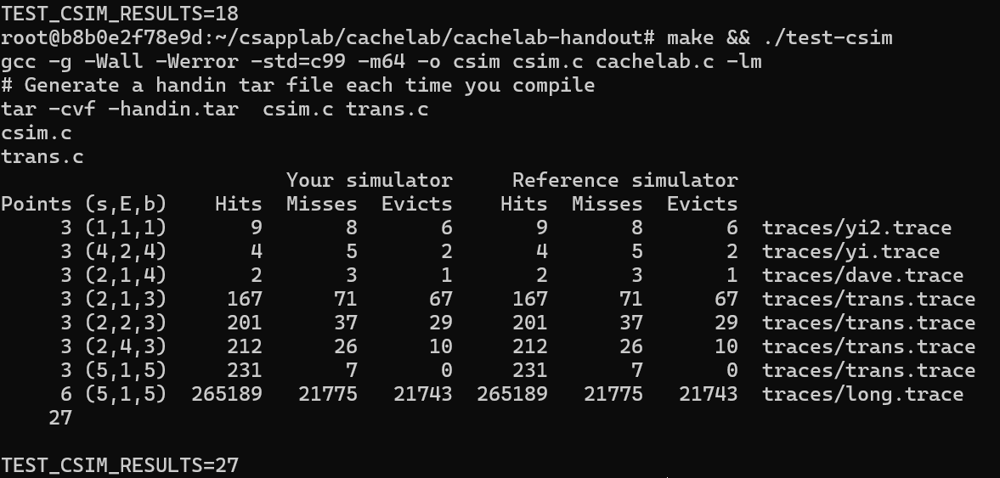


### Part B

#### 写在前面

有$32 \times 32$， $64 \times 64$， $61 \times 67$ 三个矩阵$A$，你需要使用C实现矩阵转置得到矩阵$B$，要求使得参数为$(s=5, E=1, b=5)$的缓存产生的不命中次数小于一个给定值，不能自己定义数组，最多使用12个局部变量

手算发现，该缓存有32个组，每组一行，块大小为32字节，即每块能存储8个`int`。方便起见，以下把一个缓存块称为一行，同时使用0-index

通过访问目录下的$trace.f1$(题目给出的不加优化的转置代码的缓存行为跟踪)发现，$A$的起始地址为$0x0010d080$，$B$的起始地址为$0x0014d080$，刚好相差$2^{18}$，这说明在下标相同时，$A[i][j]$和$B[i][j]$会被分配到相同的一行内，只是标志位不同；同时二者的起始地址都是32的倍数，说明$A[i][8k+0]$到$A[i][8k+7]$都在一行里面，$B$也同理

题目给出的最原始的转置函数如下

```c
void trans(int M, int N, int A[N][M], int B[M][N])
{
    int i, j, tmp;

    for (i = 0; i < N; i++) {
        for (j = 0; j < M; j++) {
            tmp = A[i][j];
            B[j][i] = tmp;
        }
    }    
}
```

注意先通过 `sudo apt install valgrind ` 安装 valgrind 

#### $ 32 \times 32 $

本部分要求缓存未命中次数小于300次

先在目录下使用`make && ./test-trans -M 32 -N 32`对原始函数缓存访问效率进行测试，结果如下


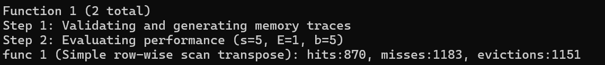


发现该函数对于缓存访问相当不友好，我们先搞明白1183次不命中是怎么来的

每隔8个int就会产生一个行的偏移，先画出每个int会被放入缓存的哪一行（不会画图，图是偷的，勿喷）


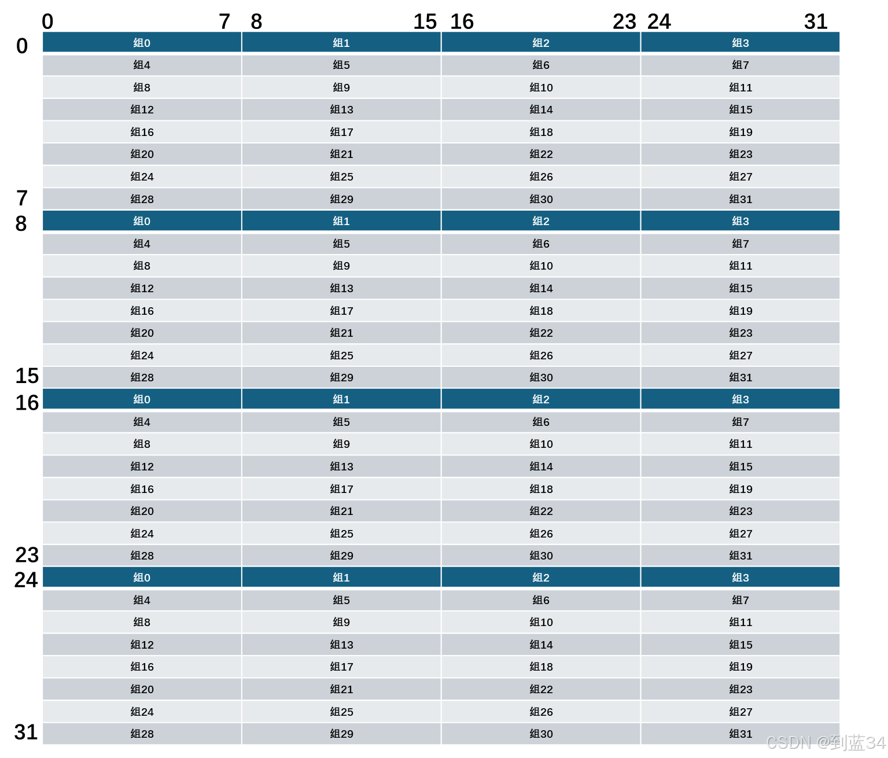


1.对于$A$是步长为1的访问，只有在第一次访问一个没有被访问过的组的时候才会不命中，所以会有128次不命中

2.对于$B$是步长为32的访问，每一次都不会命中，所以有1024次不命中

3.对于 $i=j$ 即对角线上的情况，此时$B[i][i]$和$A[i][i]$所在的组一样，写入$B[i][i]$的值的时候，刚好会将$A$所在行替换掉，在下一次读取$A$的值的时候，会将$B$替换掉，这样的情况会发生31次，因为最后一次访问$(31,31)$后不会再读取$A$了

所以一共为128+1024+31=1183次

接下来考虑如何优化，可以使用分块，取块长为8，即每次将一个$8\times8$的$A$矩阵写入其在$B$上对应的位置

这样优化后，$A$在块内以步长为1访问，而$B$在块内按列顺序访问，每一块会在每一列第一次访问的时候不命中

优化后代码如下

```c
    if (M == 32 && N == 32) {
        for (i = 0; i < N; i += 8) {
            for (j = 0; j < M; j += 8) {
                for (ii = i; ii < i + 8; ii++) {
                    for (jj = j; jj < j + 8; jj++) {
                        B[jj][ii] = A[ii][jj];
                    }
                }
            }
        }
    }
```


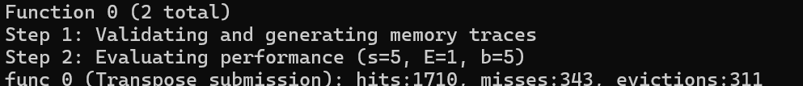


仍然需要进一步的优化，考虑对角线上的块，在转置的时候会发生对$B$进行写入时，替换掉了这一行的$A$，所以可以使用临时变量保存$A$的值，然后放入$B$中，这样减少了访问$A$这一行后面的元素所需要的一次不命中

```c
    if (M == 32 && N == 32) {
        for (i = 0; i < N; i += 8) {
            for (j = 0; j < M; j += 8) {
                for (ii = i; ii < i + 8; ii++) {
                    a = A[ii][j];
                    b = A[ii][j + 1];
                    c = A[ii][j + 2];
                    d = A[ii][j + 3];
                    e = A[ii][j + 4];
                    f = A[ii][j + 5];
                    g = A[ii][j + 6];
                    h = A[ii][j + 7];
                    B[j ][ii] = a;
                    B[j + 1][ii] = b;
                    B[j + 2][ii] = c;
                    B[j + 3][ii] = d;
                    B[j + 4][ii] = e;
                    B[j + 5][ii] = f;
                    B[j + 6][ii] = g;
                    B[j + 7][ii] = h;
                }
            }
        }
    }
```

结果如下，成功通过此题


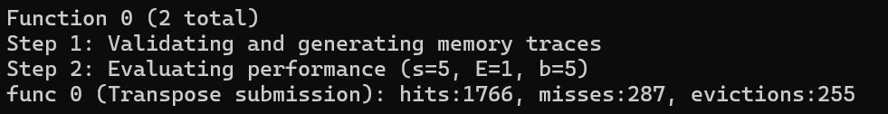


#### $64\times64$

本部分要求缓存未命中次数小于1300

再次偷图（ 这是左上角$16 \times 16$的矩阵


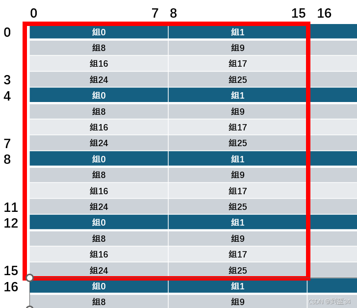


如果我们仍然采用$8\times8$分块处理的话，块内会存在严重的抖动，比如$B$内部对组0，组8，组16，组24都有两次访问，都会产生一次替换，这导致缓存命中率相当糟糕，实际测试中不命中次数为4611，与未优化的原始代码次数4723几乎没有差别

为了减少$B$的抖动，我们尝试使用$4\times4$分块

```c
    if (M == 64 && N == 64) {
        for (i = 0; i < N; i += 4) {
            for (j = 0; j < M; j += 4) {
                for (ii = i; ii < i + 4; ii++) {                                     
                    a = A[ii][j];
                    b = A[ii][j + 1];
                    c = A[ii][j + 2];
                    d = A[ii][j + 3];
                    B[j ][ii] = a;
                    B[j + 1][ii] = b;
                    B[j + 2][ii] = c;
                    B[j + 3][ii] = d;
                }
            }
        }    
    }
```

结果如下


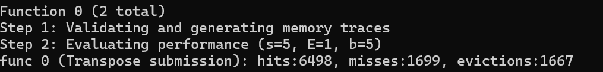


有所优化但是还未达到本题要求，采用$4\times4$分块的时候，虽然$B$的抖动减少了，但是对$A$中原本连续8个数的访问变成了两次对4个数的访问，这增加了$A$的抖动

到这里就不会了，去看别人博客了（

我们考虑以下的策略


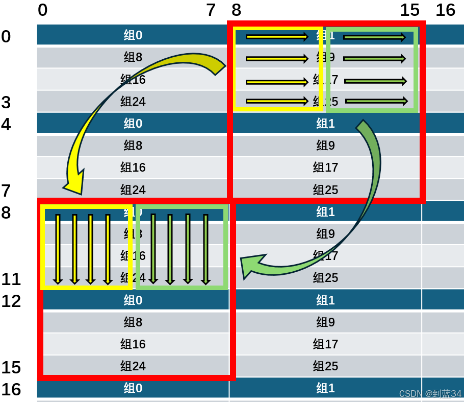


1.先读取$A$矩阵$8\times8$分块的前4行，将黄色部分和绿色部分分别转置后，直接顺序不变拷贝到$B$中，此时未发生缓存替换，只有$A$和$B$的各4次载入


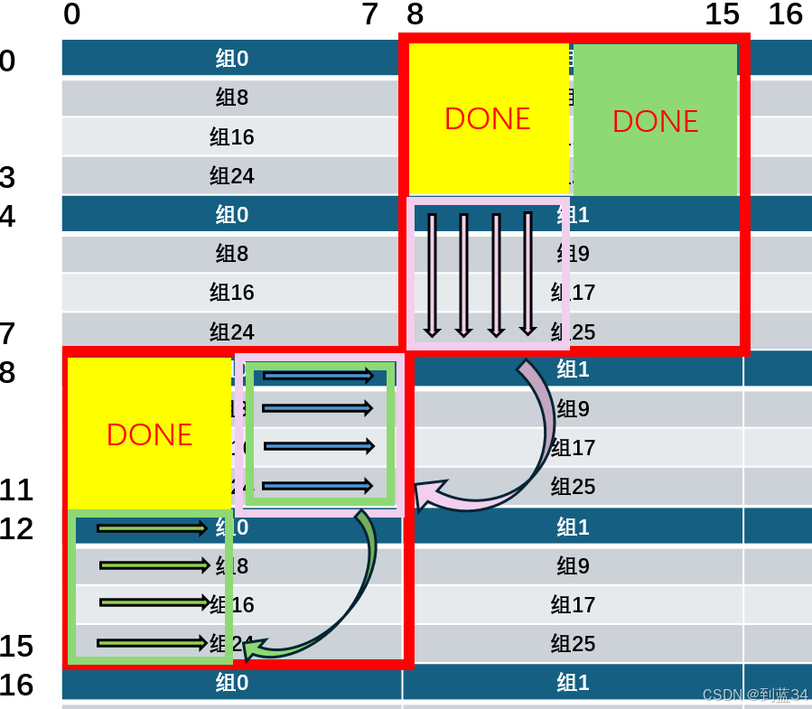


2.使用寄存器暂存未放置正确的绿色部分的一行，然后将粉色部分的一列放置到绿色部分的这一行，接着从寄存器中取值将绿色部分这一行放到正确的位置。绿色部分已经存放在了缓存中，可以直接读取，粉色第一列的时候会发生4次载入，热身缓存，正确放置绿色部分每一行的时候都会产生一次对原本存放$A$的组的替换，故一共发生8次缓存不命中


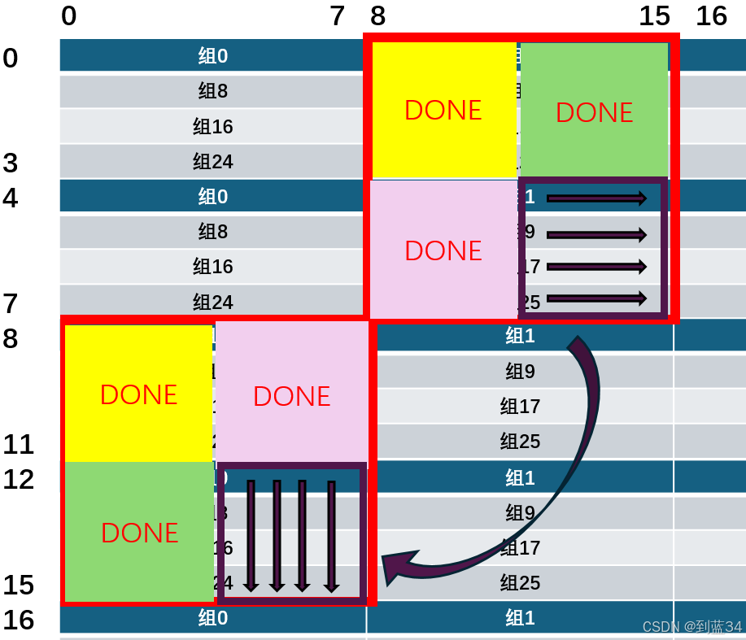


3.最后将紫色部分直接转置到正确位置即可，紫色部分每一行和放置的$B$每一列都在缓存中，全部命中

所以对于$8\times8$的块，发生了16次不命中，对$64 \times 64$的块，理论会有1024次不命中

```c
    if (M == 64 && N == 64) {
        int i, j, ii;
        int a, b, c, d, e, f, g, h;

        for (i = 0; i < N; i += 8) {
            for (j = 0; j < M; j += 8) {
                for (ii = i; ii < i + 4; ii++) {
                    a = A[ii][j];
                    b = A[ii][j + 1];
                    c = A[ii][j + 2];
                    d = A[ii][j + 3];

                    e = A[ii][j + 4];
                    f = A[ii][j + 5];
                    g = A[ii][j + 6];
                    h = A[ii][j + 7];

                    B[j][ii] = a;
                    B[j + 1][ii] = b;
                    B[j + 2][ii] = c;
                    B[j + 3][ii] = d;
                    
                    B[j][ii + 4] = e;
                    B[j + 1][ii + 4] = f;
                    B[j + 2][ii + 4] = g;
                    B[j + 3][ii + 4] = h;
                }

                for (ii = 0; ii < 4; ii++) {
                    a = B[j + ii][i + 4]; 
                    b = B[j + ii][i + 5];
                    c = B[j + ii][i + 6];
                    d = B[j + ii][i + 7];

                    e = A[i + 4][j + ii];
                    f = A[i + 5][j + ii];
                    g = A[i + 6][j + ii];
                    h = A[i + 7][j + ii];

                    B[j + ii][i + 4] = e;
                    B[j + ii][i + 5] = f;
                    B[j + ii][i + 6] = g;
                    B[j + ii][i + 7] = h;

                    B[j + 4 + ii][i] = a;
                    B[j + 4 + ii][i + 1] = b;
                    B[j + 4 + ii][i + 2] = c;
                    B[j + 4 + ii][i + 3] = d;
                }


                for (ii = i + 4; ii < i + 8; ii++) {
                    a = A[ii][j + 4];
                    b = A[ii][j + 5];
                    c = A[ii][j + 6];
                    d = A[ii][j + 7];

                    B[j + 4][ii] = a;
                    B[j + 5][ii] = b;
                    B[j + 6][ii] = c;
                    B[j + 7][ii] = d;
                }
            }
        }    
        return;
    }
```

运行结果如下，达到了本题的要求


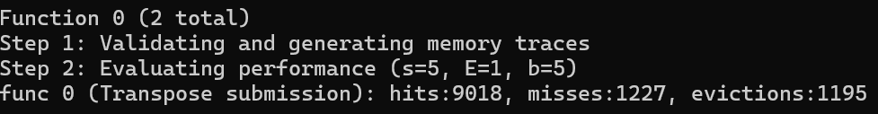


#### $67 \times 61$

本题要求缓存不命中次数小于2000

我们调整参数，发现使用$16 \times 16$分块可以通过此题

```c
    if (M == 67 && N == 61) {
        int i, j, ii,jj;
        for (i = 0; i < 61; i += 16) {
            for (j = 0; j < 67; j += 16) {
                for (ii = i; ii < i + 16 && ii < 61; ii++) {
                    for (jj = j; jj < j + 16 && jj < 67; jj++) {
                        B[jj][ii] = A[ii][jj];
                    }
                }
            }
        }
    }
```

结果如下


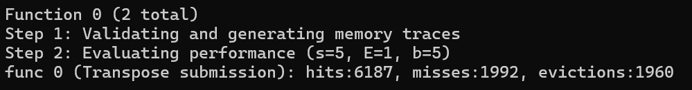


#### 代码

```c
/* 
 * trans.c - Matrix transpose B = A^T
 *
 * Each transpose function must have a prototype of the form:
 * void trans(int M, int N, int A[N][M], int B[M][N]);
 *
 * A transpose function is evaluated by counting the number of misses
 * on a 1KB direct mapped cache with a block size of 32 bytes.
 */ 
#include <stdio.h>
#include "cachelab.h"

int is_transpose(int M, int N, int A[N][M], int B[M][N]);

/* 
 * transpose_submit - This is the solution transpose function that you
 *     will be graded on for Part B of the assignment. Do not change
 *     the description string "Transpose submission", as the driver
 *     searches for that string to identify the transpose function to
 *     be graded. 
 */
char transpose_submit_desc[] = "Transpose submission";
void transpose_submit(int M, int N, int A[N][M], int B[M][N])
{

    if (M == 32 && N == 32) {
        int i, j, ii;
        int a, b, c, d, e, f, g, h;
        for (i = 0; i < N; i += 8) {
            for (j = 0; j < M; j += 8) {
                for (ii = i; ii < i + 8; ii++) {
                    a = A[ii][j];
                    b = A[ii][j + 1];
                    c = A[ii][j + 2];
                    d = A[ii][j + 3];
                    e = A[ii][j + 4];
                    f = A[ii][j + 5];
                    g = A[ii][j + 6];
                    h = A[ii][j + 7];
                    B[j ][ii] = a;
                    B[j + 1][ii] = b;
                    B[j + 2][ii] = c;
                    B[j + 3][ii] = d;
                    B[j + 4][ii] = e;
                    B[j + 5][ii] = f;
                    B[j + 6][ii] = g;
                    B[j + 7][ii] = h;
                }
            }
        }
        return;
    }

    if (M == 64 && N == 64) {
        int i, j, ii;
        int a, b, c, d, e, f, g, h;

        for (i = 0; i < N; i += 8) {
            for (j = 0; j < M; j += 8) {
                for (ii = i; ii < i + 4; ii++) {
                    a = A[ii][j];
                    b = A[ii][j + 1];
                    c = A[ii][j + 2];
                    d = A[ii][j + 3];

                    e = A[ii][j + 4];
                    f = A[ii][j + 5];
                    g = A[ii][j + 6];
                    h = A[ii][j + 7];

                    B[j][ii] = a;
                    B[j + 1][ii] = b;
                    B[j + 2][ii] = c;
                    B[j + 3][ii] = d;
                    
                    B[j][ii + 4] = e;
                    B[j + 1][ii + 4] = f;
                    B[j + 2][ii + 4] = g;
                    B[j + 3][ii + 4] = h;
                }

                for (ii = 0; ii < 4; ii++) {
                    a = B[j + ii][i + 4]; 
                    b = B[j + ii][i + 5];
                    c = B[j + ii][i + 6];
                    d = B[j + ii][i + 7];

                    e = A[i + 4][j + ii];
                    f = A[i + 5][j + ii];
                    g = A[i + 6][j + ii];
                    h = A[i + 7][j + ii];

                    B[j + ii][i + 4] = e;
                    B[j + ii][i + 5] = f;
                    B[j + ii][i + 6] = g;
                    B[j + ii][i + 7] = h;

                    B[j + 4 + ii][i] = a;
                    B[j + 4 + ii][i + 1] = b;
                    B[j + 4 + ii][i + 2] = c;
                    B[j + 4 + ii][i + 3] = d;
                }


                for (ii = i + 4; ii < i + 8; ii++) {
                    a = A[ii][j + 4];
                    b = A[ii][j + 5];
                    c = A[ii][j + 6];
                    d = A[ii][j + 7];

                    B[j + 4][ii] = a;
                    B[j + 5][ii] = b;
                    B[j + 6][ii] = c;
                    B[j + 7][ii] = d;
                }
            }
        }    
        return;
    }

    if (M == 61 && N == 67) {
        int i, j, ii,jj, tmp;
        for (i = 0; i < N; i += 16) {
            for (j = 0; j < M; j += 16) {
                for (ii = i; ii < i + 16 && ii < N; ii++) {
                    for (jj = j; jj < j + 16 && jj < M; jj++) {
                        tmp = A[ii][jj];
                        B[jj][ii] = tmp;
                    }
                }
            }
        }
    }
}

/* 
 * You can define additional transpose functions below. We've defined
 * a simple one below to help you get started. 
 */ 

/* 
 * trans - A simple baseline transpose function, not optimized for the cache.
 */
char trans_desc[] = "Simple row-wise scan transpose";
void trans(int M, int N, int A[N][M], int B[M][N])
{
    int i, j, tmp;

    for (i = 0; i < N; i++) {
        for (j = 0; j < M; j++) {
            tmp = A[i][j];
            B[j][i] = tmp;
        }
    }    
}

/*
 * registerFunctions - This function registers your transpose
 *     functions with the driver.  At runtime, the driver will
 *     evaluate each of the registered functions and summarize their
 *     performance. This is a handy way to experiment with different
 *     transpose strategies.
 */
void registerFunctions()
{
    /* Register your solution function */
    registerTransFunction(transpose_submit, transpose_submit_desc); 

    /* Register any additional transpose functions */
    registerTransFunction(trans, trans_desc); 

}

/* 
 * is_transpose - This helper function checks if B is the transpose of
 *     A. You can check the correctness of your transpose by calling
 *     it before returning from the transpose function.
 */
int is_transpose(int M, int N, int A[N][M], int B[M][N])
{
    int i, j;

    for (i = 0; i < N; i++) {
        for (j = 0; j < M; ++j) {
            if (A[i][j] != B[j][i]) {
                return 0;
            }
        }
    }
    return 1;
}

```

