## 系统级I/O

`Linux`文件本质上是一个包含字节的序列，I/O设备都被模型化为文件，内核通过使用 `Unix I/O`这一接口，对文件进行操作

### 文件的类型

`Linux`目录层次构成的是一个树形结构，根节点为 `/` 根目录

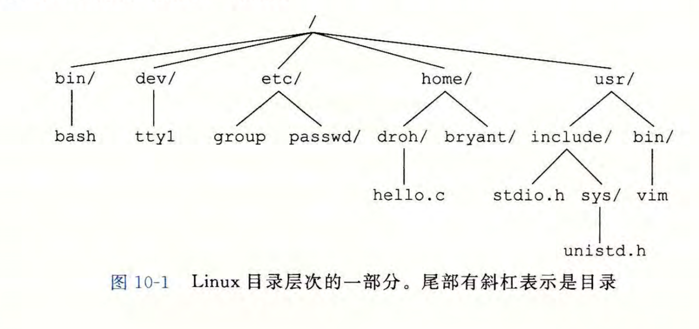

此处介绍三种最常见的文件

1. 普通文件：分为文本文件和二进制文件。前者只含有 `ASCII` 和 `Unicode` 字符，采用`LF`格式，每一行以 `'\n'`结束；后者是其余的普通文件
2. 目录：目录是存储了一组文件名到文件的映射的文件，存储的映射可以是一个目录。用`.`表示到自身的映射，`..`表示到父节点的映射
3. 套接字：与另一个进程进行跨网络通信的文件

### 文件的打开关闭

`open`函数实现了打开或新建一个文件

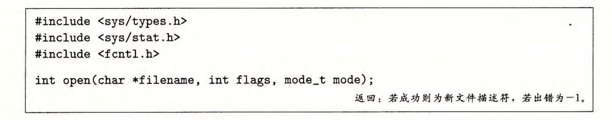

`open`函数打开文件`filename`，采用`flags`的访问方式，当创建一个新文件时，`mode`参数指明了它的访问权限位

`flags`参数的取值可以如下：
`O_RDONLY` `O_WRONLY` `O_RDWR` 分别表示只读，只写，同时读写
同时，还可以与以下值进行或运算：
`O_CREAT` `O_TRUNC` `O_APPEND` 分别表示文件不存在时创建，将当前文件截断为空，写改为在当前文件末尾追加

每个进程都有一个`umask`变量，可通过`umask`函数设置，当使用`mode`创建一个新文件时，它的权限为`mode & ~umask`
`mode`和`umask`的取值可以如下，同样支持或运算

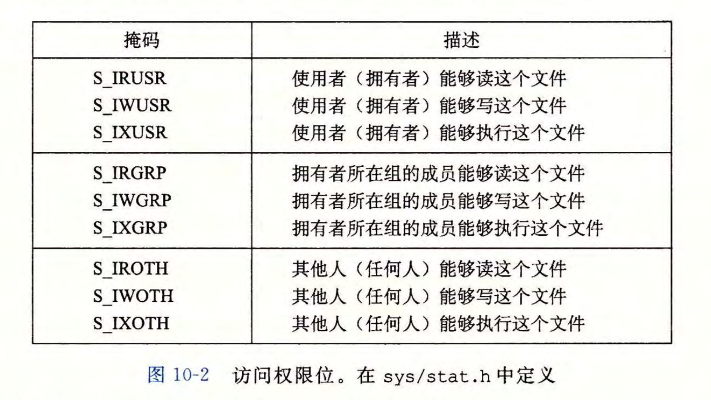

`open`函数的返回值为一个整数的文件描述符。每个进程通常都会打开三个文件`STDIN_FILENO`，`STDOUT_FILENO`，`STDERR_FILENO`，文件描述符分别为0，1，2

使用`close`函数，传入一个文件的描述符，就可以关闭该文件

### 文件的读写

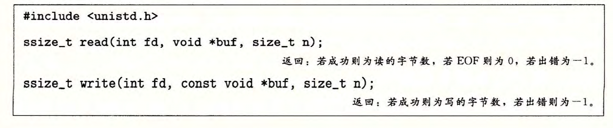

其中，`fd`为对应文件的描述符，`buf`为从文件读的数据存放到的地址指针或要写入文件的数据的地址指针，n为最大读写字节数
值得注意的是，当能读的字节数小于要求的字节数n时，会读取剩下的所有字节，然后将文件读对应的指针指向文件的末尾

### RIO包实现健壮的读写

当遇到`EOF`或者进行网络通信时，读写操作的字节数会比要求的要少，此时称产生了**不足值**。在网络编程中，我们需要处理这种不足值避免出错，所以需要实现一个RIO(Robust I/O)包

#### 无缓冲的输入输出函数
直接在内存和文件之间传输数据，没有应用级缓冲

原型如下

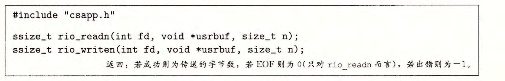

实现如下，输入函数会在被信号中断后继续进行，使用了`while`循环反复调用`read`函数直到读入要求的字节数，除非遇到了`EOF`；输出函数类似

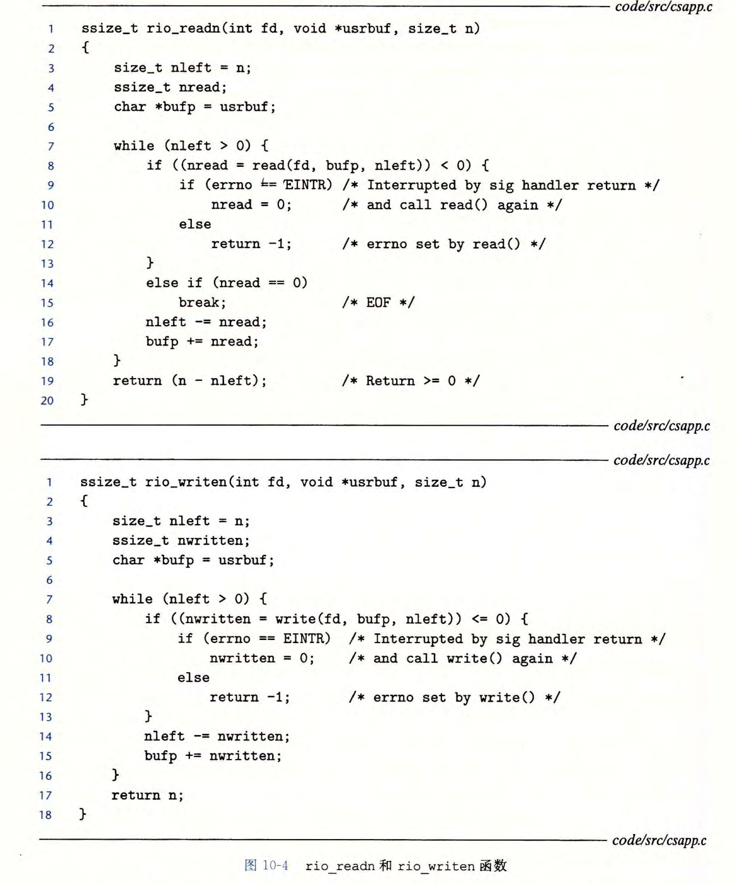

#### 带缓冲的输入函数
先将从文件读的数据放入一个缓冲区内，当调用函数时，尝试从该缓冲区内读取数据，这样避免了反复系统调用`read`函数。例如检查是否换行时，我们需要调用字符串长次`read`函数，每次读入1字节，这样会反复进入内核。而采用带缓冲的输入，可以一次调用`read`读入多个字节，再遍历缓冲区检查是否有换行即可

函数原型如下

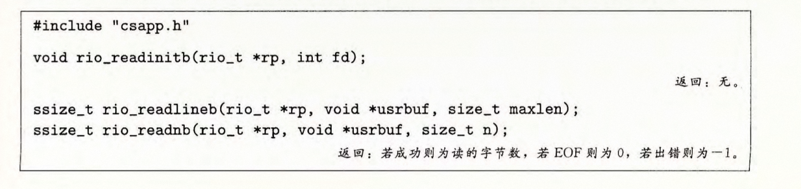

具体实现如下

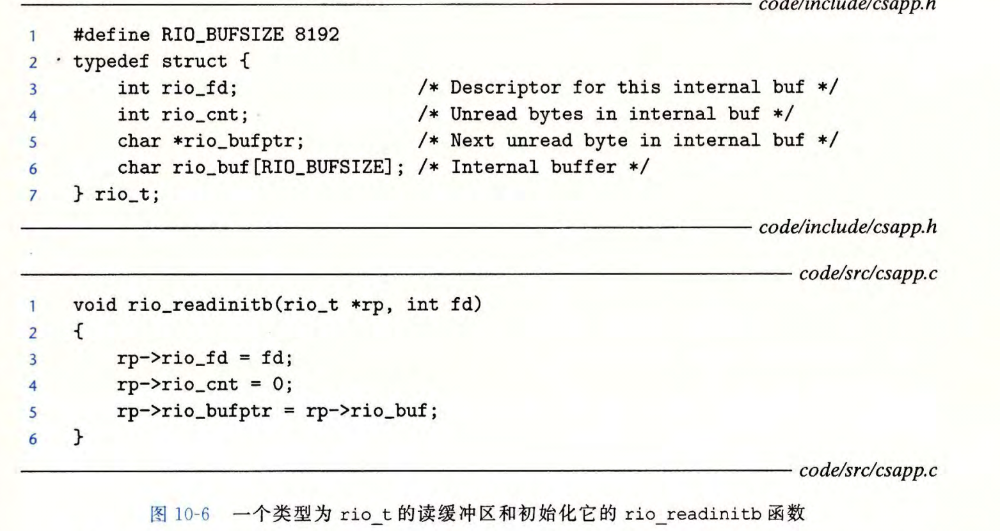

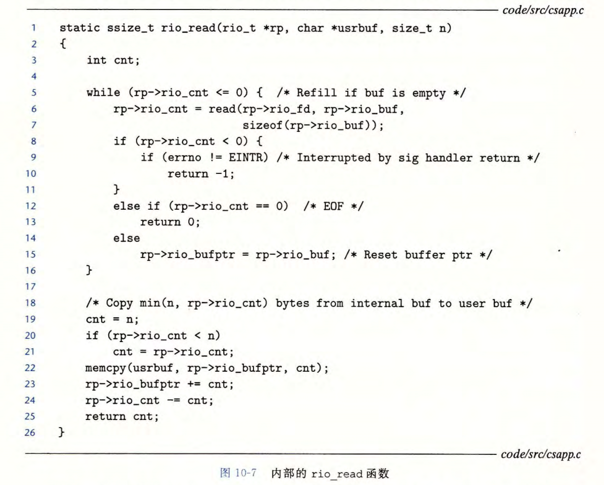

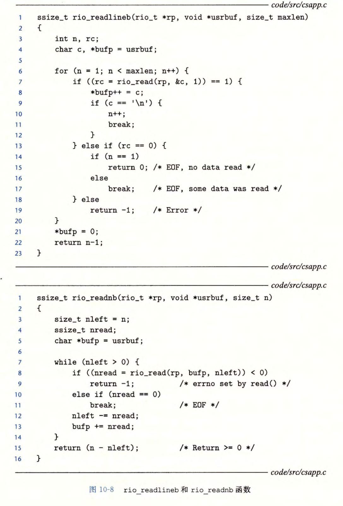

### 读取文件信息

文件的信息，也称为文件的元数据

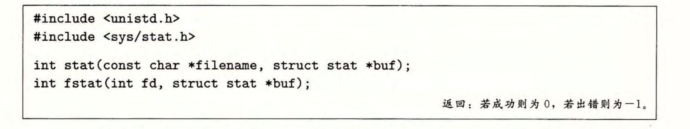

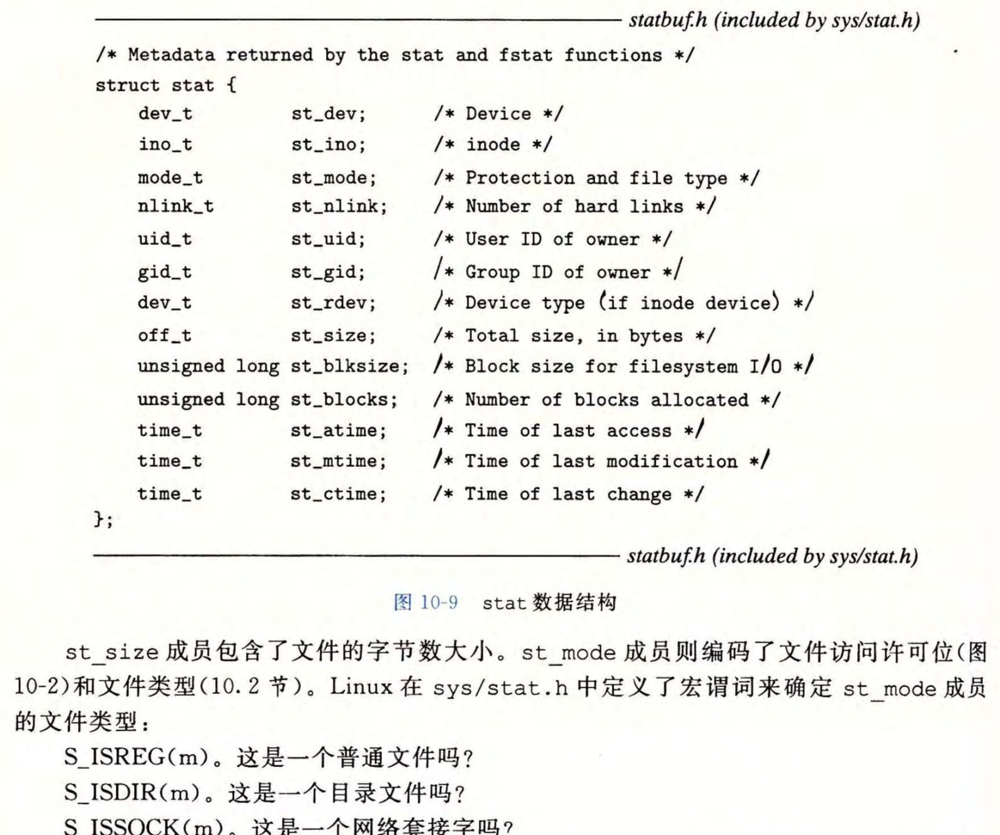

### 目录的读取

使用 `opendir`打开一个目录

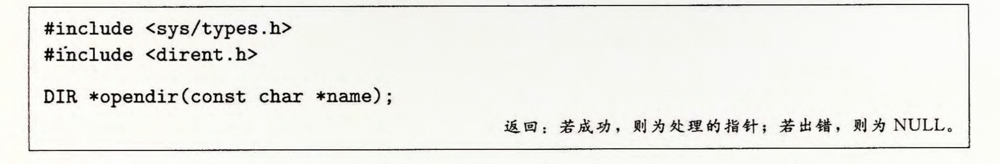

注意`opendir`返回的是一个`DIR *`目录流指针；`readdir`返回的目录项是`struct dirent *`，该结构体定义如下

使用`readdir`读取下一个目录项

使用`closedir`关闭一个目录

### 共享文件

每个进程维护了一个描述符表，每个打开文件的操作与其中描述符相同的表项对应，每个表目都指向了打开文件表的一个表项。打开文件表由所有进程共享，它存储了一个被打开文件的打开次数和位置，并指向由所有进程共享的，存放了当前文件元数据的v-node表的对应表项

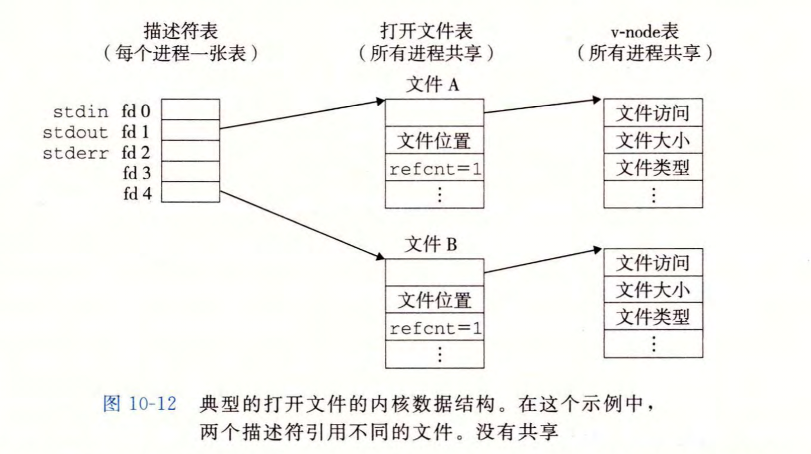

当执行`fork`时，子进程也会复制父进程的描述符表

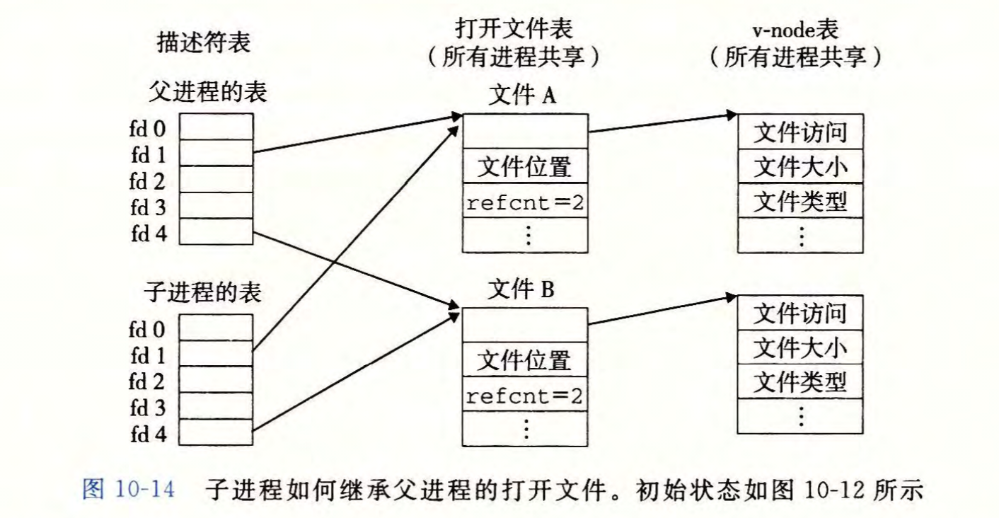

#### I/O重定向

考虑`shell`中的指令`linux> ls > foo.txt`，实现了将`ls`指令的结果标准输出重定向到`foo.txt`中
对应的 `dup2`用户级调用原型如下，实现了`oldfd`描述表表项对`newfd`表项的覆盖

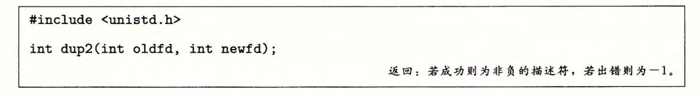

以`dup2(4,1)`为例，实现了对描述符为1的`STDOUT`标准输出的重定向，重定向到了描述符为4的打开操作对应的文件

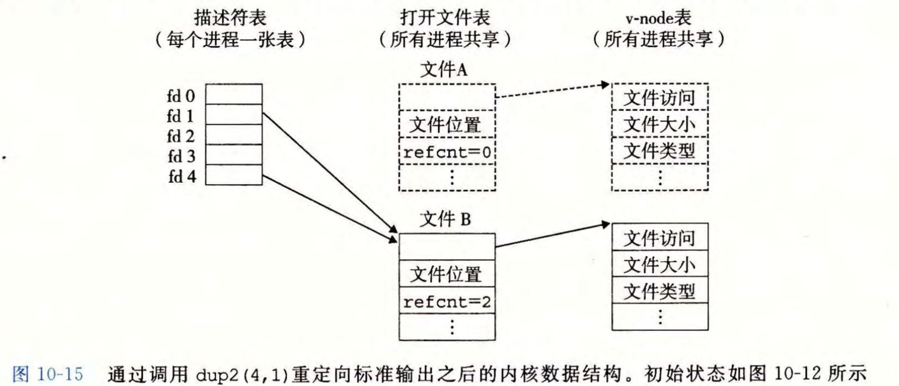

### I/O函数的使用

`C`也提供了被称为**标准I/O库**的高级输入输出函数，通过**FILE**这一类型实现了对文件描述符和流缓冲区的抽象

在大多数情况下，我们会使用标准I/O库；当涉及二进制文件时，不应该使用`scanf`和`rio_readlineb`；当涉及网络编程时，一般需要使用RIO函数

