## 虚拟地址

虚拟地址这一机制为每个进程提供了独立的，私有的地址空间，简化了内存的管理，同时也避免了进程的地址空间被其它进程破坏

### 物理寻址和虚拟寻址

主存(DRAM实现)可以看做一个由$M$个字节组成的数组(不一定连续，中间可能有内存映射I/O区域)，通过数组索引访问内存的方式称为**物理寻址**(故主存也可称物理内存)，一般用于嵌入式

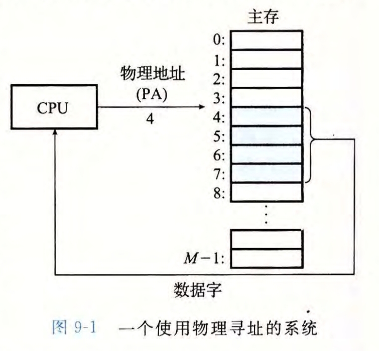

CPU通过生成的虚拟地址，在处理器芯片上通过内存管理单元**MMU**进行地址翻译，得到对应的物理地址，再根据此对主存进行访问，称为**虚拟寻址**

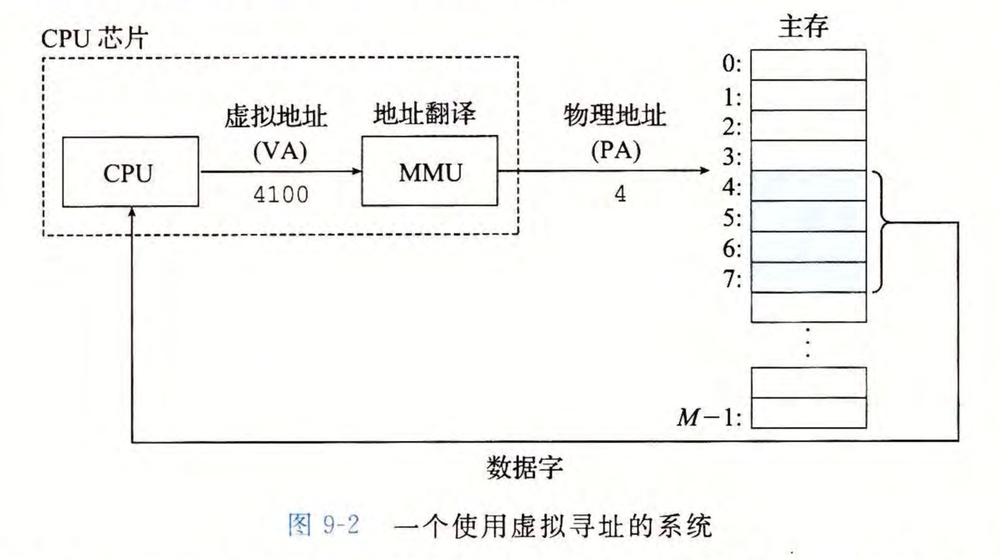

对于一个n位线性地址空间，可以访问的地址为$0$到$2^n-1$
$n$位地址理论上最多表示$2^n$个不同地址；实际CPU支持的虚拟地址位数常小于寄存器位宽。现代操作系统提供的虚拟地址空间通常大于实际物理内存容量

### 虚拟内存与缓存

虚拟内存在实体上并不存在，虚拟地址只是用来访问物理地址的一个抽象值

虚拟内存被分割为虚拟页，每个虚拟页都是固定大小的连续虚拟地址的集合。物理页同理，且每页大小和虚拟页相同，便于实现虚拟页到物理页的映射，将物理页与虚拟页关联起来

通过虚拟内存这一机制，我们得以实现从磁盘到主存的缓存机制
虚拟页中每一页可能有如下三种情况：

1. 未分配的：该页还没有和磁盘上的某部分相关联
2. 未缓存的：该页已经和磁盘上的某部分相关联，但是这些磁盘信息还没有缓存到主存中，所以这一页也没有对应一个物理页
3. 已缓存的：该页已经和磁盘上的某部分相关联，且这些磁盘信息正在主存中，这一页已经对应了一个物理页

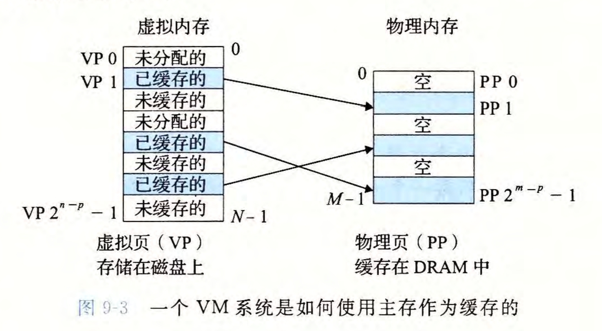

类比SRAM实现的高速缓存，主存也会发生替换，由于主存不命中的惩罚大的多(从磁盘中读取数据特别慢)，主存DRAM是全相连的，使用了更精细的替换算法，同时采用写回而不是直写

#### 物理内存缓存的机制

##### 页表

为了明确某个虚拟页处于以上三种情况的哪一种，我们引入了页表这一数据结构
每个进程都有一个页表，存储在物理内存中，是用来存储**页表条目**(Page Table Entry，**PTE**)的一个数组
对于编号为$k$的虚拟页，编号为$k$的页表条目存储了其状态信息
页表条目存储的信息是一个$(valid，address)$的二元组，其中$valid$为0/1，$address$为一个地址指针
(此处是为了简化，实际$address$存储的是物理页号，下文会提到)
当$valid$为1时，表示对应的虚拟页存储在物理地址为$address$的主存中
当$valid$为0时，若$address$不为$NULL$，则表示对应的虚拟页在磁盘上的起始地址为$address$，否则表示该页还未与磁盘相关联

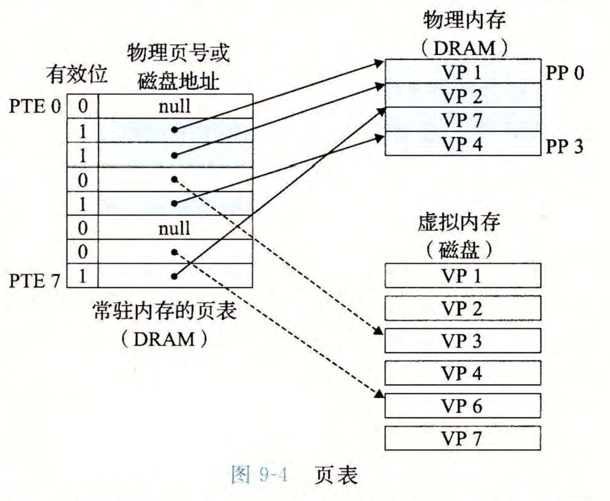

同时，我们可以通过对PTE上增加一些额外的许可位来控制一个进程的访问权限，进而避免了破坏其它进程的地址空间，如添加$SUP$位表示是否只能在内核模式下访问，$READ$，$WRITE$位表示能否进行读写

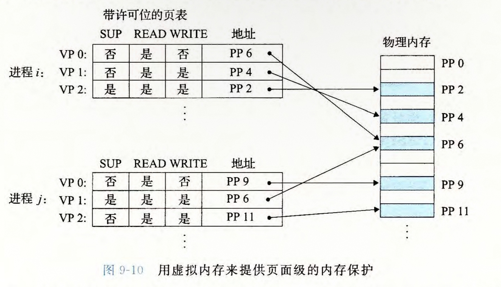

当一条指令违反了这些权限时，就会产生异常控制流，shell将其报告为"段错误"

##### 页命中与缺页

当访问的虚拟页的信息已经存储在物理页中时，对应的PTE的$valid$位为1，$address$位参与构造物理地址，这就称为页命中

当访问的虚拟页不在物理页中时，对应的PTE的$valid$位为0，此时就会产生一个缺页异常，调用内核中的缺页异常处理程序。内核会选择一个牺牲页，若它被修改过则写回磁盘，然后把需要的虚拟页调入某个物理页，并更新相关PTE。此后异常处理程序结束，重新执行触发缺页的指令，若异常处理成功就会产生页命中

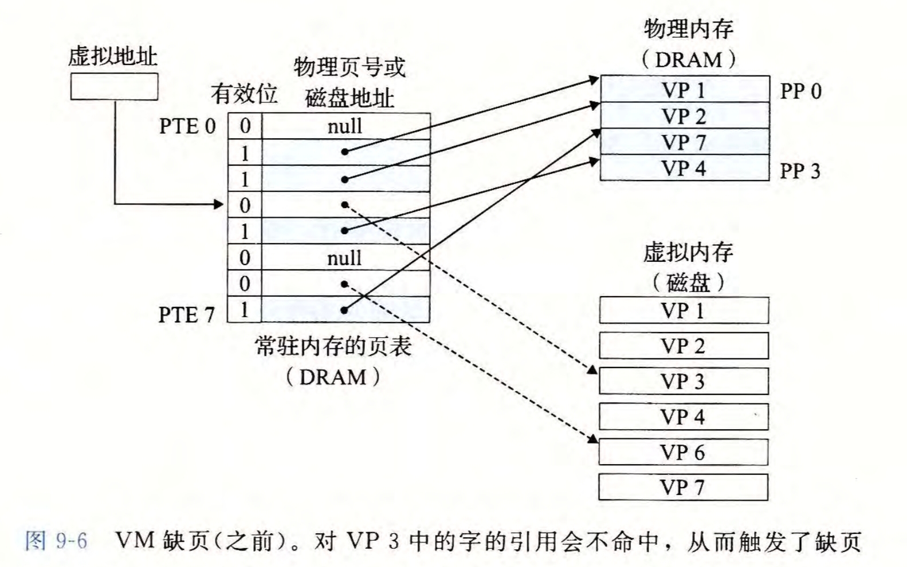

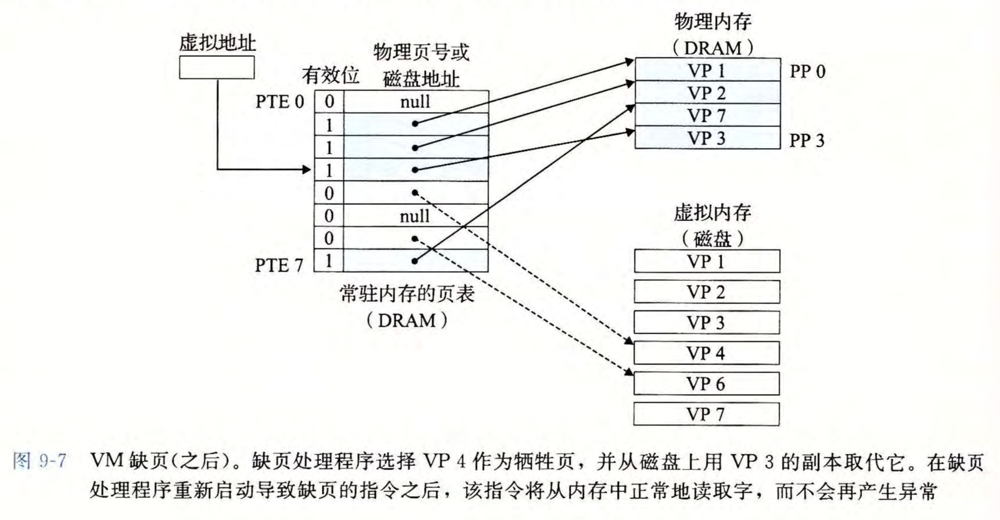

##### 页分配

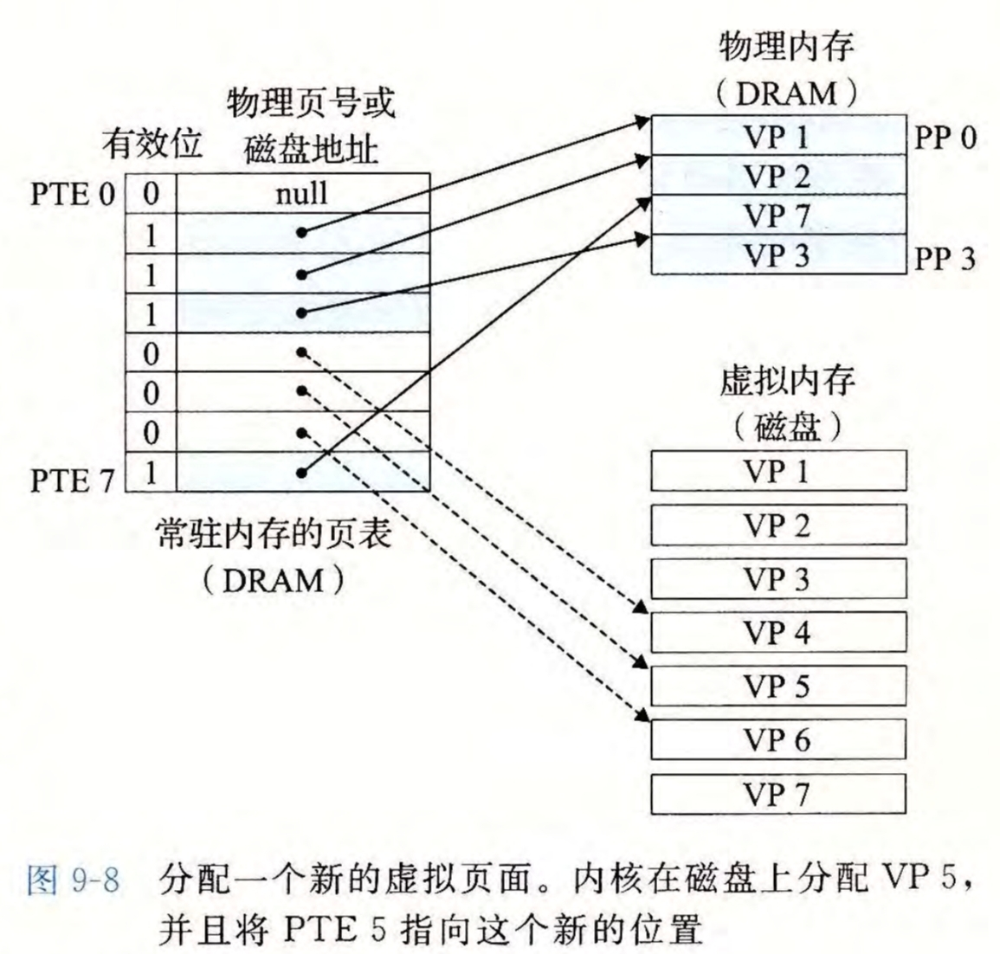

#### 虚拟内存的作用

1. 简化链接：每个目标文件使用的内存格式相同，如数据段都从虚拟地址0x400000开始，这极大简化了链接
2. 简化加载：在一个进程中加载目标文件时，加载器直接为加入的数据段和代码段分配虚拟页，并将其对应PTE设置为未缓存的即可
3. 简化共享：不同进程中的不同虚拟页可以对应相同的物理页，当该物理页是共享库时，就完成了共享，不需要将共享库多次载入到主存中
4. 简化内存分配：当分配空间生成了$k$个连续的虚拟页时，对应的物理页不需要连续，可以分散在物理内存中

### 地址翻译

传入一个虚拟地址后，MMU采用以下的机制进行地址翻译得到物理地址：

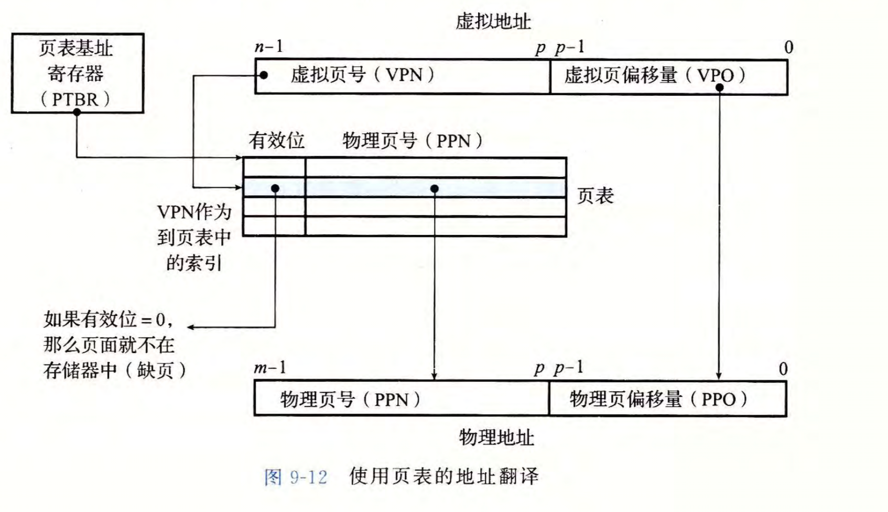

虚拟地址由两部分组成，$p$位的虚拟地址偏移量，和剩下$n-p$位的虚拟页号
虚拟页号表明了这个地址处在第几个虚拟页中，同时也是对应的PTE编号
由于物理页直接对应于一个虚拟页，所以虚拟地址偏移量与物理地址偏移量相同

硬件整体执行的流程如下

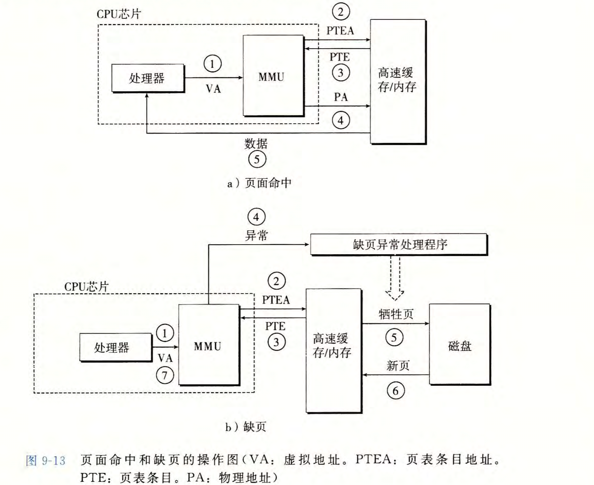

#### TLB加速地址翻译

一次对虚拟地址的访问，需要MMU访问高速缓存得到PTE，构造出物理地址后再次访问高速缓存得到该地址存储的具体值
为了简化得到PTE的过程，进而减少对高速缓存访问造成的开销，MMU内置了一个关于PTE的缓存，翻译后备缓存器(**TLB**)

类比高速缓存，对于一个有$T=2^t$个组的TLB，组索引来自虚拟页号VPN的低$t$位，页内偏移VPO不参与TLB查找；VPN剩下的高位作为标记位进行校验

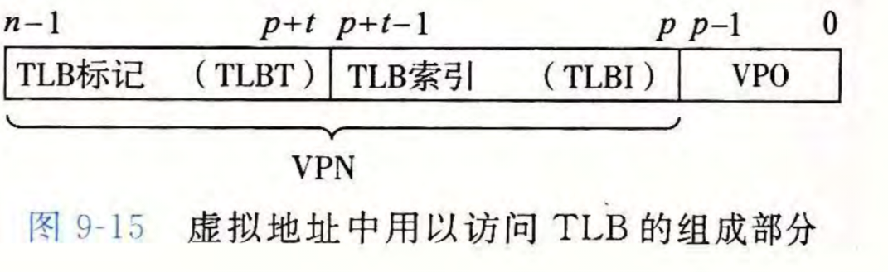

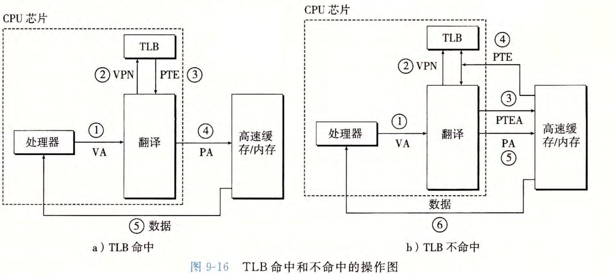

同时，各级高速缓存也可能保存PTE的缓存

#### 多级页表
现代计算机实际上采用的是多级页表的结构，即上一级页表中存储的是下一级页表的地址，最后一级页表存储的才是虚拟页的信息。这样构成的是一种树形结构

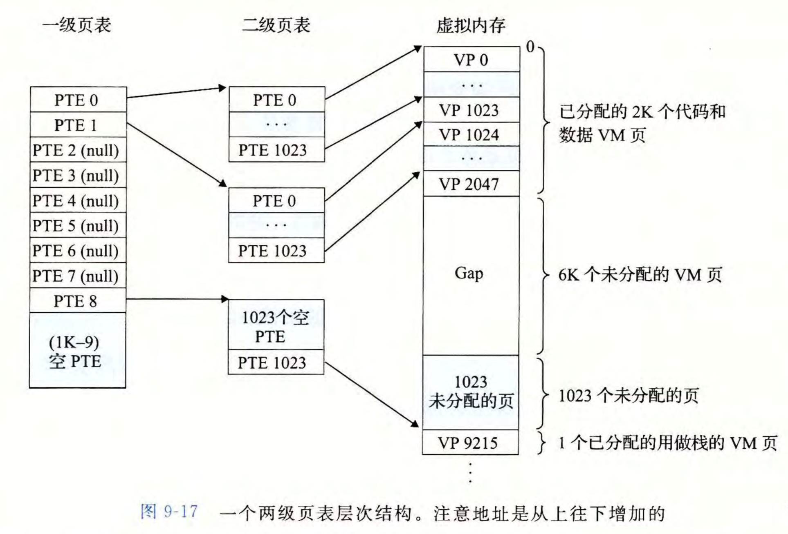

只有当一个页表的下一级至少有一个页是分配了的时候，该页表才非空，会分配空间，这极大节约了空间。TLB会缓存最终的地址翻译结果，因此TLB命中时无需逐级访问页表；但TLB不命中时，多级页表仍可能带来多次内存访问

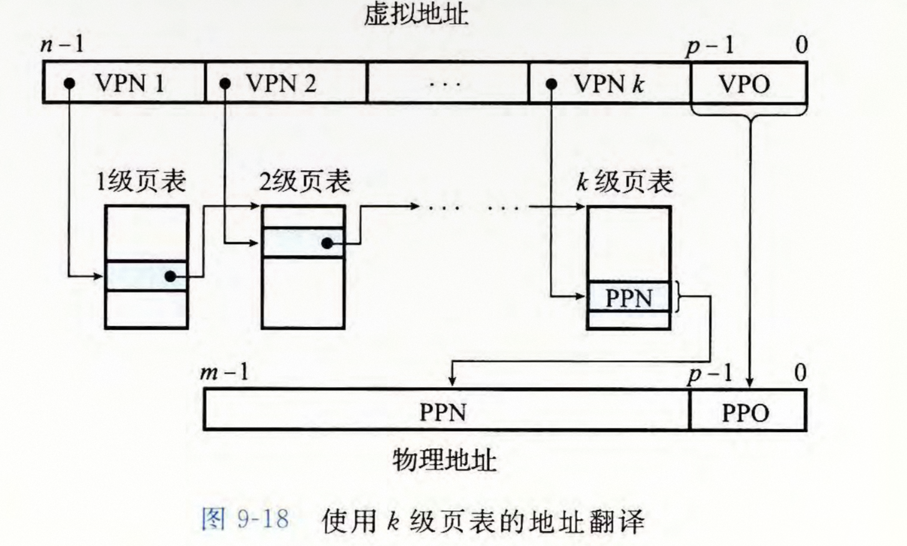

### Intel Core i7/Linux 内存系统

咕咕咕

### 内存映射

通过文件对虚拟内存进行初始化的过程称为内存映射
内存映射分为以下两种：
1. 文件映射：使用来自磁盘的文件对虚拟内存进行初始化
2. 匿名映射：映射不依赖普通磁盘文件，内核按需提供初始化为0的页面，因此也被称为“请求二进制零”的页面

#### 共享对象与私有对象

物理页中的一个对象可以同时被多个进程的虚拟地址使用，分为共享对象和私有对象
共享对象指一个进程对该对象的修改会反映到共享的底层对象或物理页上，并且可以被其它映射该对象的进程看到；私有对象指修改会通过写时复制变为进程私有副本，不会反映到其它进程或原始文件中

共享对象示意如下

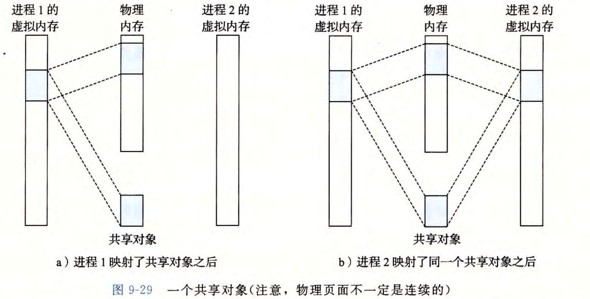

具体实现上，采用了修改PTE，使得不同的虚拟页面指向同一个物理页面，并且这些对应的PTE都有读写权

私有对象示意如下

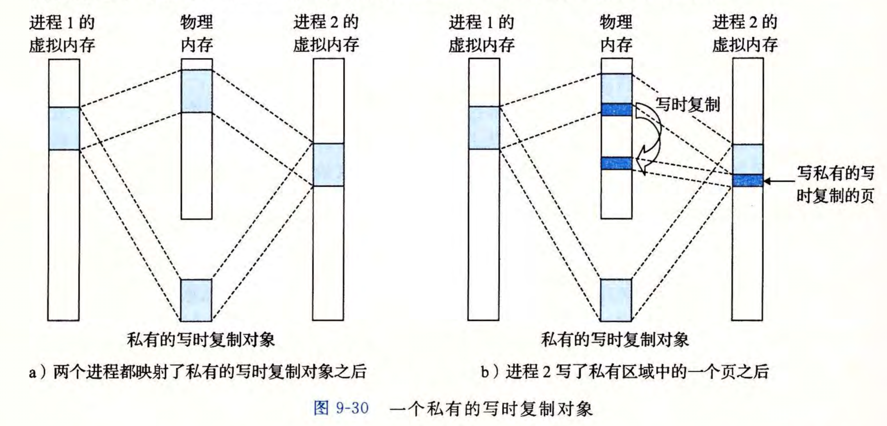

具体而言，私有对象采用了一种“写时复制”(copy-on-write，COW)的机制。在最初不同进程虚拟地址的PTE都指向物理地址中的对象，这些进程对应此对象的PTE上都只有读权限，当一个进程尝试进行写的时候，由于没有写的权力，会触发一个故障处理程序，该故障处理程序将私有对象被访问的物理页拷贝一份在为其新分配的物理空间上，并将该页对应的PTE指向此处，设置读写权。然后再重新执行这个写操作，就能正常执行了。写时复制通过推迟复制操作直到对象被修改，极大节约了物理内存。

#### fork execve 与内存

当执行fork函数时，内核为子进程分配PID，同时将父进程的页表拷贝到子进程中，使它们每个虚拟页指向相同的物理页，然后将PTE权限都设置为只读，采用COW机制即可

当执行execve函数时，先解除原程序在对虚拟空间的映射，使用内存映射将新程序的信息载入虚拟空间，然后将PC跳转到新程序指令起始位置

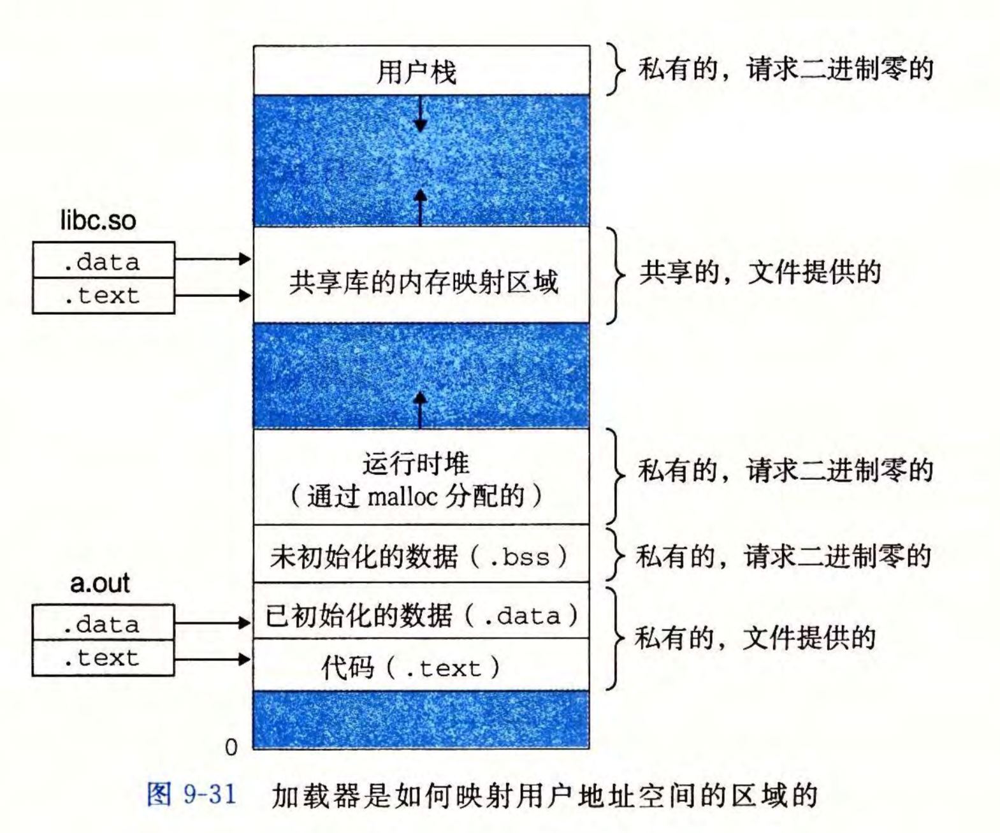

#### 用户级内存映射mmap

mmap函数原型如下，实现了用户级的内存映射

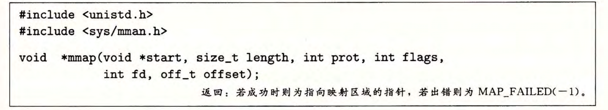

函数中部分参数的意义如下

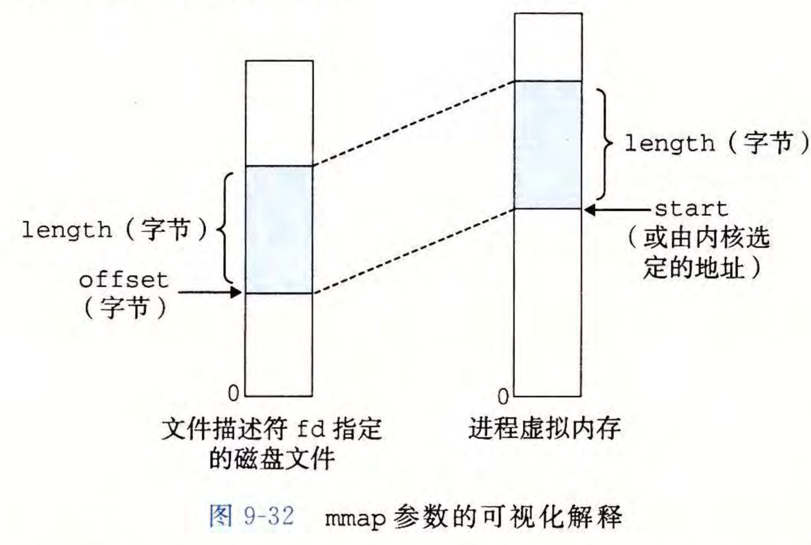

对于剩余的参数prot，该参数指定了虚拟内存的权限访问位，可以为以下几种

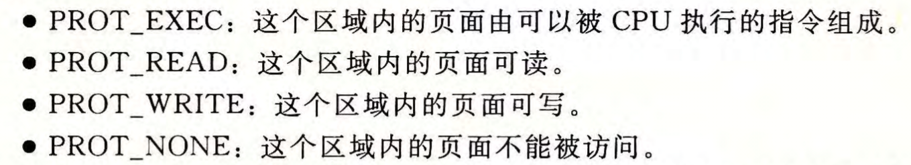

注意，可以将这个常量采用或运算来给予多个权限

对于参数flags，可以为$MAP\_PRIVATE$，$MAP\_SHARED$，$MAP\_ANON$ （此处应该有爱音唐笑嘿嘿嘿），分别表示共享对象，私有对象，匿名映射。匿名映射可以与前两个进行或运算

要想删除虚拟空间的一部分，可以使用$munmap(start, length)$对start为起点的length字节虚拟空间进行删除

### 动态内存分配

动态内存分配器维护了一个进程的虚拟空间，该区域被称为**堆**
堆从.bss区上面向上生长，内核为其维护了一个$brk$指针指向堆顶，堆的大小定义为brk减去堆的起始地址

#### 动态内存分配的用户级函数

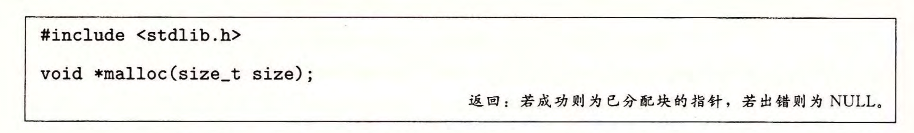

`malloc` 返回一个至少为size字节的内存块的起始地址的void类型指针，由于需要内存对齐，这段内存字节大小可能大于size
当发生错误时(如内存不足)，`malloc`会返回`NULL`，并可能设置`errno`
注意：`malloc` 不会初始化这段内存的值，要初始化为0可以使用`calloc`

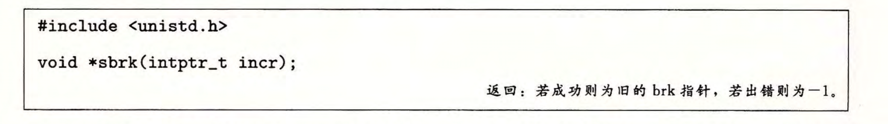

当`incr`为0时，可以得到当前的`brk`指针

注意：`free`的参数必须为`NULL`，或为尚未释放过的`malloc`类函数返回值

#### 动态分配器的基本原则

1. 对于任意一个释放内存操作，此前必须存在对应的分配内存
2. 立即响应，不能延迟操作
3. 不能依赖额外的复杂全局数据结构；分配器维护空闲块所需的数据结构通常存放在堆本身中
4. 进行内存对齐
5. 不对已经分配的内存块进行操作，避免指针失效

动态分配器需要做到效率和效果的平衡
前者用最大吞吐率衡量，即单位时间能完成的分配/释放操作
后者用峰值利用率衡量，具体来说，当前已分配块的有效载荷总和称为**有效载荷**，峰值利用率定义为运行过程中有效载荷峰值与堆大小的比

#### 隐式空闲链表

下文假设内存按照8字节对齐，称1个字为4字节

块的结构如下

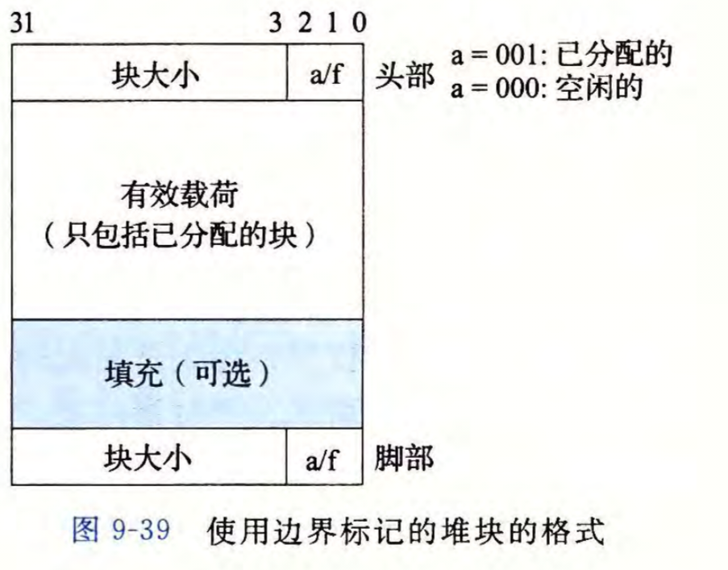

块开头和结尾的头部，脚部是完全相同的，大小都为1个字32位。前29位表示这个块的字节大小(头部与脚部地址的差)，由于内存按8字节对齐，所以大小的后三位一定全为0，所以不需要显式地表示出来，可以用来存储其它的信息，比如这个块是空闲的还是已经被分配的。中间分别为这个块的有效载荷和填充。

通过块头部记录的大小可以跳到下一个块，通过空闲块的脚部可以找到前一个块的大小。这样所有块按内存顺序形成隐式链表；它不同于显式链表，并不在每个块中保存前驱/后继指针

##### 分配内存
介绍以下三种算法：
1. 首次适配：从头开始遍历空闲链表，第一次遇到大小足够的内存块就将其分配到这段内存
2. 下一次适配：从上一次成功适配的位置开始遍历空闲链表，其余步骤同上
3. 最优适配：遍历整个空闲链表，分配到大小足够且最小的那一段内存上

##### 分割空闲块
当直接分配极度不优时，如申请1个字节的空间，但是只有一个114514字节大的空闲块时，就可能会从这个大块中分割出小块用来满足这个申请

##### 合并空闲块
当一个被分配的块被释放时，可能创造连续的空闲块，显然创造的连续空闲块只可能是被释放块与其前后的一共三个块，利用边界标记即可在常数时间内判断并合并相邻空闲块

##### 获取额外的堆内存
当空闲块已经最大程度合并，还是无法满足当前的申请时，分配器调用`sbrk`函数改变堆顶指针，向内核请求新的堆内存，该内存以一个大的空闲块的形式，插入到空闲链表中

#### 显式空闲链表

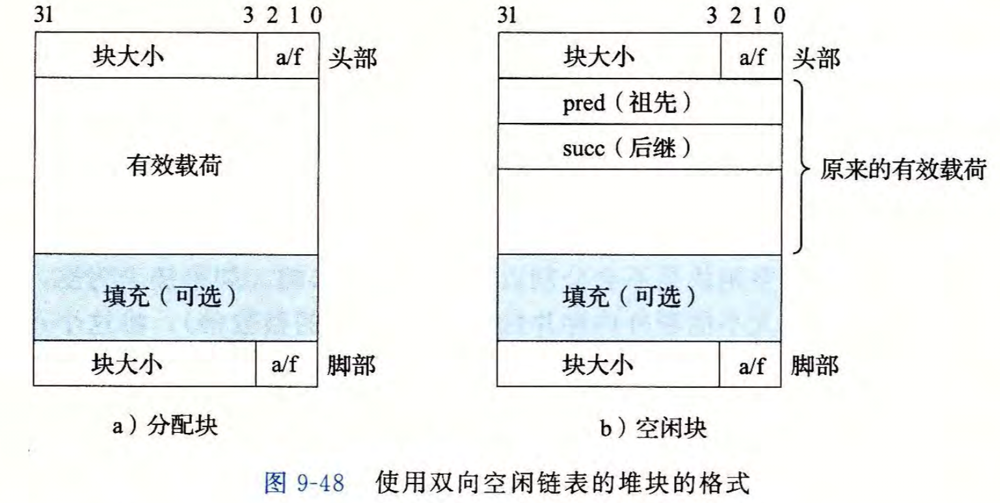

显式空闲链表是对隐式空闲链表的一种优化，空闲块由于为被分配，有效载荷部分为空，可以额外存储信息。于是显式存储了当前空闲块的前一个和后一个空闲块的指针，使得每次寻找空闲块时无需遍历已分配块，降低了时间开销

#### 分离存储技术

可以将使用一个大的链表维护堆改为使用多个小的链表进行维护，将这些链表按照块大小范围分为多个类。当进行分配和释放时，只需优先遍历对应大小类的链表，而非整个链表

分离存储的方法包括简单分离存储，分离适配，伙伴系统等

#### 垃圾收集

当某个被分配的块使用完毕后，可以无需显式地释放内存，而使用垃圾收集器，定期地识别并回收无用的内存，`Java`等语言就是利用该机制释放已经分配的块的

具体而言，当一个内存空间被寄存器，全局变量，用户栈中的变量指向时，这个内存一定需要保持有效。所以我们将后面这些变量看做根节点，已分配块看做是堆节点，当发生a对b的引用时，就连一条a到b的有向边，进而构成了一张有向可达图。所有从根节点出发不可达的堆节点显然就是无用的内存，需要被回收。当malloc找不到空闲块时，就会调用垃圾收集器，从所有根节点出发遍历所有可达的节点并标记，再依次遍历堆，释放所有未被标记的堆节点。然后再次尝试malloc，若还是没有合适的空闲块再尝试向内核获取额外的堆内存

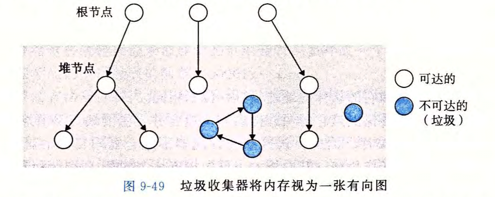

