## 处理器体系结构

### CISC 与 RISC 指令集

CISC：复杂指令计算机 (如x86-64) 
RISC：精简指令计算机 (如RISC-V)

RISC 相较于CISC通常指令数量更少，编码更规整，寻址模式更简单，对机器级程序实现细节可见......
RISC指令集设计简约，便于流水线优化；CISC指令集表达能力强，常能用更少指令完成同样任务，两者各有优势
比较新的CISC处理器也采用了流水线和微操作等结构，外部以CISC作为接口，内部实现会把复杂指令拆成更简单的操作；RISC在嵌入式领域也有广泛应用

### Y86-64

本章使用了一种简化的$x86-64$指令集，同时结合了部分$RISC$的特点，称为$Y86-64$指令集

#### 程序可见状态

程序可见状态对使用汇编语言的程序员和产生机器级代码的编译器都可见
$Y86-64$中，程序可见状态包括15个寄存器，条件码，PC，虚拟内存，以及状态码

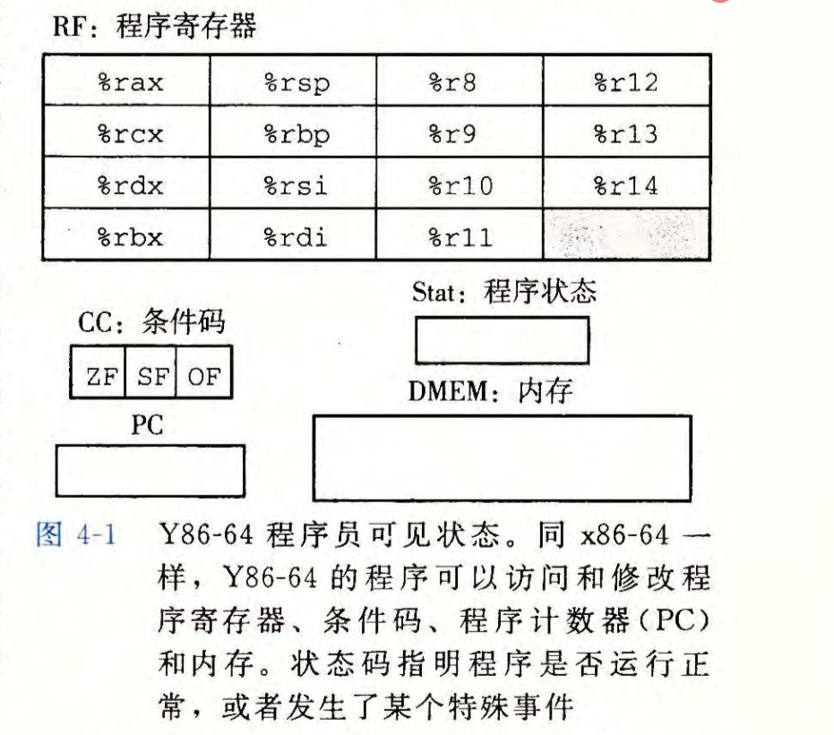

#### 可用指令
$Y86-64$只包含8字节整数操作，指令格式与$x86-64$ AT&T格式类似
`mov` 指令需要两个前缀，为以下之一：`i`立即数，`r`寄存器，`m`内存 这两个前缀分别为源和目的
操作指令`addq subq andq xorq`只能对寄存器进行操作，无法操作内存
跳转指令和条件传送指令与$x86-64$保持一致
`call ret pushq popq`与$x86-64$保持一致
`halt`指令停止处理器的运行，并将状态码设置为`HLT`

#### 指令的编码

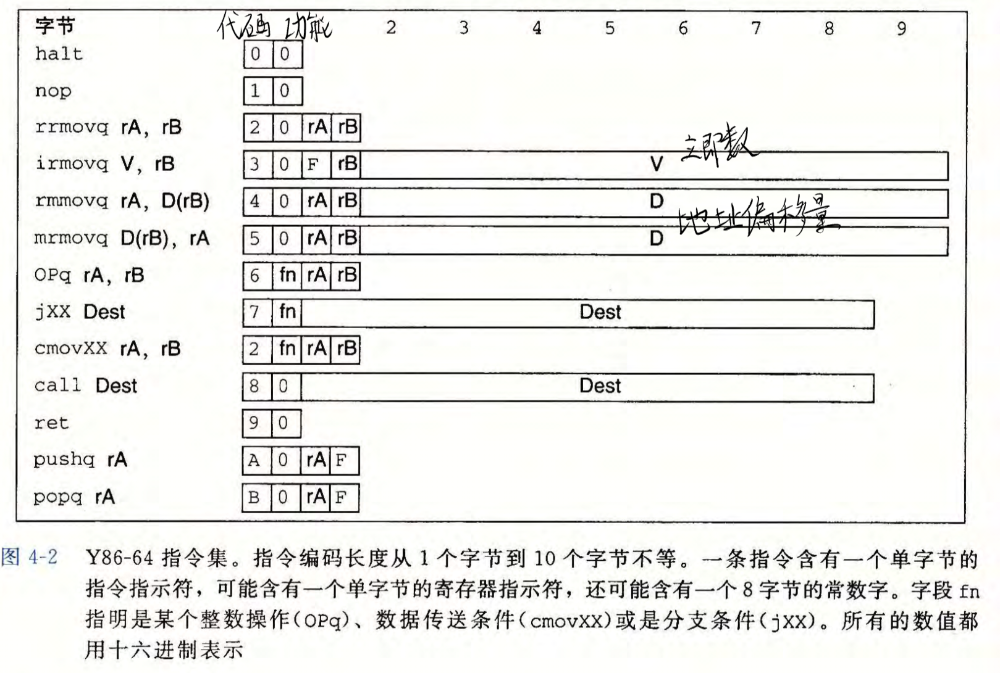

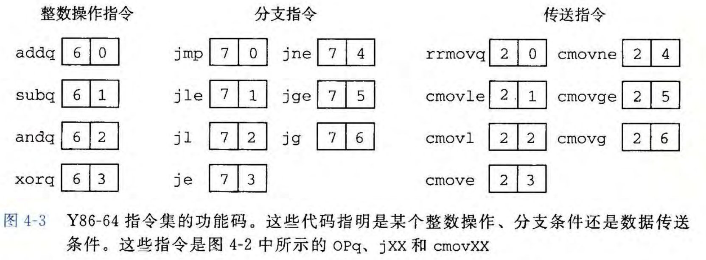

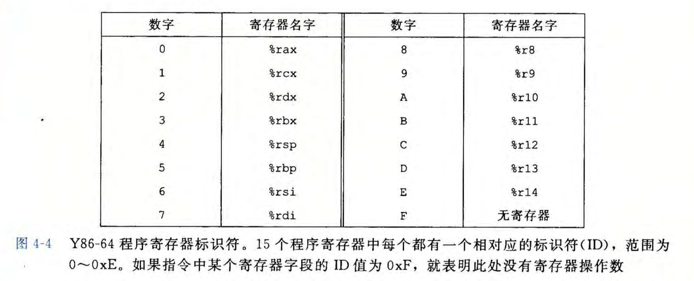

我们以指令 `rmmov %rsp,0x123456789abcd(%rdx)`为例，`rmmov`的指令编码为40，`%rsp %rdx`的编码为42，最后的偏移量字节序列为$000123456789abcd$，注意是小端法，按照字节间反序得到偏移量编码为$cdab896745230100$,进而得到整条指令编码为$4042cdab896745230100$

#### Y86-64指令异常

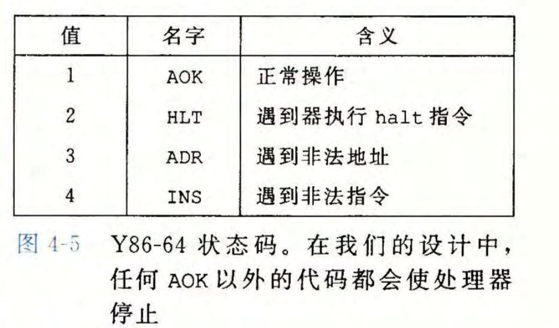

#### Y86-64程序

伪指令：以`.`开头的指令为汇编器伪指令，使得汇编器调整地址，将汇编代码或者数据存放在指定的地址

实例：

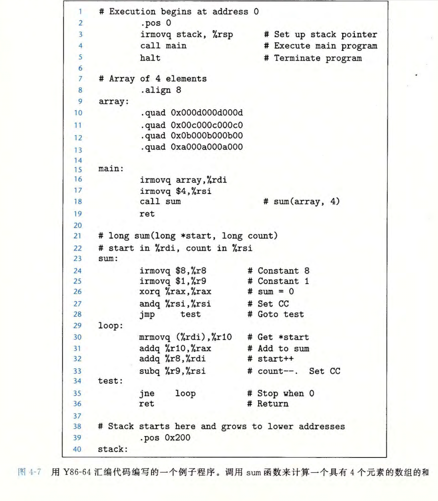

补充：在x86-64和Y86-64语义下，`pushq %rsp`压入的是执行压栈前的栈指针旧值；`popq %rsp`会把旧栈顶处弹出的值写入`%rsp`

### 硬件控制语言HCL
HCL只表达硬件设计的控制部分，不关心硬件的具体实现而是考虑怎样将处理器中的各个部分联系起来，是HDL的一个真子集
[HDL 和 HCL 的对比可以参考本节](/posts/CSAPP/notes/3.architecture/#硬件控制语言hcl)，以下部分会很快带过

#### 逻辑门
逻辑门是活动的，输入变化后输出几乎是立即变化

#### 组合电路
组合电路需要满足以下条件
1. 逻辑门的输入必须连接到主输入，存储器单元输入，另一个逻辑门的输出三者之一
2. 两个或多个逻辑门输出不能连接在一起
3. 构成的网无环
组合电路的输出值会随着输入值变化，而C中的只有在遇到赋值的时候才会变化
MUX函数

#### 字级的组合电路
由多个位级的组合门得到字级的抽象
多路MUX的HCL语法

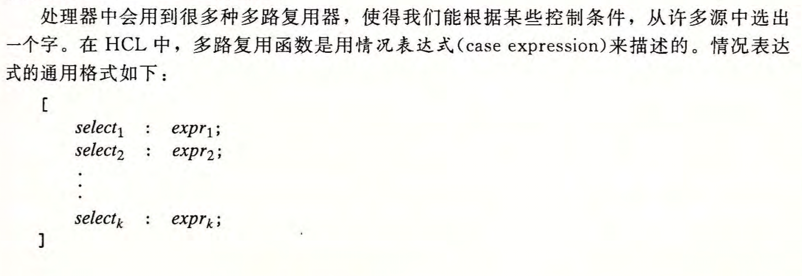

注意：不要求$select_i$之间互斥，即返回的结果是第一个满足$select_i$后面的值

ALU

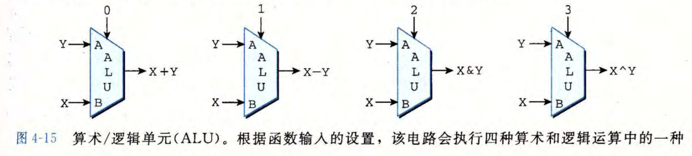

集合关系

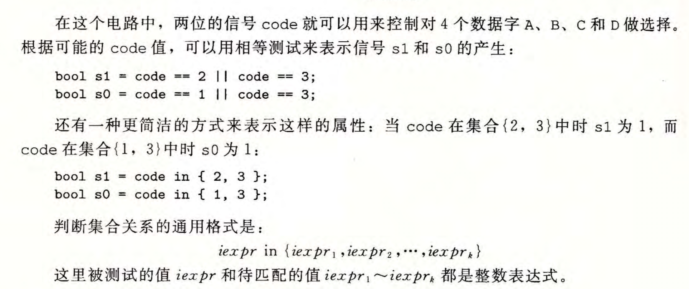

#### 时序逻辑
组合逻辑不存储任何信息，只是对输入信号输出其对应的函数值

而时序电路受到时钟控制，通常在时钟上升沿更新存储器的值
存储器都采用时序逻辑，更具体来说，分为以下两种存储器
1. 随机访问存储器：虚拟内存系统和一组寄存器，存储多个字，采用地址或寄存器标识符进行访问
2. 时钟寄存器：程序计数器，条件码寄存器，状态寄存器，存储单个位或字

#### 存储器的读写

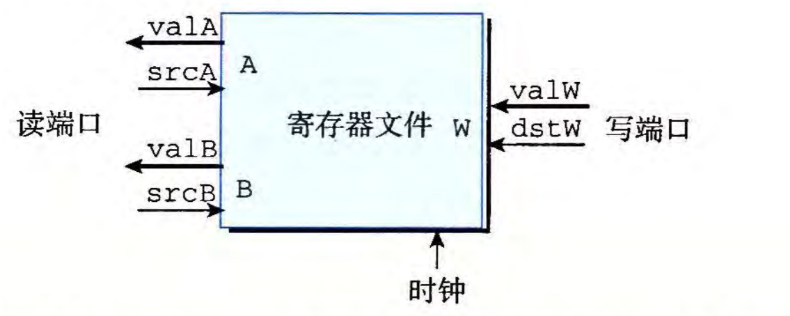

可以通过修改$srcA$或$srcB$为需要读取的寄存器编号，寄存器文件会组合逻辑地从$valA$,$valB$输出相应寄存器的值；写入则在时钟上升沿根据$dest$完成

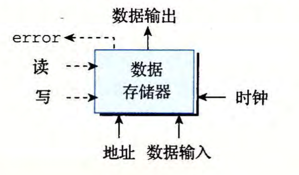

内存的读写也类似：读操作根据地址产生输出值，写操作则在受时钟控制的写入时刻把输入数据写入相应地址

### 指令集的顺序实现
以下以$Y86-64$作为一个简化的模型进行讨论，不考虑流水线化等优化

#### 处理指令的各个阶段
**1. 取指**：根据指令的确定指令的操作与功能，并得到操作需要用到的寄存器以及常数(如果该指令需要用到这些)，同时计算没有跳转的情况下下一条指令$PC$应该指向的地址$valP$(此时的PC加上当前指令的字节长度)
**2.译码**：通过访问寄存器得到相应的值(如果该指令需要用)
**3.执行**：对于计算操作，ALU计算相应的值，并且设置条件码；对于传送指令，计算传送的地址；对于跳转操作，检查条件码是否成立，得到布尔值$Cnd$
**4.访存**：从内存中读出数据或者向内存写入数据
**5.写回**：向寄存器写入数据
**6.更新PC**：若$Cnd$成立，则将PC设置为跳转的地址，否则设置为$valP$

#### Y86-64指令执行的阶段

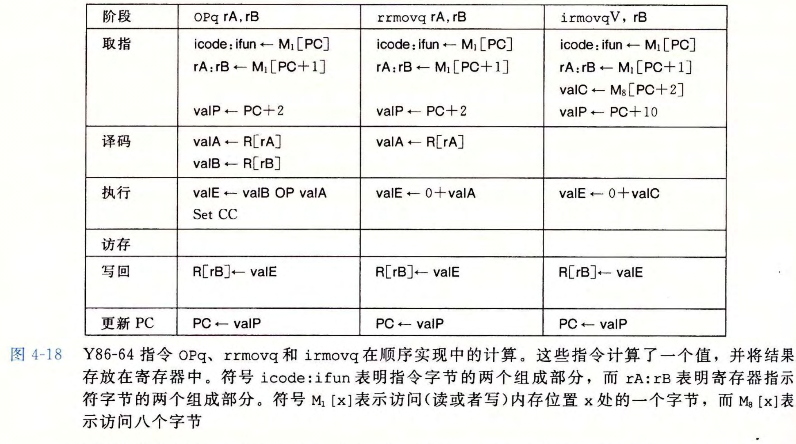

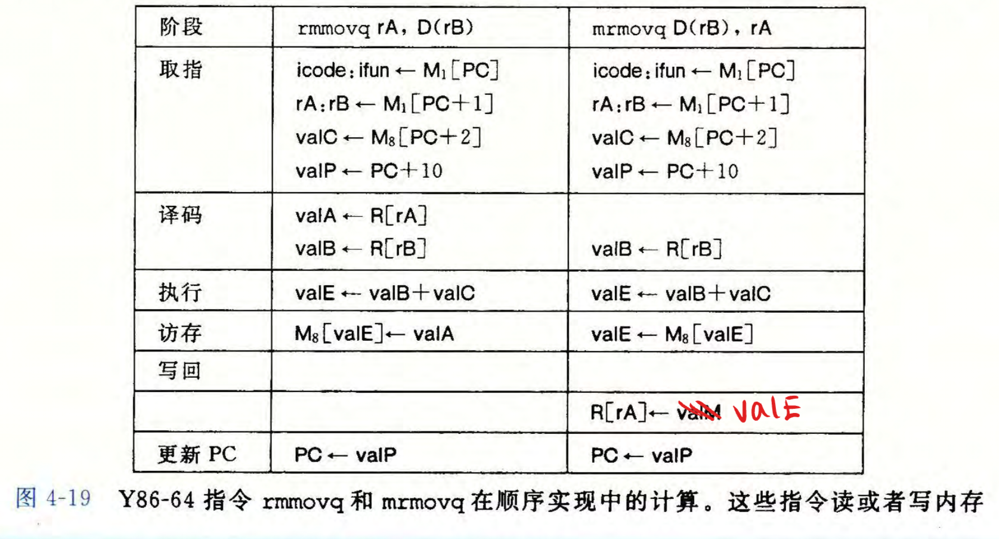

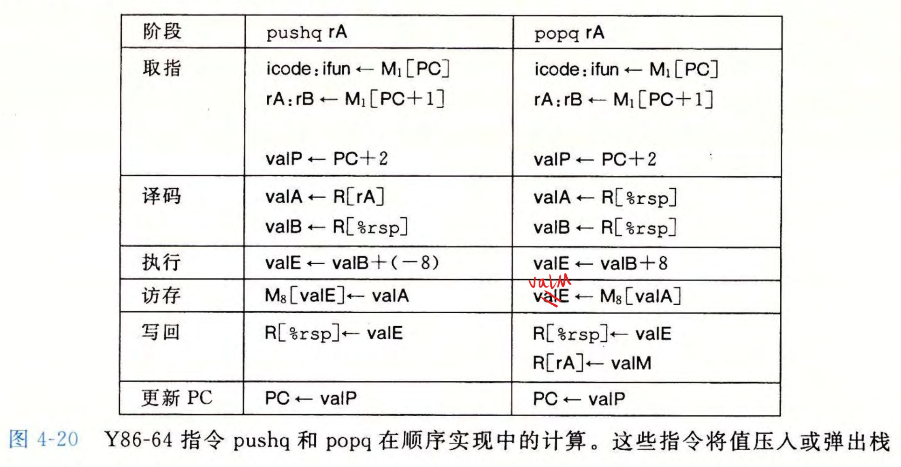

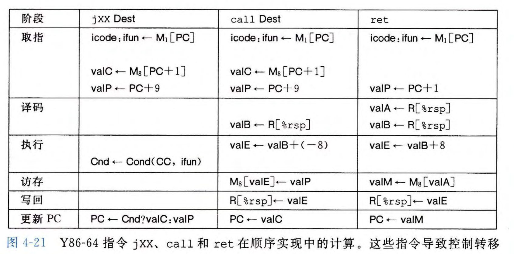

### SEQ 顺序处理器
引入了一种叫做$SEQ$的顺序执行的处理器，每条指令在一个时钟周期内完成

#### SEQ的硬件结构

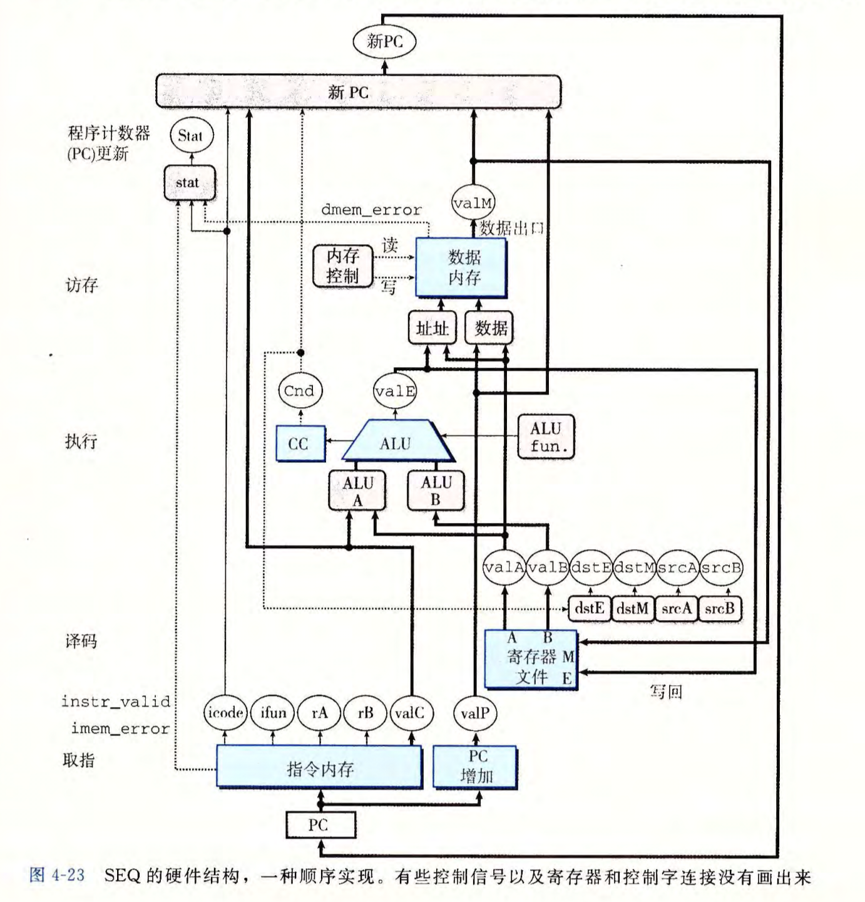

注意：处理器遵循“用不回读”原则，在同一个时钟周期内即不会修改一个存储器后再读取这个存储器的值

#### SEQ的HCL实现

以下是控制逻辑中必须显示使用的常量在HCL中的定义

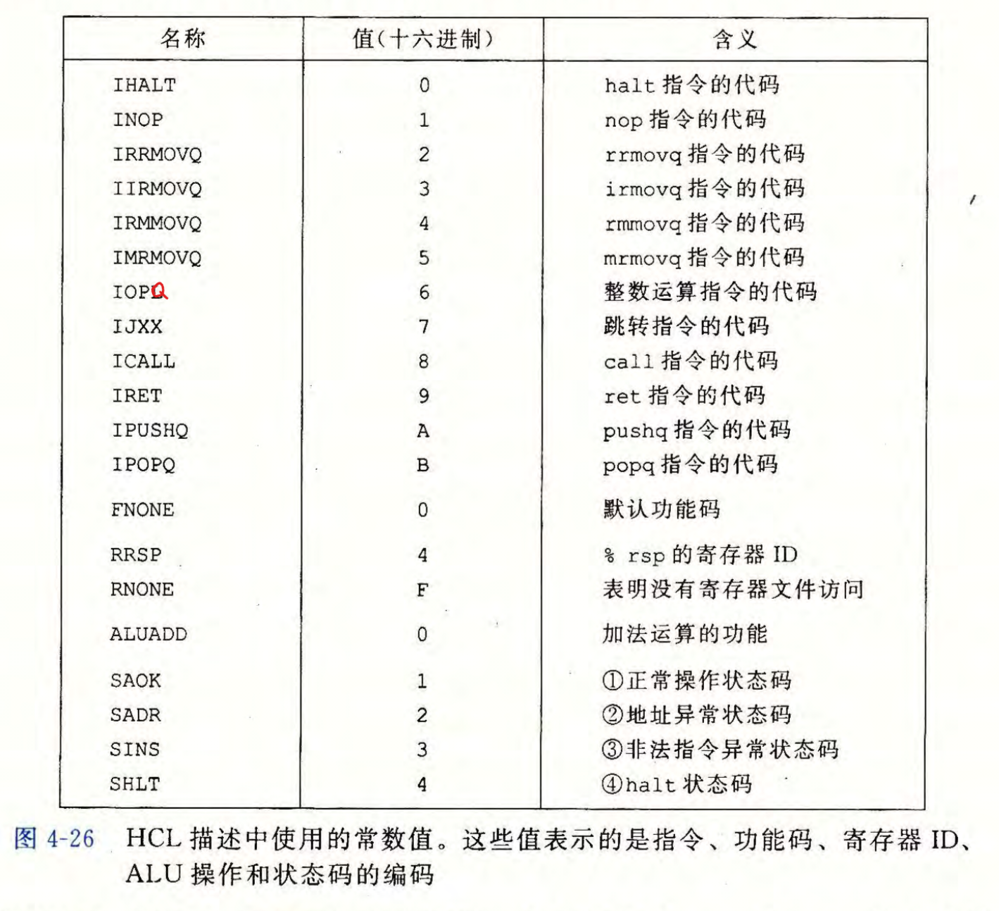

##### 取指阶段

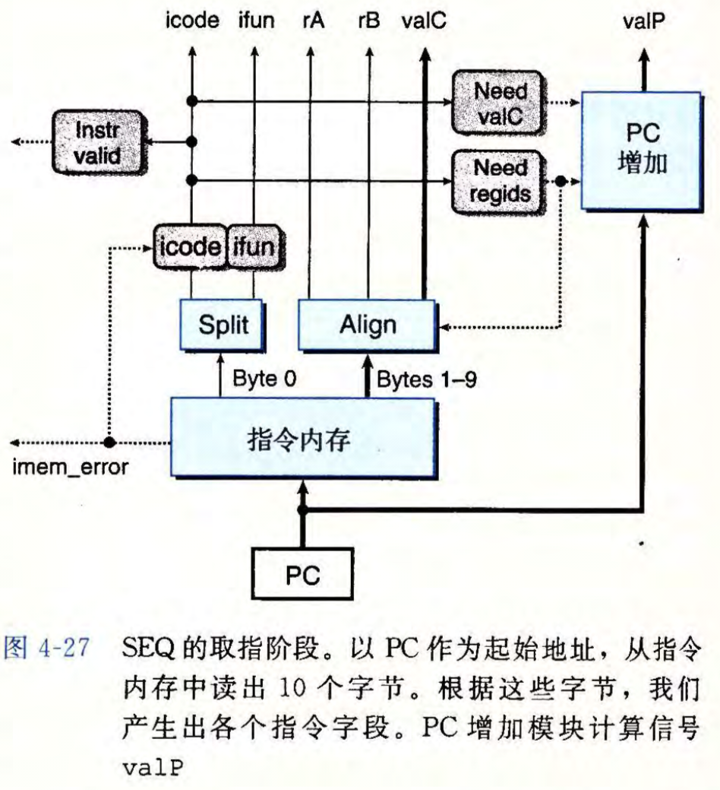

通过指令第一个字节中包含的指令功能，判断得到是否需要读入寄存器和常数($Need\_regids$和$Need\_valC$)
当该指令不合法时(当前指令地址不合法或不存在功能码对应的指令)，会将当前指令设置为$nop$所对应的代码
然后根据$Need\_regids$，若该值为真，将$rA$,$rB$设置为第二个字节的两个四位二进制数，否则设置为$0xF$(空寄存器)
若$Need\_valC$为真，当$Need\_redigs$为真的时候在第3到10个字节取得常数，为假的时候在第2到9个字节取得常数
最后，将$valP$(下一个指令起始地址)设置为$PC+1+Need\_regids+8*Need\_valC$

例：

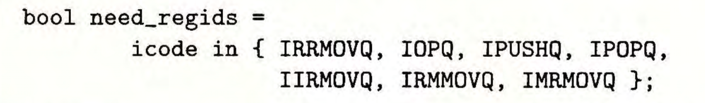

##### 访问寄存器

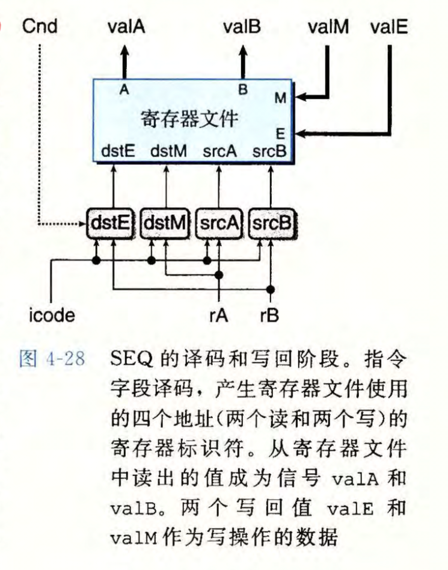

译码，写回两个阶段本质都是对寄存器的访问
通过$srcA$,$srcB$访问相应的寄存器，结果从$valA$,$valB$读出
通过$dstE$,$dstM$进行写入同理
当某个地址访问端口上的值为$0xF$时，则表示不需要读取/写入

例：

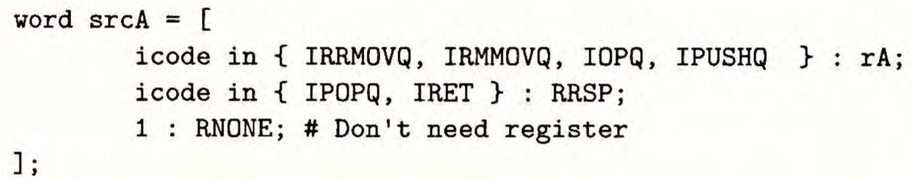

##### 执行阶段

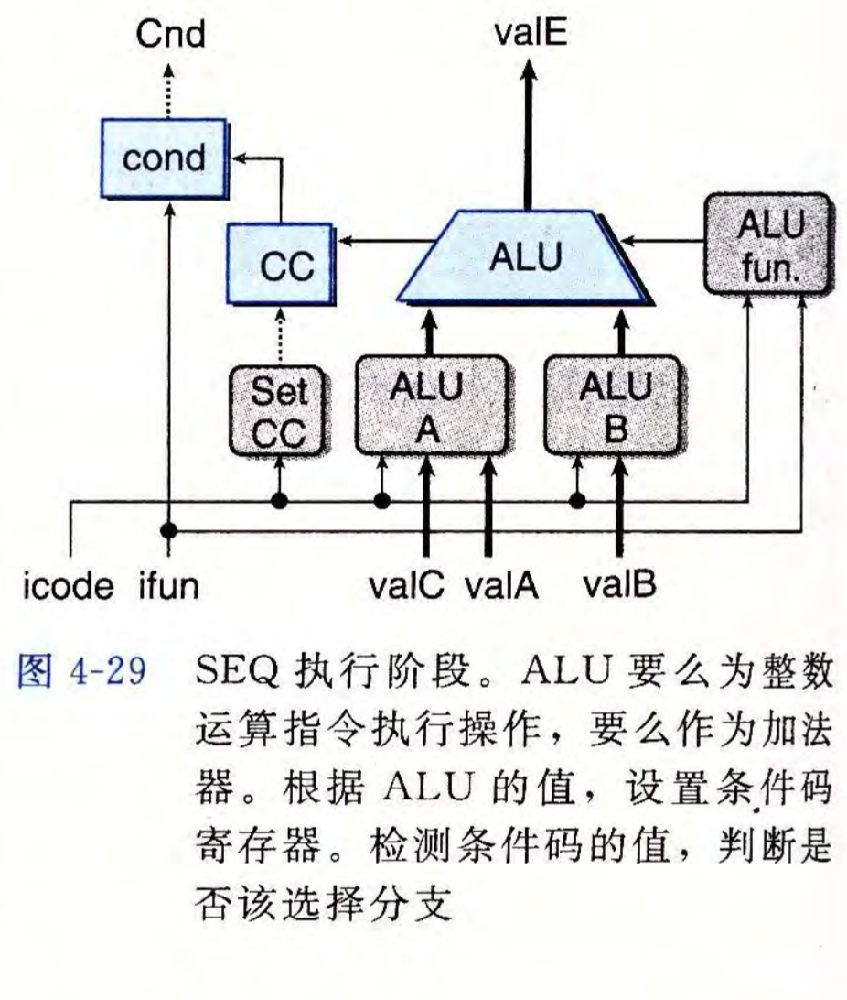

ALU接收三个参数$aluB$,$aluA$,$alufun$，得到结果$valE$并设置条件码
注意当运算为减法时不符合交换律，需要保证得到的结果为$aluB-aluA$，故需要将$aluB$放在前面

例：

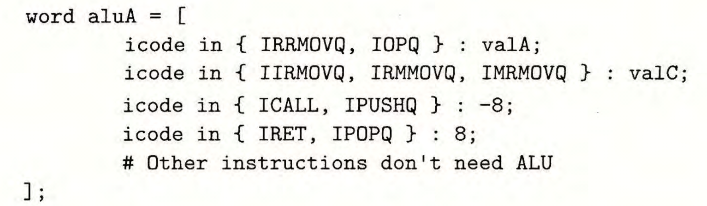

条件码会和指令的功能一同传入黑箱$cond$中，黑箱传出信号决定$Cnd$用于条件跳转和条件传送

##### 访问内存

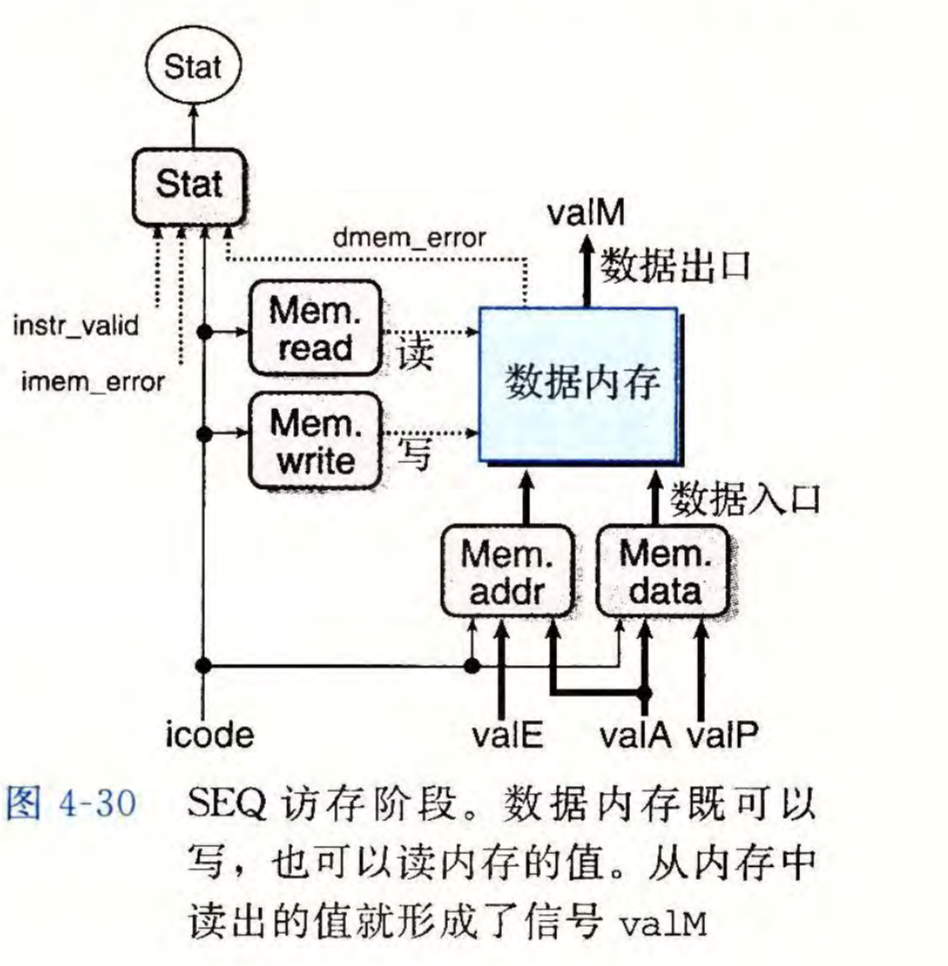

通过$Mem.read$和$Mem.write$控制是写还是读，$Mem.addr$控制读写的地址，$Mem.data$控制写入值，$valM$得到读取值

例：

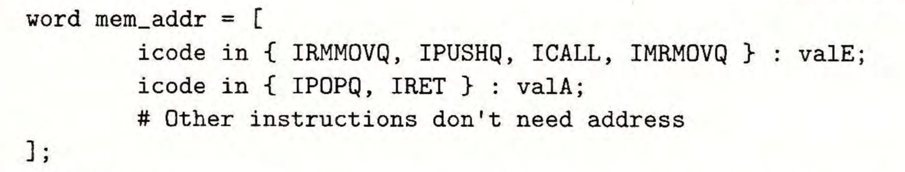

##### 更新PC状态

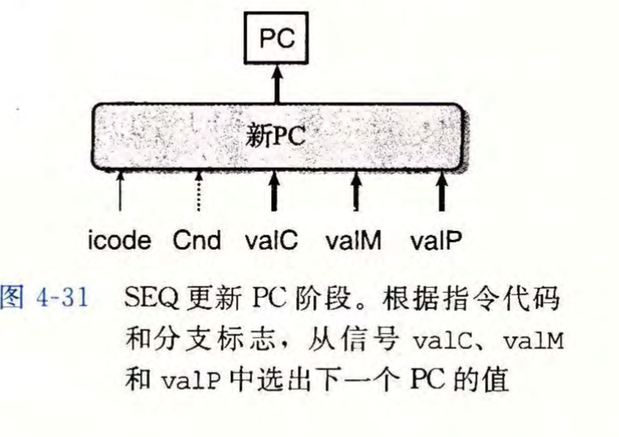

PC可能的新值为顺序下一条指令的地址，使用函数或结束函数跳转到的地址，条件跳转的地址
从这几个地址中选择即可

### 无反馈的流水线系统

在SEQ中，我们必须等待上一条指令按照阶段顺序依次完成，一个时钟周期结束后才能开始处理下一条指令，每个单元只在时钟周期的某一段时间内被使用。
通过流水线化，系统的整体延迟虽然增加，但是吞吐量增大。

#### 流水线基本原理

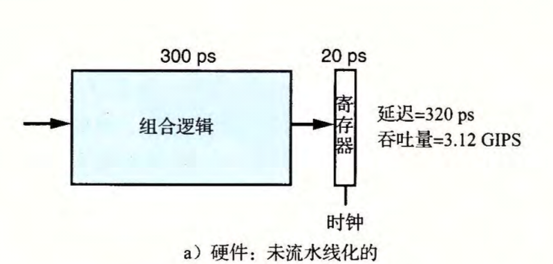

注：$1ps=10^{-12}s$

延迟：一条指令从头到尾运行完毕需要的时间，这个例子中为$20ps+300ps=320ps$
吞吐量：单位时间内能完成的指令数，即 $\frac{\text{完成指令数}}{\text{执行时间}}$，这个例子中为 $\frac{1}{320ps}=3.12GIPS$（GIPS: 每秒十亿条指令）

流水化后：

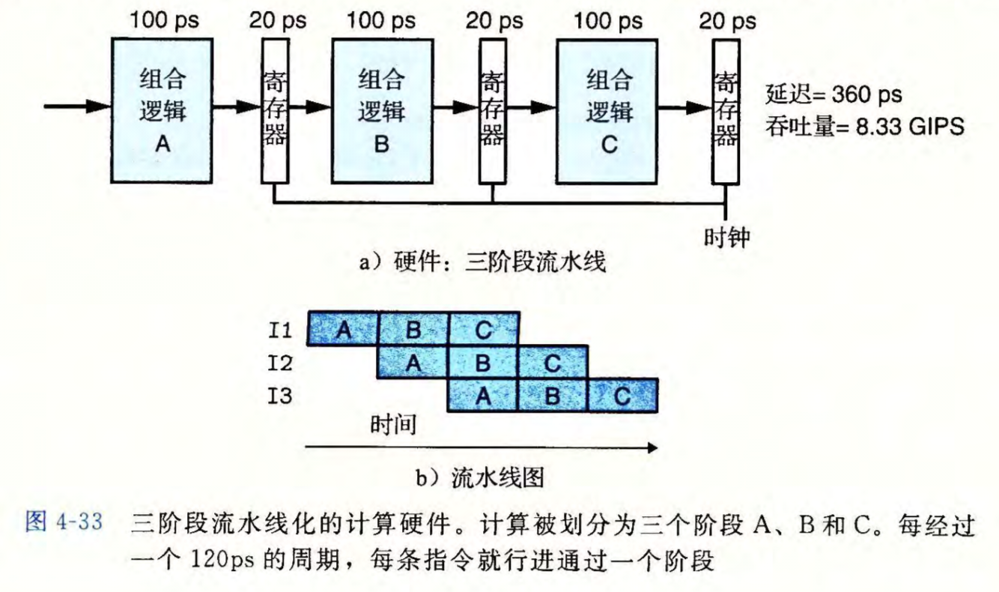

将组合逻辑拆解为几个子阶段，并引入寄存器保存每个子阶段的结果
为了保证电位上升时，所有子阶段的结果都已经计算完毕，能够写入寄存器中，时钟周期需要取子阶段耗时的最大值
每过一个时钟周期，相关数据从寄存器中读取并进入到下一个子阶段，同时在第一阶段加入新的指令，在最后一阶段结束流水线中最早的一条指令
流水化后，因为引入了寄存器，增大了时钟周期，使得执行一条指令的延迟增加了；但是由于能够同时执行多条指令，吞吐量增加了
以该图为例子，时钟周期变为$\max\{100+20,100+20,100+20\}=120ps$，延迟为$120ps\times3=360ps$，吞吐量为$\frac{1}{\text{时钟周期}}=\frac{1}{120ps}=8.33GIPS$

#### 流水线加速的限制因素

 1. 子阶段划分不一致：时钟周期由最慢的子阶段延迟决定，而部分硬件单元，如$ALU$和内存无法划分成更小的部分
 2. 流水线过深：流水线子阶段划分过多，此时寄存器开销是决定性因素，吞吐量提升很小，总延迟反而增加比较多，同时也增大了预测错误，数据冒险的惩罚

#### 五级流水线的实现

以下简称流水线的五个阶段分别为F(Fetch)，D(Decode)，E(Execute)，M(Memory)，W(Write)

##### PC计算阶段提前进行

PC计算阶段并入取指阶段中，影响PC更新的寄存器来自前一个周期产生的控制信号，使得能够立即得到下一条指令的地址，以便其加入流水线

##### 插入流水线寄存器

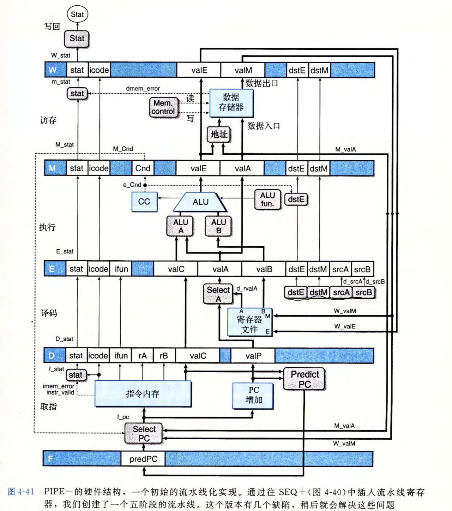

通过插入流水线寄存器保存流水线各阶段之间的信息，使得其得以自底向上流动

##### PC的预测

当目前取指的指令为条件跳转或`ret`时，必须在访存\执行阶段才能得到跳转指令的地址，处理器通过预测下一个PC值保证流水线尽量被填满
对于条件跳转操作，处理器使用分支预测，例如按照总是选择或从不选择来填充流水线，一种简单而比较有效的预测逻辑是“反向选择，正向不选择”，即向更低地址的跳转预测为真，向更高的预测为假，因为循环的汇编表示都是条件成立时向更小的地址跳转，而循环一般会执行多次，预测只有最后一次才会出错
对于`ret`操作，简化的Y86-64流水线通常需要暂停取指，直到返回地址从栈中读出；真实处理器常用返回地址栈预测`ret`目标，预测通常相当准确，除非返回地址栈失配或溢出

### 带反馈的流水线系统

#### 流水线冒险

数据冒险：此后的指令会用到当前指令相关的数据，而这个数据还未写入内存/寄存器中导致后续使用了错误的数据
控制冒险：执行跳转，引用，返回等指令时，PC预测可能出现错误

#### 避免数据冒险

##### 暂停
当下一步继续进行会产生数据冒险时，处理器会动态加入气泡(作用类似`nop`指令)，来将后续受影响的指令停止在取指阶段，直到最深的一条指令通过写回阶段再继续进行

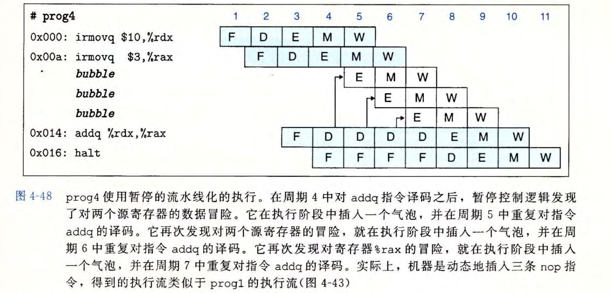

##### 转发

在基本的硬件结构中增加一些额外的数据连接和控制逻辑，使得更深的指令得以在数据已经计算完毕但还未来得及写入的情况下，直接将该数据写入受影响的指令的流水线寄存器中，避免了指令的停止

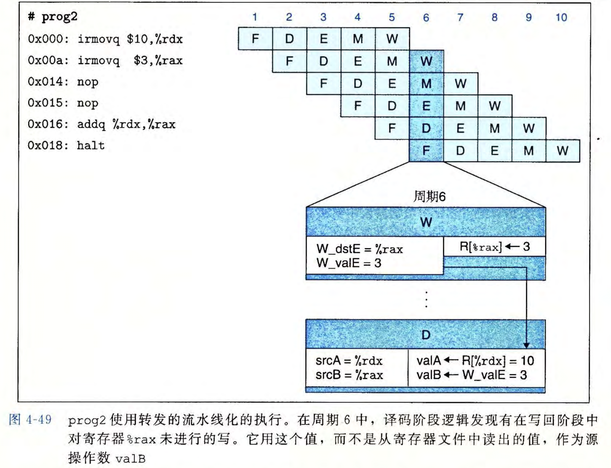

##### 转发与暂停的结合
当更深指令尚未得到与后面受影响的指令相关的数据时(如读取内存的值写入寄存器，直到M阶段才能得到该数据)，处理器会动态产生气泡，直到得到该数据，能够进行转发

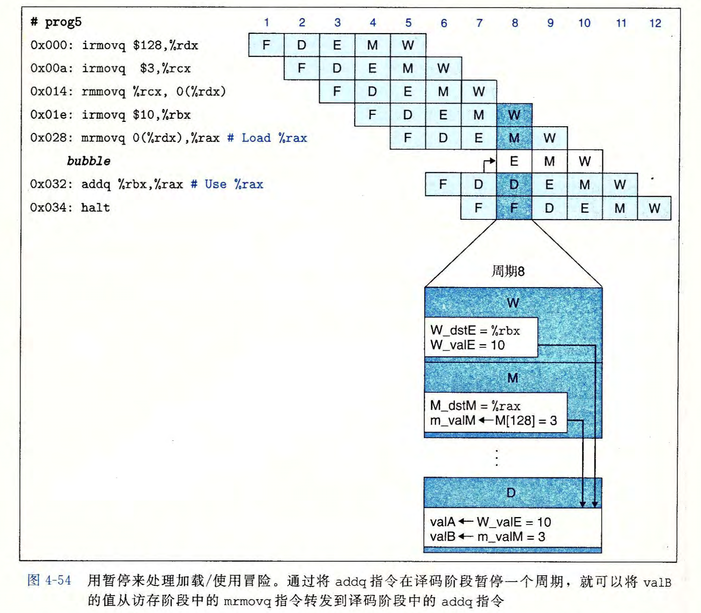

#### 避免控制冒险

当跳转指令已经执行完F和D阶段，在E阶段发现预测出错，此时后面两条指令分别在D和F阶段，未对任何程序员可见状态进行修改，只需要在下一个时钟周期时向D和E阶段插入气泡，同时取出正确跳转地址的指令，就能从流水线中排除这两条错误指令

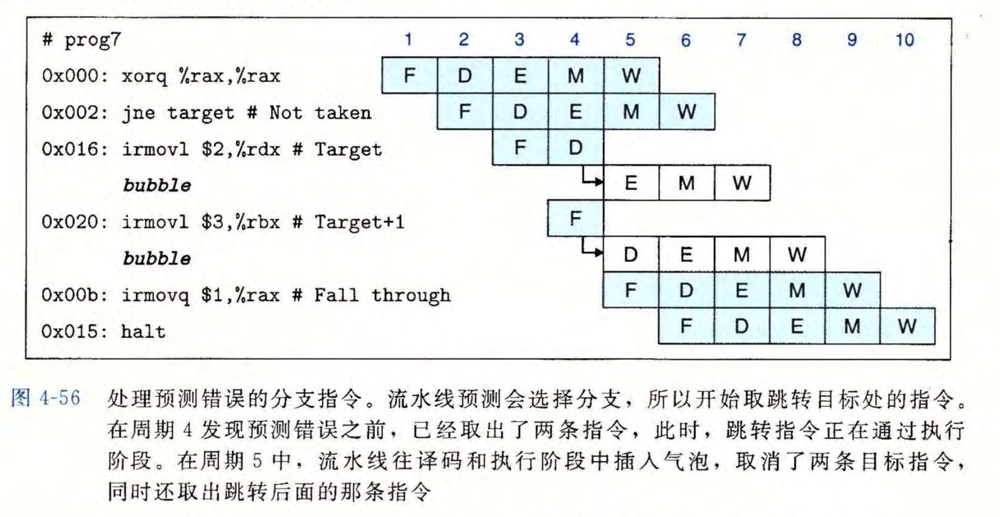

#### 异常处理
可能存在以下三种内部异常情况：`halt`指令，指令异常，地址异常。在产生异常时，最流水线深的一条指令(对应源汇编代码中靠前的指令)的异常会被报告到状态码中，在异常状态下，寄存器和内存被禁止更新，导致异常的指令继续沿着流水线传播，直到写回阶段，流水线控制逻辑发现异常并停止执行

### 流水线的HCL实现
咕咕咕

### 流水线的性能分析

我们用$CPI$即执行每条指令所需时钟周期衡量流水线的性能
当执行的指令足够多时，我们可以忽略启动指令经过流水线的周期，此时执行的指令数$C_i$与气泡数$C_b$之和近似等于消耗的时钟周期
所以有$CPI=\frac{C_i+C_b}{C_i}=1.0+\frac{C_b}{C_i}$，其中$\frac{C_b}{C_i}$是平均每条指令插入的气泡数，受到加载处罚，预测错误分支处罚，返回处罚影响，其中预测错误分支处罚为主要因素
比较新的处理器支持超标量操作和乱序执行技术，可以使得$CPI$小于1.0

