## 程序的机器级表示

### 编译过程
以GCC编译C语言为例
linux> `gcc -Og -o hello hello.c`
(-Og 优化等级低，避免机器代码严重变形，便于进行调试)

1. 预处理：将预处理指令进行替换 (头文件包含，宏展开，条件编译`#if #ifdef #endif...`)，删除注释，得到处理后的`.i`C代码
2. 编译：将`.i`文件进行编译得到`.s`汇编语言文件
3. 汇编：将`.s`翻译成机器指令，得到二进制文件 (windows下`.obj` linux下`.o`)
4. 链接：将`.o`文件和所需要的库文件组合在一起(头文件的函数在预处理中只声明，链接定位函数的具体实现)，生成可执行文件

linux> `gcc -Og -S hello.c` 产生一个汇编文件 `hello.s`
linux> `gcc -Og -c hello.c` 产生二进制文件`hello.o`
linux> `objdump -d hello.o` 实现反汇编

### 机器级代码概述
*指令集架构(ISA Instruction Set Architecture)* 定义机器级代码的格式和行为，虽然指令在ISA层面被描述为顺序执行，但现代处理器采用流水线、乱序执行等技术实现并发执行，最终结果与顺序执行一致
x86系列：`8086`(16位架构) $\rightarrow$ `IA-32` (32位架构) $\rightarrow$ `x86-64`(64位架构)
机器级程序看到的是字节级虚拟地址空间，操作系统和硬件负责将虚拟地址翻译成对应的物理地址
一条机器代码一般只执行非常基本的操作，如寄存器中两个数相加，存储器与寄存器之间传送数据，条件分支转移到新的指令地址等

汇编代码格式：`AT&T`与`Intel`
1. Intel 代码省略了指示大小的后缀:`movq` $\rightarrow$ `mov`
2. Intel 代码省略寄存器前面的"%":`%rax` $\rightarrow$ `rax`
3. Intel 代码描述内存的方式不同:`(%rax)` $\rightarrow$ `QWORD PTR [rax]`
4. Intel 与 AT&T列出操作数的顺序相反: `movq %rax, %rbx` $\rightarrow$ `mov rbx, rax`

**本文采用x86-64 AT&T格式**

机器代码的优势：性能优化，访问硬件特性(PC,寄存器)，更难逆向分析

### 数据的传输
#### 数据格式
最初的架构为16位，所以Intel用 **字(word)** 表示16位，32位为**双字(double words/long word)**，64位为**四字(quad words)**


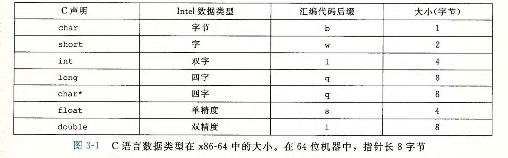


GCC生成的部分汇编代码指令都带有一个字符后缀表示操作的大小，如`movl`表示传送双字

#### 信息访问
x86-64 CPU 中含有16个通用寄存器


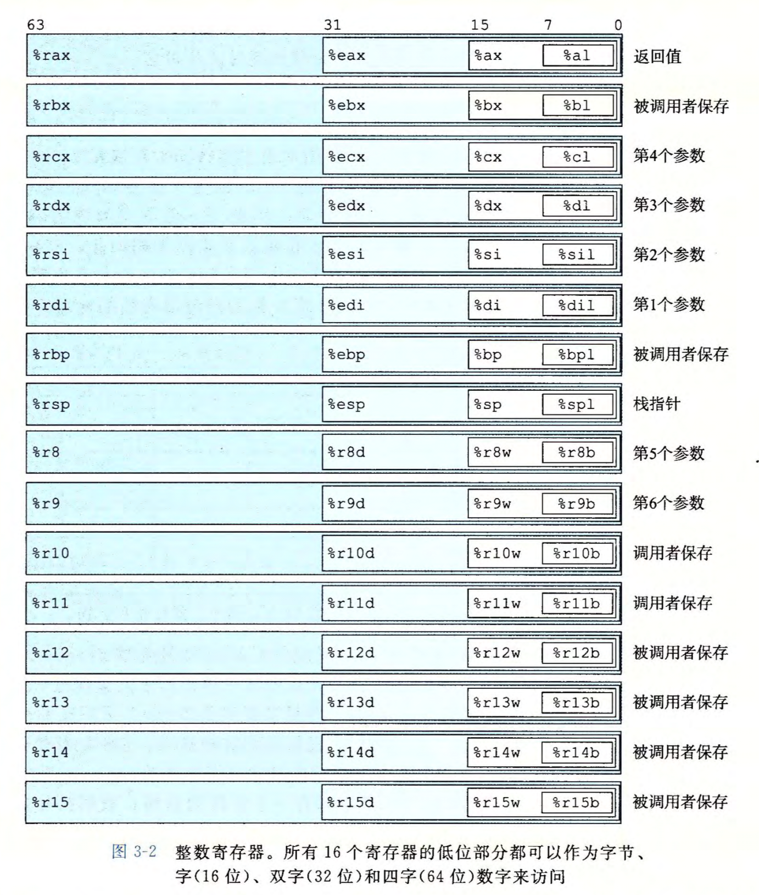


8086中含有`%ax`到`%sp`8个通用寄存器
IA32将这8个寄存器扩展为32位 (`%eax`中的"e":extended)
x86-64将寄存器扩展到64位(`%rax`中的"r":register整个寄存器)，并采用新的命名方式增加8个寄存器(`%r8`～`%r15`，`%r8d`中的"d":double words，`%r8w`中的"w":word)
指令通过不同的后缀大小(b,w,l,q)，得以访问寄存器的不同最低字节(1,2,4,8)
小于8字节的数据传送到寄存器中时，若传送字节为1或2，则更高的字节不变；若传送字节为4，则更高的4个字节全置为0(IA32到x86-64扩展导致的)

#### 操作数指示符
将寄存器看做数组$R[]$，内存看做数组$M[]$
1. 立即数(immediate):`$`后面接常数 *eg.* `$114514`
2. 寄存器(register):以指定寄存器的低位1,2,4,8字节为操作数，返回寄存器中的值即$R[r_a]$ *eg.* `%eax`返回第一个寄存器的低32位
3. 内存引用：将内存看做很大的字节数组，根据计算的有效地址访问内存位置

内存引用的寻址模式：$Imm(r_b,r_i,s)$，其中$Imm$为立即数偏移，$r_b$和$r_i$为64位寄存器，$s$取1,2,4,8(默认为1)
有效地址被计算为$addr=Imm+R[r_b]+R[r_i]*s$，返回$M[addr]$


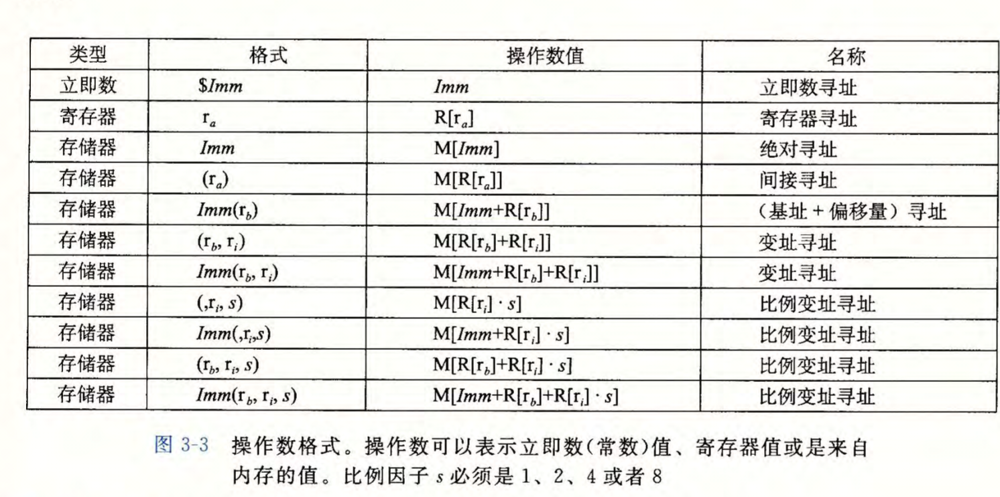


#### 数据传送指令
将数据从一个位置传送到另一个位置的指令
##### MOV
`MOV S, D`指将数据从$S$复制到$D$，其中$S$称为源操作数，$D$称为目的操作数


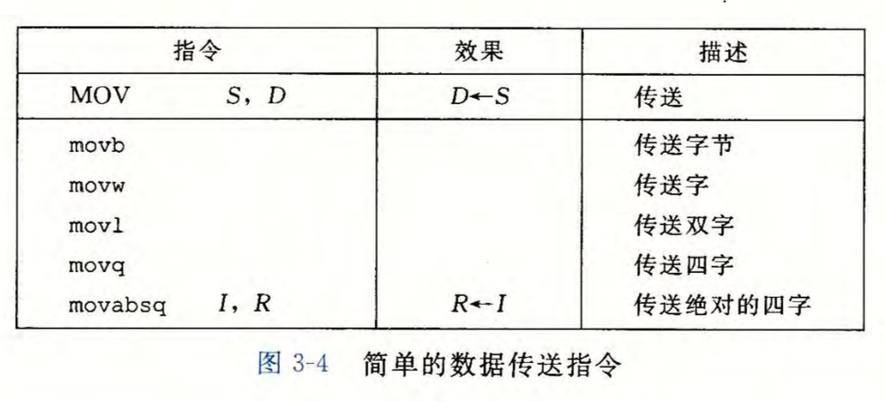


其中源操作数可以取立即数，寄存器，内存；目的操作数可以取寄存器和内存
注意：x86架构中大部分操作(包括`MOV`)源操作数和目的操作数不能同时为内存，必须通过寄存器进行中转
$movabsq$作用：处理立即数时，$movq$只能传送32位立即数然后在符号扩展到64位，而$movabsq$能将64位立即数直接传送到寄存器，但只能移动立即数


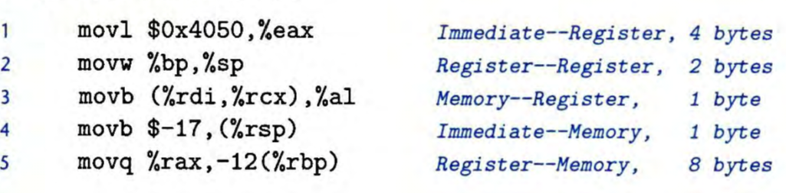


##### MOVZ与MOVS
两者都是将较小源值复制到较大的目的值，后缀都有两个大小指示符，分别是源的大小和目的的大小
`MOVZ` 采用零扩展进行复制，无符号数扩展


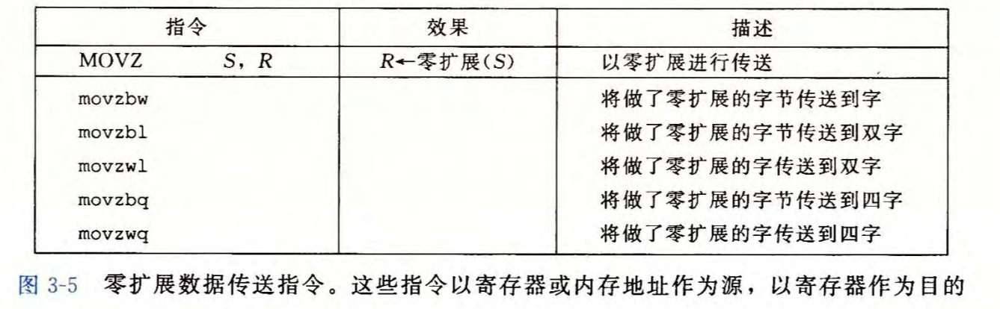


注：没有`movzlq`的原因是使用`movl`传送4个字节会把前面更高的4个字节全赋为0，两者等价

`MOVS`采用符号扩展进行复制，有符号数扩展


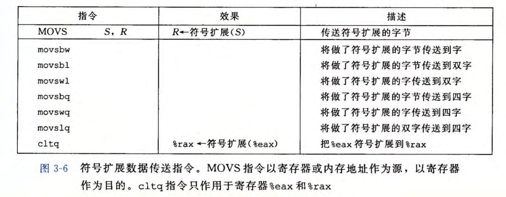


##### 压入和弹出栈数据
x86-64架构中，程序栈放在内存中某个区域，寄存器`%rsp`保存栈顶的地址
不同于C语言中用数组模拟实现栈时栈顶指针指向地址最高，`%rsp`指向的栈顶地址是栈中最小的


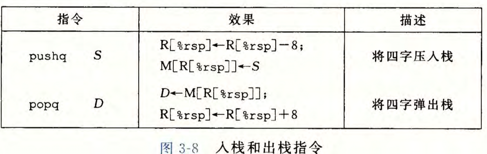


`pushq %rbp`等价于`subq $8,%rsp movq %rbp,(%rsp)`，即将栈顶指针向前移动8个字节，再将元素入栈
`pushq`的优势：编码为1个字节，而等价代码编码为8个字节；同时现代x86-64处理器上`pushq`被高度优化，效率更高
栈内数据在内存中，同样可以用内存寻址法访问


#### 算术和逻辑操作
四类操作：加载有效地址，一元操作，二元操作，移位
这里主要讨论`leaq`的64位形式；其他算术逻辑指令通常能用不同后缀(b,w,l,q)指示操作大小


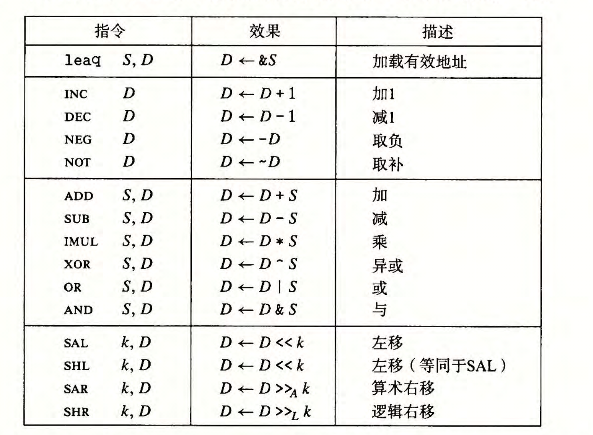


##### 加载有效地址
lea:load effective address
`leaq Imm(r_b,r_i,s), r_d` 表示采用内存计算的方法算出地址之后，将该有效地址作为数字直接存储到$r_d$中
*eg.* 设`%rbx`的值为$x$，则 `leaq 6(%rbx,%rbx,4), %rax` 表示计算$5 \times x + 6$并存放在`%rax`中
作用：简洁地表示普通的算术操作

##### 一元操作和二元操作
一元操作中的操作数既是源操作数又是目的操作数；二元操作中前者为源操作数，后者为目的操作数
*eg.* `subq %rbx,%rax`表示将$R[rax]$减去$R[rbx]$
同样，二元操作也不能源和目的都为内存，需要进行寄存器的中转

##### 移位操作
`SAR`表示算术右移(Shift Arithmetic Right)，`SHR`表示逻辑右移
为了对称，同时有`SAL`和`SHL`，但是两者作用完全等价，`SHL`更为常用
移位操作有两个操作数，前者为移位数(立即数或者`%cl`中的数 **不能是其他寄存器或内存中的数**)，后者为移位的对象(内存或寄存器)
注：移位操作实际使用的移位位数为指令大小后缀对应的低位，如$sarl$实际移位数位给定数对32取模
*eg.* `shlq $65, %rax` 即为将`%rax`中的数左移1位

##### 特殊算术操作
两个64位整数相乘时需要得到128位整数再进行截断，其中16字节的数称为八字(oct words)


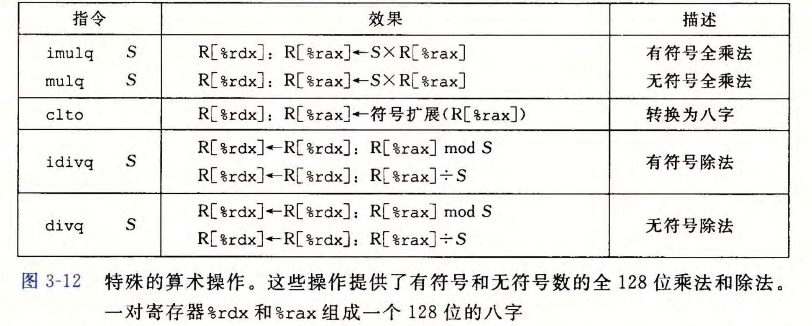


`imulq` 的第一种形式：`imulq S, D` 将 `D` 乘以 `S`，结果存储在 `D` 中
`imulq`的第二种形式：`IMUL S`，另一个参数在`%rax`中，乘积得到的128位结果高64位放在`%rdx`中，低64位放在`%rax`中($\_\_int128$)

`idivq`(有符号除法):将`%rdx`看做高64位，`%rax`看做低64位得到128位被除数，除数作为指令操作数给出，商存放在`%rax`中，余数存放在`%rdx`中
当被除数为64位时，`cqto`指令通过符号扩展将被除数扩展到128位


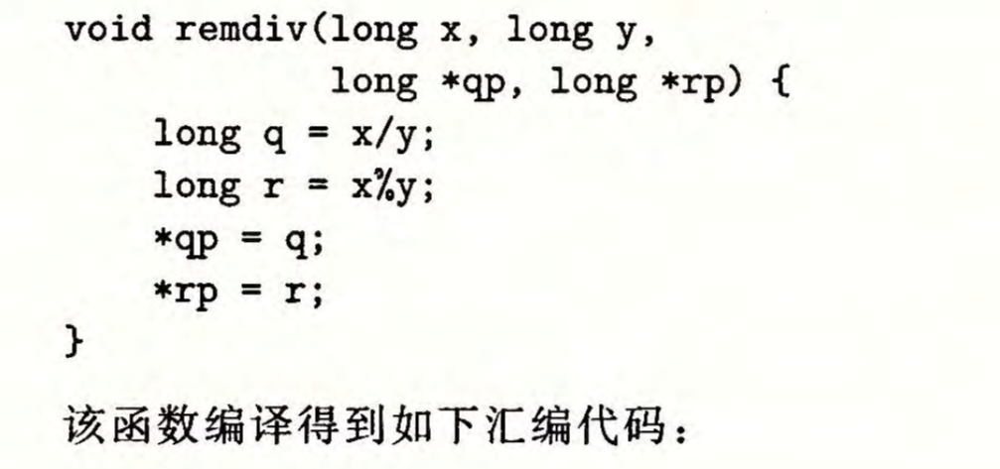


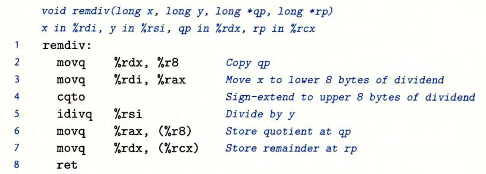


`divq`(无符号除法)：事先将`%rdx`设置为0，可以使用`xorq %rdx, %rdx`

### 控制
使得指令按一定的顺序执行(顺序结构，选择结构，循环结构)

#### 条件码
部分指令(如计算，比较和测试，移位等)会设置条件码
注：`leaq`计算地址，不会设置条件码


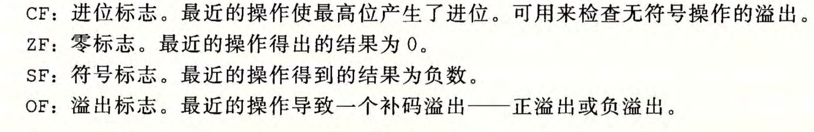


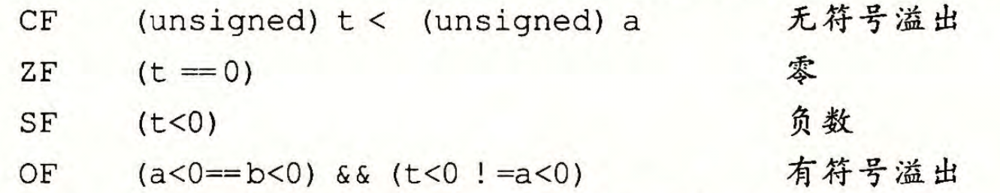


`CMP`，`TEST`进行类似于`SUB`和`AND`的计算，不同之处在于不会将结果写入目的位置，而只会设置条件码


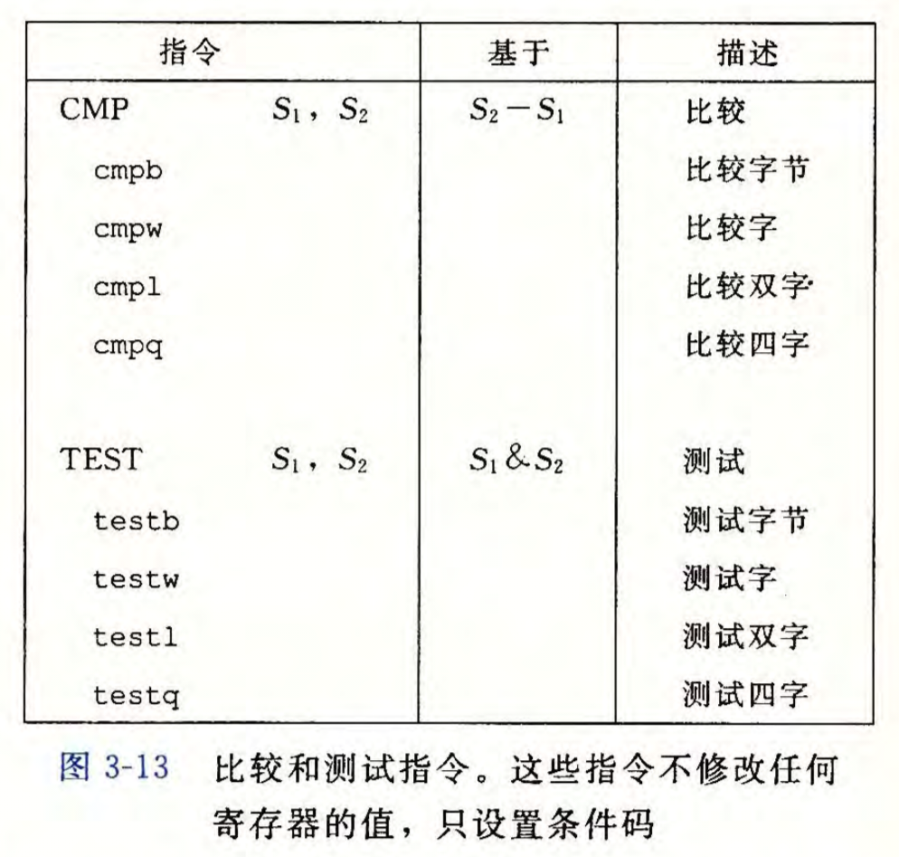


通过`CMP a, b`可以得到$b-a$对应的条件码，从而判断$a$和$b$的相对大小；通过`TEST a, a`可以将$a$的零值和符号等特征反映到条件码中


#### 访问条件码

`SET`通过条件码的组合，将是否满足后缀条件(0/1布尔值)传送到一个低位字节中


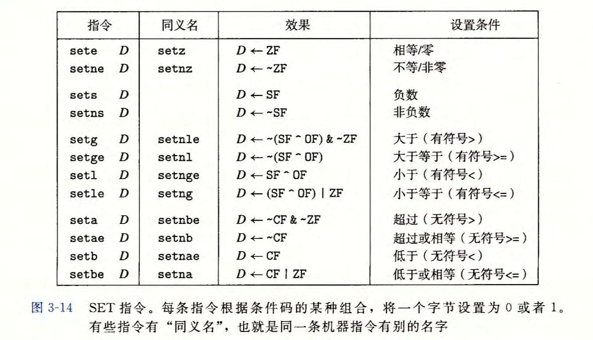


如假设$a$存储在`%rsi`中，$b$存储在`%rdi`中，执行`cmpq %rdi, %rsi`后
`setl %al`表示将`%rax`的最低字节设置为$(bool) (a < b)$，结果字节为0或1

#### 跳转指令
将指令执行的顺序改变，跳转到一个指定的位置


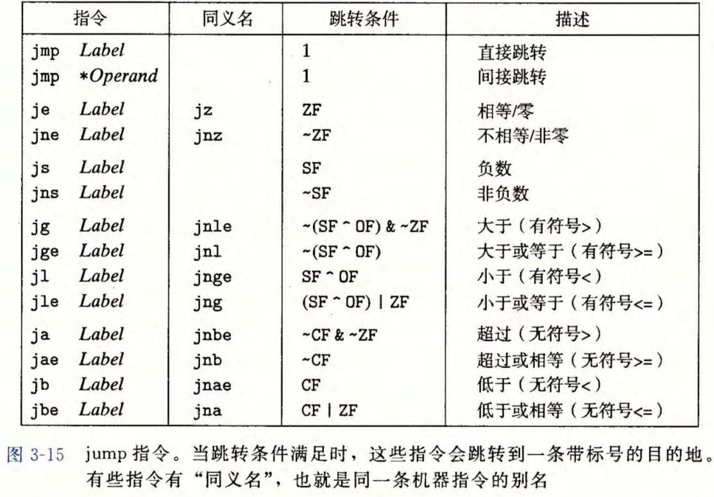


格式类似C中的`goto-label`：


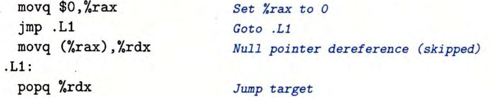


`jmp`被称为无条件跳转，其余被称为条件跳转
只有无条件跳转能执行间接跳转，如`jmp *%rax`跳转到`%rax`的值对应地址的指令，`jmp *(%rax)`跳转到`%rax`指向内存的值对应地址的指令

##### 跳转指令的编码
将汇编代码编码后，跳转目标通常会被编码为1、2或4字节的位移量，其值等于目标地址减去当前跳转指令的**下一条指令**地址(PC相对寻址，使得代码与位置无关，便于加载共享库)


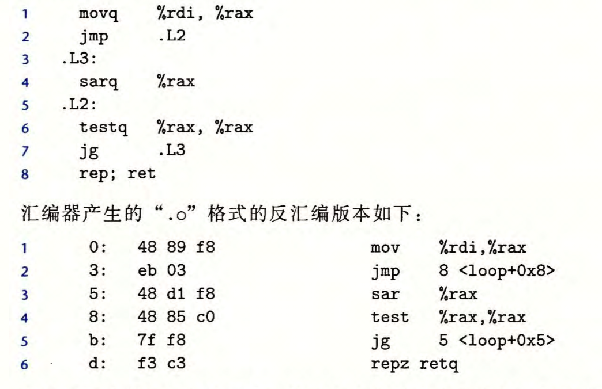


如图所示，编码后文件每一行冒号前的数字表示该指令编码得到的第一个字节的地址
第二行中通过$0x05 + 0x03 = 0x08$得到这条指令会跳转到地址$08$即第四行执行
第五行中通过$0x0d + 0xf8 = 0x05$(注意是有符号运算)得到这条指令会跳转到地址$05$即第三行执行

##### 条件传送与条件控制
汇编使用$JMP$实现$if-else$和$goto-lable$进行跳转被称为条件控制


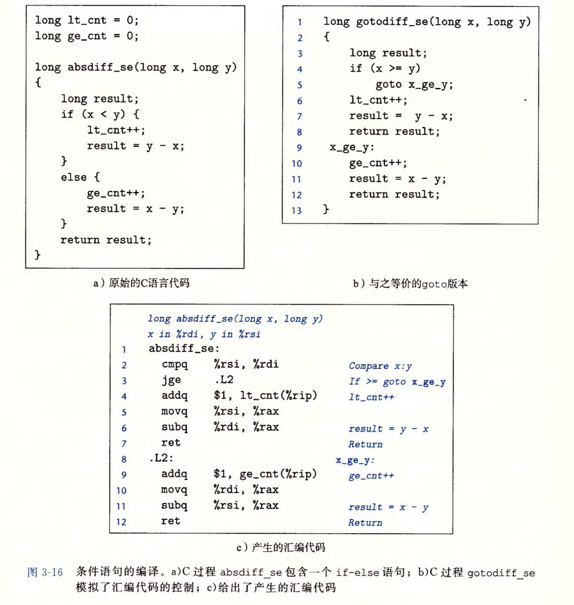


在一些特殊情况下，使用`CMOV`(conditional move) 的条件传送更为高效


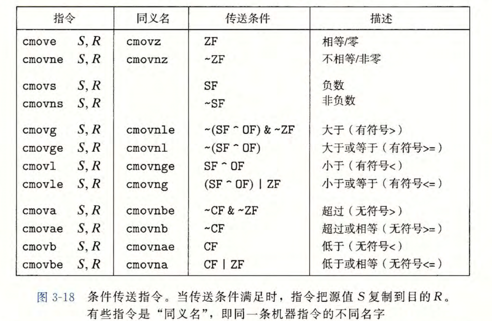


`CMOV`需要加上条件后缀，操作数大小通常可由寄存器名或汇编器推断；它只支持字、双字和四字形式，不支持单字节条件传送
当条件码满足的时候，`CMOV a, b` 会将$a$的值写入$b$
使用条件传送实现$if-else$：
```cpp
if (condition){
	a = if_expr;
}
else {
	a = else_expr;
}
```
使用条件传送实现等价的代码为
```cpp
int x = if_expr;
int y = else_expr;
a = condition? x:y; 
```
注意，以下代码不能使用条件传送


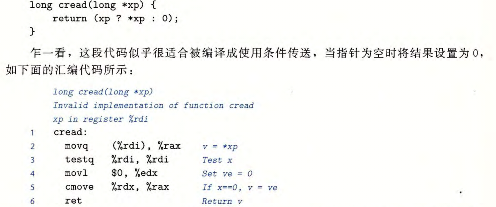


原因：不论是否为空指针，都会提前计算$0$和$*xp$，在指针为空的情况下会导致$UB$

相较于条件控制，条件传送在一些情况下更为高效
原因：现代处理器使用流水线来得到高性能，即通过预先确定要执行的指令序列来使得流水线尽量充满。在遇见指令的跳转时，处理器通过分支预测逻辑猜测是否会进行跳转，并按猜测的结果为后续指令预处理。当猜测出错时，处理器只能丢掉已经做过的处理，重新填充流水线导致效率大大降低。在是否跳转极其难以预测的情况下(如`if (x & 1)`)，性能会受到严重影响。而条件传送没有改变程序计数器(PC)，下一条指令的地址确定，保证了流水线尽量填满。

编译器会在两个分支计算简单且计算代价差异小，分支难以预测，无副作用，优化程度高(-O2 -O3)的情况下优先选择条件传送

##### switch 语句 

在开关大跨度稀疏时，`switch`会被编译为条件控制
在开关小跨度密集时，`switch`会被编译为跳转表

*eg.* 左侧为C源代码，右侧为与跳转表类似的C实现 (`&&`表示指向代码位置的指针)


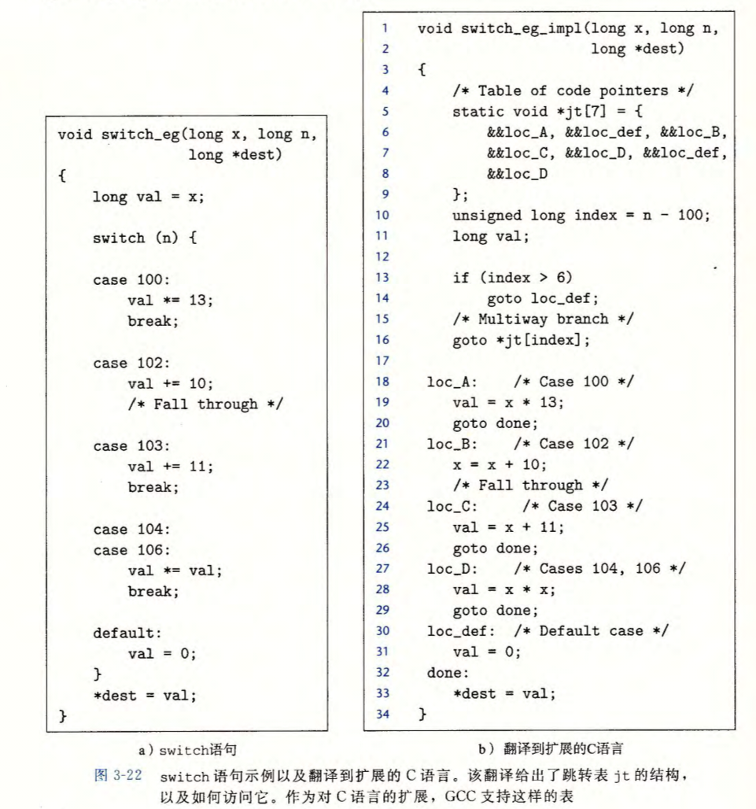


编译得到跳转表。表中每一项保存一个目标代码地址或相对位移，相邻表项通常按指针大小排列，并不是相邻的`label`只相差1个字节


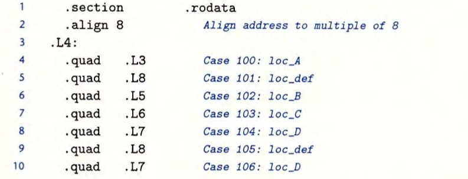


汇编代码


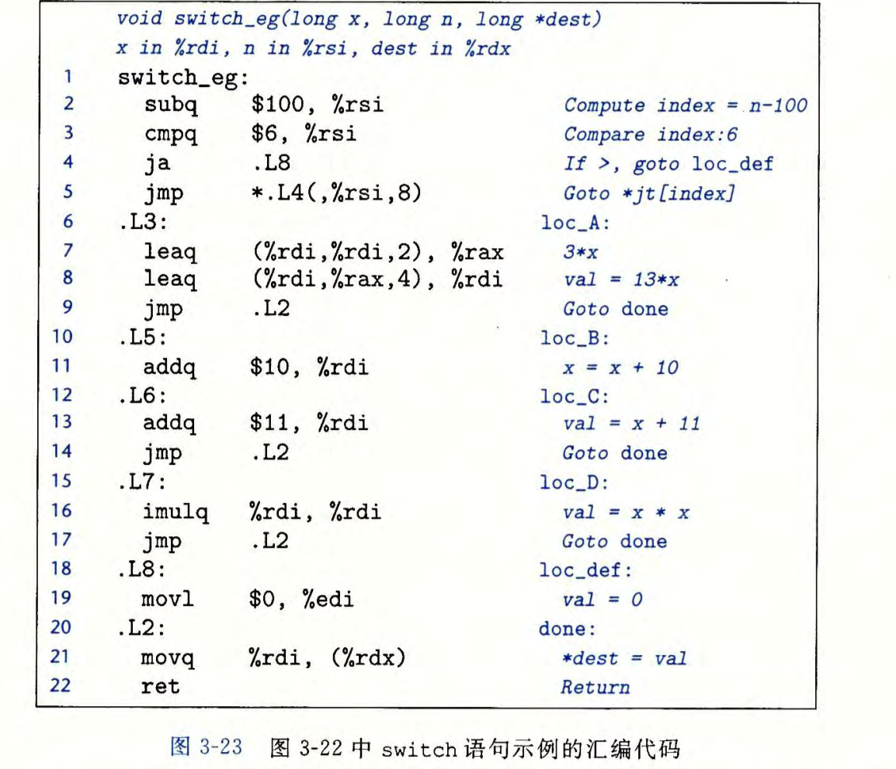


#### 循环
将条件测试和跳转组合起来即可得到循环

`do-while`

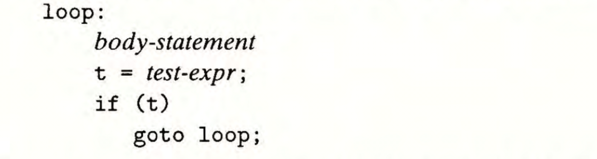


`while`有两种形式
1. *jump to middle*(先进入循环，在循环中途再检查条件)


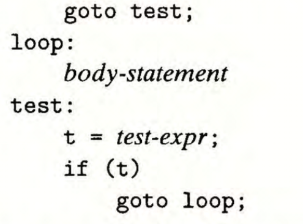


2.*guarded-do*(先检查条件，再进入循环)

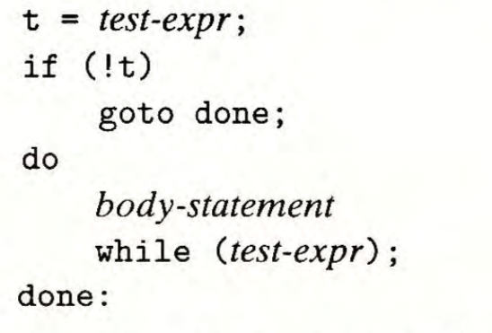


`for`

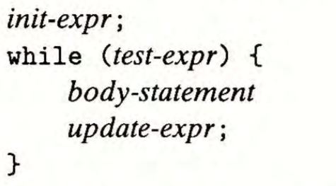


注意：当在$body-statement$中存在$continue$语句时，$continue$应当跳转到$update-expr$部分，否则可能导致死循环等问题
现代编译器会根据循环特征自动选择最优的实现方式，并进行循环展开等优化

### 过程
一种封装代码的方式，隐藏具体的实现，同时提供清晰的接口(类比C中的函数)
过程包含的机制(假设从过程$P$进入过程$Q$)：
1. 传递控制：将PC设为$Q$过程起始指令的地址，执行完$Q$过程后再将$PC$设置为$P$中调用$Q$下一条指令的地址
2. 传递数据：$P$将特定的参数传递到过程$Q$中,同时$Q$向$P$传递返回值
3. 内存的分配与释放：为局部变量分配空间，并在过程结束时将这些空间释放

#### 运行时栈


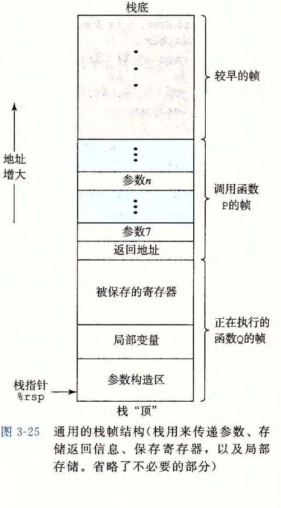


在过程$Q$被执行时，其调用链上的所有信息的挂起在栈上，栈中存放着传递控制，传递数据，内存分配释放的信息
栈帧：过程在寄存器中存放不下，存放在栈中的空间
局部变量都可以存储在寄存器中并且为叶子过程(未调用其他过程的过程)，则不需要栈帧
注:`%rsp`为栈指针，`％rip`为PC

#### 传递控制
从过程$P$到过程$Q$
`call Q`将PC跳转到$Q$起始指令的地址，并将`call`指令的下一条地址(返回地址)压入栈中
`ret`从栈中弹出返回地址，并将PC设置为返回地址 


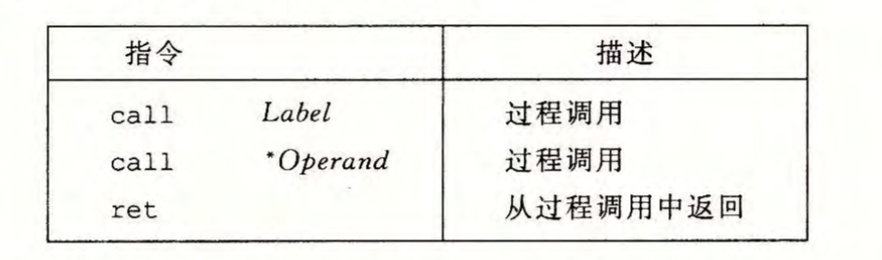


#### 传递数据

$x86-64$架构中最多可以用6个寄存器来传送参数


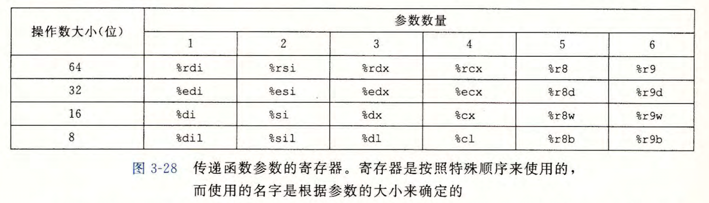


当传递的参数大于6时，需要通过栈来进行传送(参数构造区)

*eg.* 


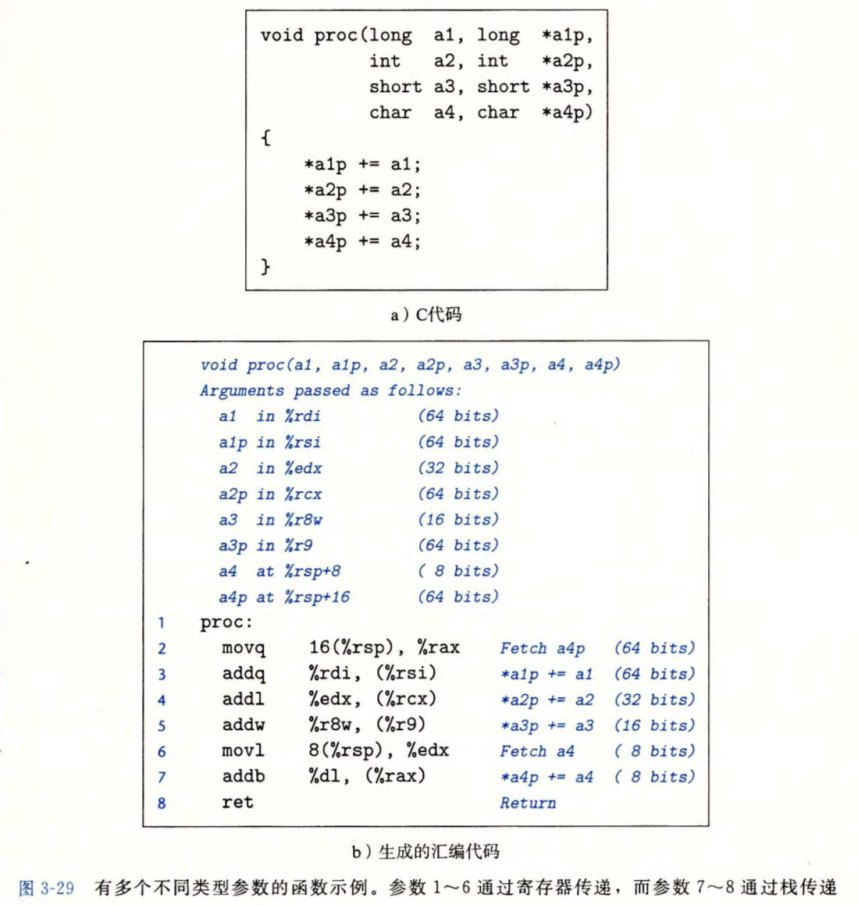


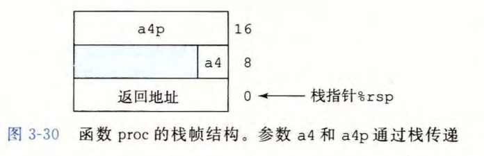


注：通过栈传送数据时，第7个及以后的参数按从右到左的顺序压入栈中，第7个参数在栈顶（低地址），后续参数依次向高地址排列

#### 内存的分配与释放

当寄存器不足以存放局部数据，或者局部数据被取地址(`&`)需要被分配地址时，会在栈上为这个数据分配空间，形成局部变量

*eg.*


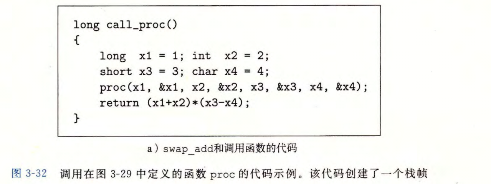


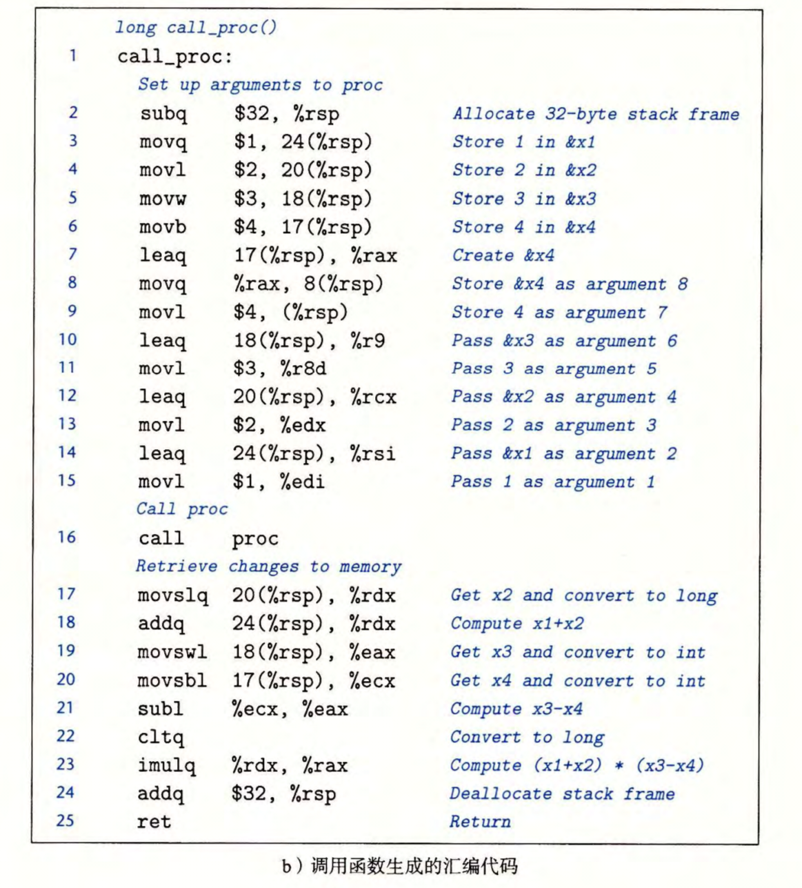


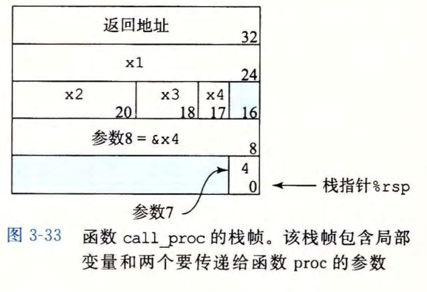


其中：
1. `x1 x2 x3`被取地址，作为局部变量在栈上分配空间，同时也属于前6个参数，传入寄存器
2. `&x1 &x2 &x3`属于前6个参数，传入寄存器，又未在该过程后续被直接使用，不是局部变量
3. `x4`被取地址，作为局部变量在栈上分配空间，同时也在栈上再次分配一个不同的空间，传送这个参数
4. `&x4`通过在栈上分配空间作为参数传送，但不是局部变量

在执行`call proc`时，会在栈中压入长8个字节的返回地址，使得$x4$和$&x4$相对栈的地址偏移量变为8和16个字节，`proc`过程得以正确执行
注意：
栈帧内存的释放只是改变了栈指针，没有改变曾经的参数和局部变量的值，意外访问这些位置可能读到旧数据

##### 寄存器中的局部存储空间

被调用者保存寄存器：`%rbx`, `%rbp`, `%r12`-`%r15`（调用前后值不变）
过程$P$调用过程$Q$，当过程$Q$回到过程$P$时，必须保证以上寄存器的值与其调用$Q$前的值相等
这些寄存器可以作为临时变量，保存$P$中的某些信息，防止在$Q$中这些信息被改变(如参数，$P$和$Q$参数可能不同)
实现：将过程中要使用的作为临时变量的寄存器，在过程开始时压入栈中，中间任意变换，结束过程时再从栈中弹出覆盖这些寄存器的值即可

调用者保存寄存器：`%rax`, `%rcx`, `%rdx`, `%rsi`, `%rdi`, `%r8`-`%r11`（调用后可能被修改）

*eg.*


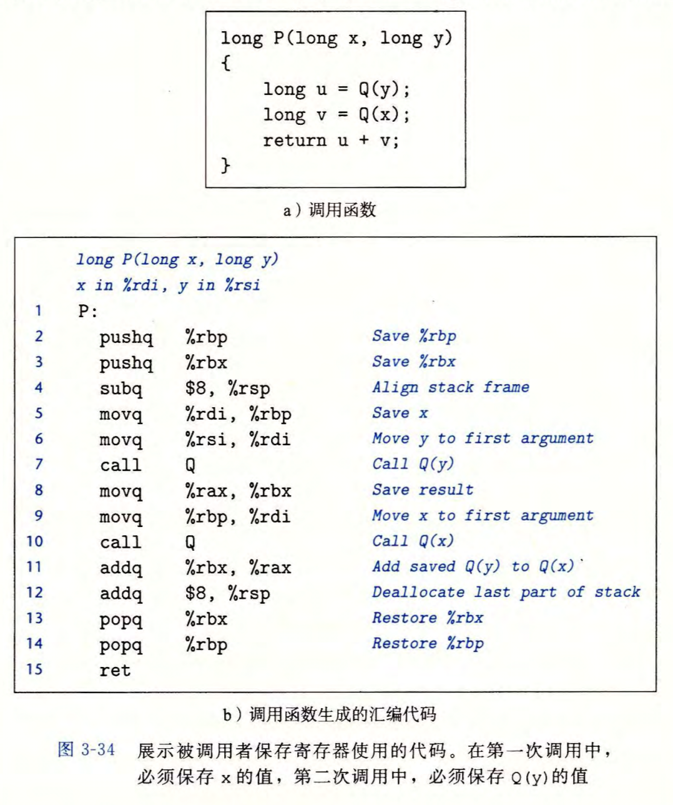


#### 递归过程

每个过程相关信息在栈上都有私有空间，互不干扰，使得递归能够高效而正确地实现

*eg.*


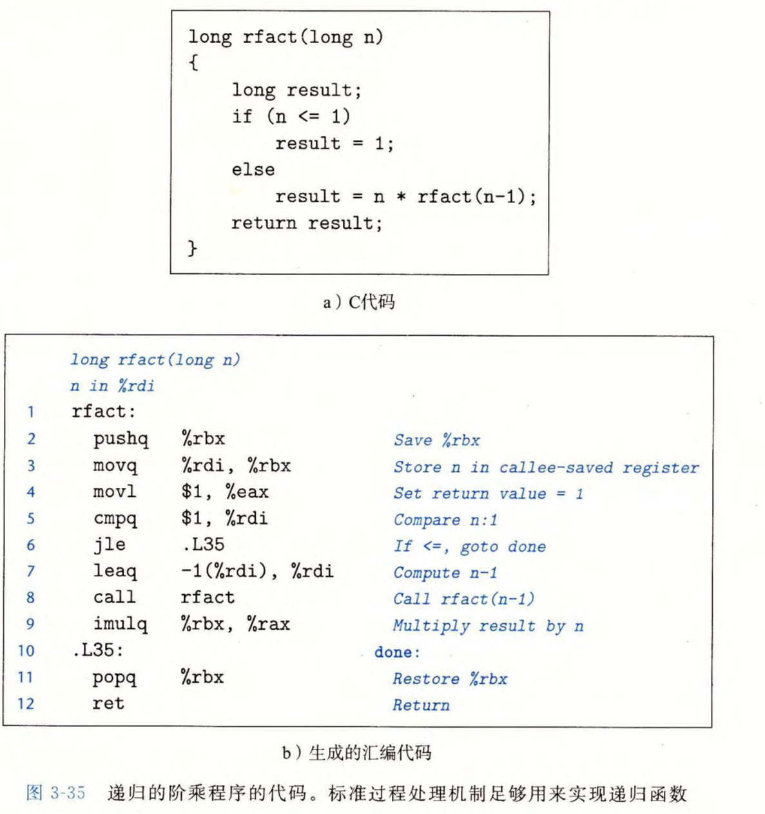


当递归调用是函数体中最后执行的操作时，编译器可能进行尾递归优化，将其转换为循环

### 数组的分配与访问

通过对数组首地址进行运算，得到需要访问的元素的地址
*eg.* `T A[N]`会在内存中以$x_A$开始，连续分配$L\times N$大小的空间，其中$L$为单个$T$的大小
`A[i]`的地址 $\&A[i] = x_A + i \times L$
例如，假设$i$的值存放在`%rcx`中，`int`数组首地址$x_A$在`%rdx`中，通过`movl (%rdx, %rcx, 4), %rax`即可将$A[i]$的值存放在`%rax`中


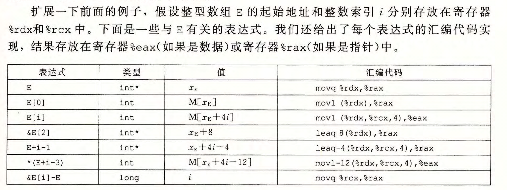


对于二维数组`T A[N][M]`来说，有 $\&A[i][j] = x_A + L \times i \times M + L \times j = x_A + L \times (i \times M + j)$

以此类推，对于$k$维数组`T A[N][][]....`来说，其$\&A[i][][]...$等于 $x_A$ + $i \times L(A[][]...)$ + $k-1$维中访问$A[][]...$的地址偏移量 

#### 定长数组与变长数组

编译器对定长数组(数组大小为常量)的优化：
通过指针加减移动进行寻址，而非用乘法进行寻址，提高寻址的效率


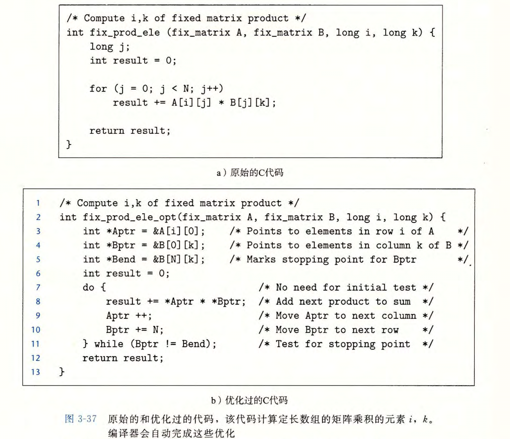


对于变长数组(数组大小为表达式)：

由于数组的大小不确定，无法使用`leaq`，需要使用`imul`，时间开销更大，但编译器仍然尽量使用指针提高效率


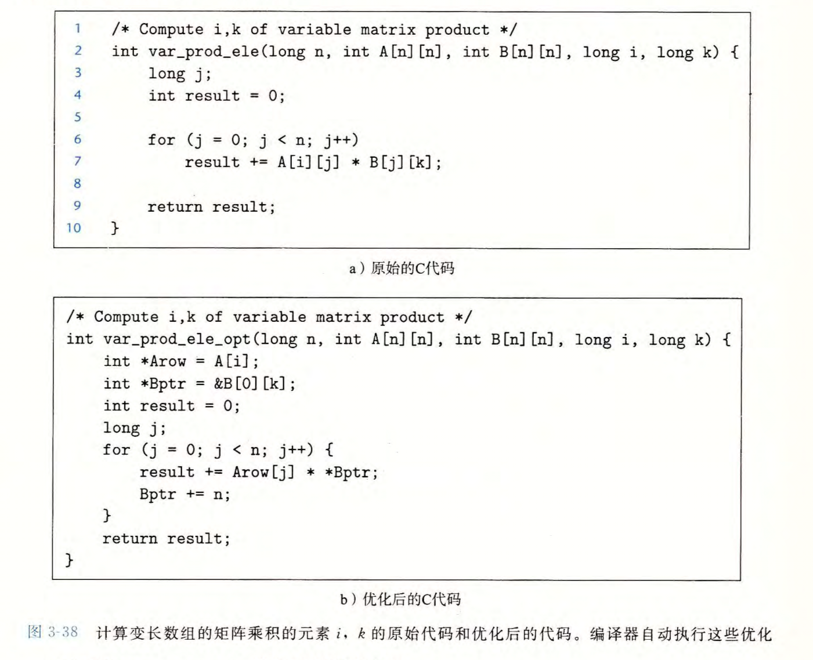


### 异质的数据结构

#### struct 结构
同一结构内的变量都分配在连续的内存中
*eg.*
```cpp
struct str{
	int l, r;
	long long val;
}s;
```
其中`s`是一个结构体对象；若`%rdx`中存放的是指向`s`的指针，则通过`8(%rdx)`即可以访问`s.val`

#### 联合 `union`
*eg.*
```cpp
struct node_t { 
	nodetype_t type; 
	union { 
		struct { 
			node_t *left; 
			node_t *right; 
		} internal; 
		double data[2]; 
	} info; 
}; 
```
其中，`internal`与`data[2]`互斥 (若为叶子节点则只有两个值，没有儿子指针；若不是叶子节点，则有两个儿子指针，无权值)
`union`的大小为其中最大变量的大小，如以上的`union`中所占大小为16，通过`union`节省了空间

同时，`union`也可以实现保持位模式相同的类型转换
```cpp
double x = 114514.1919810;
unsigned val = (unsigned)x;
```
这是普通数值转换：浮点数会向零舍入；如果超出`unsigned`可表示范围，行为不由C标准保证
```cpp
union{
	double x;
	uint64_t val;
}u;
u.x = 114514.1919810;
uint64_t val = u.val;
```
通过`union`，可以观察同一段存储的位模式；这里用64位整数保存`double`的完整二进制串，数值含义会发生改变

#### 数据对齐

对于结构体中的变量，编译器通过数据对齐保证其地址为$K$的倍数($K=1,2,4,8$)，进而提高访问的效率
例如假设处理器每次操作从内存中取8个字节，对$double$进行字节对齐，使其不会落在两个不同的内存块中，保证了读写时处理器只会访问一个内存块，进而保证了操作的高效

字节对齐按以下步骤进行：
1. 对于结构内的某个变量，在其后面的地址连续填充空隙，直到下一个地址满足下一个变量所需的对齐约束，再将下一个变量放入这个地址中
2. 设$M$为结构内所有变量的最大对齐要求，在最后一个变量之后连续填充空隙，直到结构体总大小为$M$的倍数

*eg.*

```cpp
struct str{
	int a;
	char b;
	int c;
	char d;
};
```
其对齐后的结果为：
a: 0～3 b:4～4 空隙:5～7 c:8～11 d:12～12 空隙:13～15


#### 杂项

##### 指针
指针本质是一个二进制串表示的地址，其类型决定了每次对指针运算时的大小偏移量
对于指针类型强制转换，只会改变其每次的偏移量，而不改变指向的地址
*eg.* `int *p; p++;`会让`p`指向的地址向后移动四个字节
指针同样能够指向函数，即指向函数首指令的地址

##### 缓冲区溢出
以C中的$gets$为例(不给定目标缓冲区的大小)，当读入的字符大于定义的字符数组长度时，就可能越界访问当前函数的返回地址和栈中保存的其他函数状态

###### 缓冲区溢出攻击
通过在输入的字符串中加入可执行代码(攻击代码)，同时又用指向攻击代码的指针覆盖返回地址，导致系统被攻击
对抗溢出攻击
1. **栈随机化**：通过执行代码前分配一段长度为$0 \sim n$个随机字节且不使用的空间，使得每次运行时的栈地址不固定，攻击时不一定能跳转到攻击代码
局限：`nop sled` 通过在攻击代码写入大量的`nop`,只要能跳转到其中任意一个`nop`就能执行攻击代码
*eg.* 32位系统随机地址范围大小大约为$2^{23}$字节，在攻击代码前写入$m$字节大小的`nop`，执行$\frac{2^{23}}{m}$ 次则一定会跳转到攻击代码
如取$m=256$，则大约需要三万次左右次枚举起始地址，攻击就能成功
2. **栈破坏检测**:通过在栈中插入一个运行时随机生成的金丝雀值(`canary`)，恢复栈的状态时，若该值被改变，则发生了溢出攻击，程序跳转到错误处理例程
其中`canary`会和保存在安全位置的原始值比较，攻击者通常难以预测并正确伪造它
注意：现代编译器默认采用栈破坏检测，gcc中可采用`-fno-stack-protector`将其关闭
3.**限制可执行代码区域**：将栈上的某些部分设置为可读可写但不能执行($NX$)

#### 浮点代码 (AVX2)
*"我们不太清楚GCC为什么会生成这样的代码，这样做既没有好处，也没有必要在XMM寄存器中把这个值复制一遍"*
看破防了，感觉CSAPP也是讲得稀里糊涂的，以后再补

