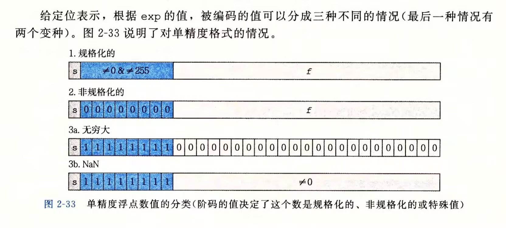

## 信息的处理和表示

### 数字的存储

内存被划分为不同大小的字块，32位CPU->4字节，64位CPU->8字节
对字长$w$的机器而言，虚拟地址范围为$0～2^w-1$，即有$2^w$个字节
64位架构地址空间限制为48位虚拟地址，约为$256TB$($2^{48}Bytes$)，但是仍然在64位逻辑上处理算术运算
编译器通过保持字节对齐，提高硬件效率
无论32位机器还是64位机器，`int32_t`和`int64_t`都分别占4个和8个字节；`int`和`long`等C类型的大小取决于具体ABI。32位机器也可以支持64位整数运算，只是通常需要用多条32位指令协同完成
而浮点寄存器有自己的宽度标准，与通用寄存器宽度无关，如$double$始终占8个字节

小端法：最低有效位所在字节存储地址在最前面，类型转换灵活，符合数学思维
大端法：最高有效位所在字节存储地址在最前面，方便阅读识别，便于判断正负
大小端法通常由ISA/系统ABI共同约定，有些架构还支持在不同模式下选择字节序
x86/x86-64使用小端法
PowerPC，网络协议(TCP/IP)使用大端法
ARM, RISC-V, MIPS等同时支持两种字节序

### 二进制下的整数

#### 1. 补码

对于 $w$ 位的无符号整数$x$：$x = \sum\limits_{i=0}^{w-1}a_i \times2^i$
对于$w$位的有符号整数$x$ : $x = -2^{w-1} \times a_{w - 1}+\sum\limits_{i=0}^{w-2}a_i \times2^i$(补码表示)
在此种表示方式下，$-x$的补码编码与无符号整数$2^w-x$的编码相同
原理：在$mod$ $2^w$ 意义下 $-x$ 与 $2^w - x$等价，无符号运算在溢出的情况下仍满足加法与乘法结合律，交换律等定律
无符号整数与有符号整数的比较：有符号整数类型转换为无符号整数再进行比较 $eg$: $-1$ $>$ $0U$
有符号整数与无符号整数的转换：
若有符号数$t < 0$，则其无符号解释为$t + 2^w$；若$t \geq 0$，则无符号解释仍为$t$
若无符号数$u > 2^{w-1}-1$，则其有符号解释为$u - 2^w$；否则仍为$u$

#### 2.符号扩展与数字截断

符号扩展：在不改变值的情况下提升一个$w$位有符号整数的位数

*case1:若符号位$a_{w-1} = 0$* 

直接将$a_w$设为$0$，扩展到了$w+1$位

*case2:若符号位$a_{w-1}=1$*

将第$a_w$设为$1$，第$a_w$和$a_{w-1}$的贡献从$-2^{w-1}$到$-2^{w}+2^{w-1}$不变，扩展到了$w+1$位
即扩展到第$w+1$位时有$a_w=a_{w-1}$

数字截断到$k$位：保留最低$k$位，舍弃第$k$位及更高位
无符号数数字截断等价于对$2^k$取模

从较小整数类型转换到较大整数类型时，C会先进行整数提升：有符号源通常符号扩展，无符号源通常零扩展，然后再按目标类型解释位模式
**eg.** *对于short x; `(unsigned)x`等价于`(unsigned)(int)x`*

#### 3.运算

对于两个$w$位整数的运算，加法得到的结果最多为$w+1$位，截断第$w+1$位得到$w$位整数，对无符号整数来说等价于对结果$mod$ $2^w$ 
乘法得到的结果最多为$2w$位，保留低$w$位并舍弃高位得到$w$位整数
$w$位整数与常数相乘的时候，编译器会根据上下文进行优化，优化方式取决于架构的指令集
**eg.** *x\*14=(x<<3)+(x<<2)+(x<<1)或((x<<3)-x)<<2*（乘法分解为位移和加减法）
         或*imul    eax, edi, 14*（编译器认为imul更快，直接使用乘法指令）

**逻辑右移**：右移一位后在最高位补0
**算术右移**：右移一位后，若符号位原本为1，则在最高位补1，否则补0
除以2的幂时：
无符号数采用逻辑右移，等价于向下取整
有符号数需要特殊处理：编译器会生成先加偏置再算术右移的代码，以保证向零取整的结果与C语言标准一致

### 二进制下的浮点数

#### 1.浮点数的表示

##### 标准化之前

对浮点数$x$有：$x=\sum \limits_{i=-j}^{k}a_i \times2^i$
左移，右移在算术上仍然等价于$\times2$ 和 $\div 2$，但是误差大，受位数有限制约
标准浮点数表示法：IEEE浮点数

##### IEEE浮点数

符号位(s) + 阶码位(exp) + 尾数位(frac)
单精度32位 双精度64位 (和英特尔扩展精度80位)
32 = 1 + 8 + 23
64 = 1 + 11 + 52

IEEE浮点标准用$V=(-1)^s \times 2^E * M$表示浮点数

设$exp=\sum\limits_{i=0}^{k-1}2^ie_i$,$bias=2^{k-1}-1$(无符号整数)
$frac = \sum\limits_{i=0}^{n-1}f_i\times2^{i-n}$(分数)

*1.规格化的情况($1 \leq exp \leq 2^k-2$)*
$E=exp-bias$，$M=1.0 + frac$，那么有$-2^{k-1} + 2 \leq E \leq 2^{k-1} -1$

*2.非规格化的情况($exp = 0$)*
$E=1-bias$，$M=frac$
用来表示$0$和极其接近$0$的值
注：$+0.0$和$-0.0$有不同的位表示，但在普通数值比较中相等

*3.特殊值($exp = 2^k-1$)*
$frac = 0$:$V=INF$
$frac \neq 0$:$V=NaN$

注：
1.引入$bias$的意义：阶码无需引入符号位；对同号规格化浮点数，阶码和尾数的位模式顺序更接近数值大小顺序
2.非规格化情况下$E$取$1-bias$，使得非规格化最大值为$2^{2-{2^{k-1}}} \times (1-{2^{-n}})$，而规格化最小值为$2^{2-{2^{k-1}}}$，二者十分接近

#### 2.整数转浮点数

以将(int)114转换为float为例

1.转为二进制下科学计数法
$114 = (1110010)_2 = (1.110010)_2 \times 2 ^ 6$
2.去掉小数点前的1并在末尾添加0直到$n$(23)位，得到尾数部分
$1.110010 -> 11001000000000000000000$
3.将阶数加上偏移值$2^{k-1}-1$(127)，转为二进制得到阶码部分
$6 + 127 = 133 ＝ (10000101)_2$
4.加上符号位，将阶码尾数拼起来
$(01000010111001000000000000000000)_2$

由该过程可知，整数二进制编码与其浮点数表示的尾数部分除第一个1外重合

#### 3.思考：n位位数不能精确表示的最小正整数

假设阶码足够大，有$n$位尾数的浮点数不能精确表示的最小正整数为$2^{n+1}+1$

证明：$n$位的$frac$再加上尾数隐式的$1.0$一共$n+1$位，乘$2^E$可以看做左移$E$位，在阶码可以取到无穷大的情况下，可以取遍$1 ～ 2^{n+1}-1$，同时在$frac$全为$0$的情况下，左移$n+1$位得到$2^{n+1}$，即$1～2^{n+1}$都可以表出，而$2^{n+1}+1$无法表出
推论：`double`能连续精确表示的最大正整数为$2^{53}=9007199254740992$，因此$2^{53}+1$不能被精确表示；但更大的2的幂或足够大的偶数仍可能精确表示
补充:$n$位尾数浮点数在$x$处的误差(可表示数的最小间隔) $ULP(x)=2^{\lfloor \log_2  \lvert x \rvert \rfloor - n}$
警钟撅烂：`double r = 1e18+5;` $r$的值仍然为$10^{18}$

#### 4.浮点数的运算

舍入：找到最接近的值$x$，使其可以按期望的浮点形式表示出来
向零舍入，向上舍入，向下舍入
向偶数舍入：优先向满足条件的最接近的数舍入，若存在两个这样的数，则向最低有效位为偶数的那个数舍入(避免了统计误差)
浮点加法，乘法运算不满足结合律，浮点乘法在加法上不存在分配律
**eg.**对于$float$有$1.14+1e18-1e18=0$（舍入导致1.14丢失），$1.14+(1e18-1e18)=1.14$
无穷运算规则：+∞ + (+∞) = +∞，+∞ + (-∞) = NaN，+∞ × 0 = NaN
NaN的传播特性：任何包含NaN的运算结果都是NaN

#### 5.C中浮点数与有符号数的转换

$int$转$float$可能被舍入
$double$转$float$可能会溢出或者被舍入
$float,double$转整数值会向零舍入；若超出目标整数类型范围，C标准认为行为未定义。在常见x86实现中，越界或NaN转换可能产生整数不确定值$(100..00)_2$，即$-2^{w-1}$

