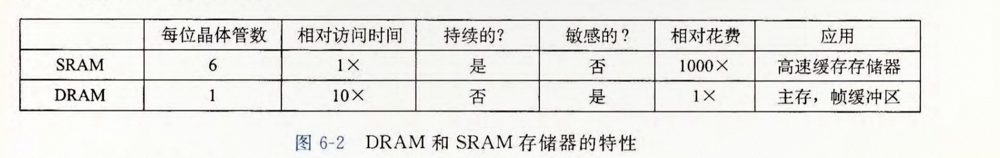

## 存储器层次结构

存储器系统是一个具有不同容量，成本和访问时间的存储设备的层次系统
整体效果是一个大的储存器池，但却以接近最便宜存储设备的成本，做到了接近顶层存储设备的读写效率
存储器层次由快到慢分别为寄存器，高速缓存存储器，主存储器，本地二级存储器，远程二级存储器


### 存储技术

#### RAM
随机访问存储器(Random Access Memory)可分为**DRAM**(Dynamic)和**SRAM**(Static)两类
SRAM 使用六晶体管电路实现，具有双稳态性，只要有电就会保持它的值，在干扰结束时，也会回到稳定状态
DRAM 对干扰十分敏感，易漏电，必须周期性刷新以保持数据；纠错码可以检测或纠正部分位错误，但不能替代刷新





##### DRAM的读写
每个DRAM单元存储一位信息，$w$个DRAM单元组成一个超单元，再由$d$个超单元组成一个DRAM芯片
$d$个超单元构成一个$r \times c$的二维阵列，每个超单元有由行列构成的二元组地址$(i, j)$
DRAM芯片通过地址引脚和数据引脚与外部传递信息，通过两次在地址引脚上传入行地址和列地址来确定要读写的超单元，再通过数据引脚传递具体数据。将超单元设计为二维，减少了需要的地址引脚个数，代价是地址需要分两次传入，降低了效率

##### 内存模块

内存模块中封装了多个DRAM芯片，我们以8个8M的DRAM芯片，每个超单元存储1个字节为例
当需要访问一个地址为A的字的时候，内存控制器将A翻译成超单元地址$(i,j)$并发送到内存模块中，内存模块再将$(i,j)$广播到每一个DRAM芯片，8个芯片都取出它地址为$(i,j)$的超单元中存储的字节，再将这八个字节合并起来，传送到内存控制器中
将一个字存储在不同的DRAM芯片内的好处：通过提高并行性提高了访问效率，同时减少整个字丢失的可能，提高了可靠性

#### ROM

只读存储器(Read Only Memory) 部分的ROM读写都支持，但是所有的ROM都是非易失性的

PROM (Programmable ROM) 可编程ROM只能使用高电流编程一次
EPROM(Erasable PROM) 可擦写可编程ROM 与 EEPROM(Electrically EPROM) 电子可擦除ROM都能使用特殊手段擦除数据重新编程，但次数有限
flash memory 闪存基于EEPROM，如固态硬盘

ROM中的程序被称为固件(firmware)，在通电下运行，如PC的BIOS

#### 主存的访问

数据流通过总线(bus)在处理器和主存之间传送，读事务中数据从主存传送到处理器，写事务中数据从处理器传送到主存
处理器通过系统总线与I/O桥接器连接，主存通过内存总线与I/O桥接器连接，I/O桥接器通过将系统总线和内存总线传入的信号进行翻译
同时，I/O桥接器还连接了I/O总线，我们会在下文提到
以读事务为例


#### 磁盘的存储

##### 磁盘的构造
每个磁盘包含了一个或多个**盘片**，每个盘片有着两个**盘面**，盘片绕着中心的主轴，以固定的角速度旋转
每个盘片包含了多个被称为**磁道**的同心圆，每个磁道上都有着多个用来存储信息的**扇区**，每个扇区存储的信息量大小相同，扇区间由用来标记格式化位的**间隙**分开
我们用**柱面**称呼到主轴间距相等的磁道构成的集合


##### 磁盘的存储
磁盘存储的信息量取决于面密度，即单位面积内可存储的位数；它通常由磁道密度和每条磁道上的线性位密度共同决定

为了简化控制，磁道的扇区数需要尽量保持相等
在技术不发达，面密度比较低的时期，每个磁道的扇区数完全相同，这导致外围的扇区间隙相比内围大了很多，造成了不必要的浪费
现代磁盘使用多区记录的技术，在每个**记录区**中保存了一段连续的柱面，每个记录区中的磁道扇区数相同，记录区间的扇区数不同。通过多区记录，达到了存储空间和控制难度的平衡

为什么标注1TB大小的硬盘电脑显示只有931GB？
这是制造商使用的十进制（$1TB = 1000^4$ 字节）与操作系统使用的二进制（$1TiB = 1024^4$ 字节 $\approx 931GiB$）之间的差异。

##### 磁盘的读写
磁盘中的**读/写头**连接到外围的传动臂上，通过绕着传动臂转动，进行寻道以定位到某个给定的磁道上，当磁道上的某个扇区旋转到读写头正下方时，就可以对其进行读写操作


对一个扇区的访问时间，取决于一下三个部分：
1.寻道时间：传动臂将读写头移动到指定磁道的时间，这个值取决于读写头之前的位置和传动臂移动的速度
2.旋转时间：等待需要操作的扇区旋转到读写头的正下方，这取决于盘片旋转的角速度和此时目标扇区的位置
3.传送时间：这个扇区从头到尾经过读写头需要的时间，这取决于盘片旋转的角速度

计算的一个示例


可见读写的时间主要取决于寻道时间和旋转时间

磁盘经过封装得到**硬盘驱动器**，简称**硬盘**，“硬盘”一词不加修饰时，通常指基于磁盘技术的机械硬盘（Hard Disk Drive, **HDD**），但需注意与固态硬盘（SSD）区分

##### 逻辑磁盘块
在逻辑上，我们可以将扇区看成一个大小为$B$的单元结构，使用一个逻辑块号进行寻址，磁盘控制器从操作系统接收这个逻辑块号，将其翻译成一个(盘面，磁道，扇区)的三元组，再对其进行寻址并进行操作

#### IO设备的连接

现代计算机系统使用PCIe（Peripheral Component Interconnect Express）总线作为主要的I/O总线标准，它取代了早期的PCI总线，将包括键鼠，图形卡，磁盘等在内的I/O设备连接到CPU和主存
有几种不同的IO设备使用I/O总线连接
1.外围I/O设备如键鼠，固态硬盘，打印机等通过通用串行总线(Universal Serial Bus,**USB**)连接到USB控制器
2.图形卡(由GPU显卡，散热器，PCB板等组成)
3.机械磁盘通过SCSI(更快更贵)或者SATA接口连接到主机总线适配器，从而连接到I/O总线
4.其他设备如网络适配器等通过主板上的拓展槽连接到I/O总线中


#### CPU与IO设备的交互
CPU通过特定的地址与I/O设备通信。这些地址可能属于独立的I/O端口地址空间，也可能被映射到物理内存地址空间中（称为内存映射I/O）
以磁盘读为例，CPU向磁盘对应的I/O端口发出三条指令，分别是指令字，逻辑块号，存放在主存中的地址
磁盘控制器接收这些信号翻译得到扇区地址，读扇区后无需CPU干涉直接将数据传输到主存，这称为直接内存访问(Direct Memory Access DMA)
磁盘读取的时间远远大于处理器执行其它指令的时间，通过直接内存访问，避免了CPU的等待
DMA传送完成后，磁盘控制器向CPU发送一个中断信号，处理器转入相应的中断处理程序记录I/O操作已经完成，随后再恢复被中断的控制流


#### 固态硬盘
固态硬盘(Solid State Disk, **SSD**)封装在I/O总线的插槽上(计算机内部)，采用闪存技术，一个SSD封装由一个或多个闪存芯片和一个闪存翻译器构成，其中
闪存芯片功能上类似于机械磁盘的机械驱动器，而闪存翻译器则类似于磁盘控制器

一个闪存由B个块构成，每个块内又有P个页，只有当一个页所在的块被擦除(所有位都被设置为1)才能对该页进行写，这导致SSD写的效率低于读。同时由于闪存基于EEPROM，所以写入次数有限，现代SSD采用了复杂的逻辑，减小了擦写块的时间代价，以及尝试让块的擦写尽量均匀，增加了SSD的寿命


SSD价格上比机械硬盘稍贵，并且写入次数有限，但是SSD读写速度远高于机械硬盘，并且随着SSD越来越受欢迎，其与机械硬盘价格差距也越来越小

### 局部性

#### 数据的局部性
对内存层次中较低层的访问代价很高，所以局部性通常是影响程序性能的重要因素之一

良好的时间局部性：一个内存位置被引用后，不久之后被再次引用
良好的空间局部性：一个内存位置被引用后，不久之后其附近的位置被再次引用

例如考虑以下代码：

```cpp
int sum = 0;
for (int i = 1; i <= n; i++) {
	for (int j = 1; j <= n; j++) {
		sum += a[i][j];
	}
}

sum = 0;
for (int j = 1; j <= n; j++) {
	for (int i = 1; i <= n; i++) {
		sum += a[i][j];
	}
}
```
第一段循环局部性明显优于第二段，因为第一段按引用步长为1访问数组，而第二段按引用步长为n访问数组

#### 指令的局部性
指令也是存储在内存中的，按照内存顺序执行的指令有着良好的局部性，往往循环体越小，循环迭代次数越多，局部性越好

### 高速缓存

#### 缓存的基本原理

##### 缓存的概念
存储器的每一层都是下一层更大更慢存储器中数据的一个缓冲空间，该过程被称为缓存

相邻的两层会以相同大小的**块**作为传输单位，更上层的存储器维护的是更底层存储器中若干块的副本，数据以块为基本单位在两层之间传输。不相邻层次块的大小可能不同


##### 缓存访问概述
1.缓存命中：当需要访问第$k+1$层中块号为$A$的数据时，先在第$k$层中查找是否保存了该数据，如果存在直接高效访问即可，我们称之为缓存命中

2.缓存不命中：当第$k$层中没有该数据时，就从第$k+1$层读出$A$号块。若能采用某种**放置策略**，将$A$号块放入一个空块，则就这样放置并访问；否则采取某种**替换策略**，用$A$号块替换$k$中某个块并访问

3.放置策略与替换策略：为了降低采用策略的代价，这两种策略一般都比较简单。如放置策略就采取简单地将$k+1$层中的每个块都放入在$k$层映射所对应的块中(如对块编号取模得到的数对应的块)，替换策略采用随机替换，最不常使用替换，最近最少使用替换等策略

4.缓存不命中的种类：第一次访问某个块时，缓存中必然没有它，我们称之为**冷不命中**；当放置策略使多个常用块竞争同一组时，可能导致**冲突不命中**，如只有4个组的直接映射缓存反复访问第0、4、0、4......号块，缓存就会一直不命中；当需要访问的数据构成的工作集太大，大于缓存能容纳的块数时发生的缓存不命中，称为**容量不命中**

5.缓存的管理：管理缓存的逻辑可以是硬件，软件，或者是两者的结合

#### 缓存的结构
现代计算机采用了L1，L2，L3三层缓存，为了方便起见，我们简化为只有L1缓存

##### 缓存的通用结构
以在一个m位的系统中进行缓存$k$级读为例

对于一个高速缓存，我们将其分为$S=2^s$个组，每个组内有$E$行，每一行有着一个1位的有效位，$t$位的标记位，以及$B=2^b$个字节的数据块，下标分别为$0, 1, \ldots, B-1$，我们称缓存的数据容量为$C = B \times E \times S$

我们该系统地址有m位，即有$M=2^m$个地址，那么我们用会通过一个长$m$位的数$A$来确定访问的地址
考虑将这个$A$分成三个部分，分别是前$t$位作为标记，中间$s$位作为组索引，最后$b$位作为字节偏移值，满足$m=t+s+b$


通过组索引定位到缓存中的某一组，再并行地与组中的每一行进行比较，当这一行有效位为1且标记和标记位相等时，以字节偏移值为下标读出的这个字节就是需要读出的值

否则每一行都是有效位为0或和标记位不相等，这说明需要读的数不在$k$级缓存中，从$k+1$中重复该步骤，尝试读出该地址的值，在$k$级缓存中进行放入或者替换即可

本质上是地址到一个能唯一确定某个块的三元组的映射，但是完美利用了二进制的性质，发明这个的人真的是天才，计组真的太美了（

补充：为什么不使用更自然的高s位作为组索引，中间t位作为标记，后b位作为偏移值？
若采用高s位为组索引，那么以连续访问地址为0到$2^{t+b}-1$的数据为例，这些数全都被分到了第一组，没有利用了其它组的，会多次发生缓存不命中，局部性良好的代码反而因此效率降低

##### 缓存的各种类型

1.直接映射高速缓存：取 $E=1$，即每组只有一行，此时因为只有一行，替换策略极度简化，直接将新的数据块放入该行即可
2.全相联高速缓存：取$E = \frac{C}{B}$，即只有一组，故可以舍去组索引位，理论上可以对每一行并行判断，但是行数过多，成本昂贵，只适合规模小的高速缓存
3.组相联高速缓存：取 $1 < E < \frac{C}{B}$，即有多个组，每组有多个行，可以在组内并行地判断每一行，同时采取随机替换，最不常使用，最近最少使用等替换策略

##### 缓存写

当需要进行写操作时，若对应地址在$k$级缓存中，即缓存命中，则有以下两种方法：
1.直写：同时更新第$k$层和第$k+1$层中的副本。该方法实现简单，但会增加下层访问流量
2.回写：类似于惰性删除，每一行维护一个初始为0的修改位，写的时候只在第$k$层进行写并将修改位设置为1，直到该行要被替换的时候再将修改后的块写回第$k+1$层。该方法减少了下层写流量，但实现更复杂
当缓存不命中时，同样有两种方法：
1.写分配：从第$k+1$层读入包含写地址的块到第$k$层，再在第$k$层执行写操作，常与回写搭配
2.非写分配：不把该块载入第$k$层，而是直接把写操作传递给第$k+1$层，常与直写搭配

##### 实际的缓存结构
高速缓存既保存数据(d-cache)，又保存指令(i-cache)，也有数据和指令都保存的统一高速缓存，由于d-cache读写都需要，而i-cache只读，所以分开设计，采用不同的访问模式来优化这两种缓存


#### 影响缓存效率的因素
1.高速缓存的大小：增大某一层缓存的大小，可以提高缓存命中率，但是每次缓存访问的时间会增加
2.缓存块大小的影响：在缓存容量固定的情况下，增大块的大小会导致行数减少。在空间局部性优秀的情况下会减少缓存不命中的概率，但是更大的块导致了单次拷贝消耗时间更长，缓存不命中的时候惩罚更大
3.相联度(一组内的行数)：相联度增大后，更不容易发生冲突不命中，但是增加了标记位的位数，以及需要采用更合理的逻辑选择替换行，成本也会增加

### 高速缓存友好的代码

#### 引用步长的影响
假设缓存的块大小为$B$字节，对于一个引用步长为$k$的循环，每次迭代的平均缓存不命中次数为$\min(1, \frac{wordsize \times k}{B})$
理解为缓存中最多存放$\frac{B}{wordsize}$个字，所以每$\frac{B}{wordsize \times k}$次循环就会出现缓存不命中，即每次迭代平均不命中$\frac{wordsize \times k}{B}$次
由此可知，取步长$k=1$对于缓存来说命中率最高

#### 重新排列循环变量

我们以矩阵乘法的六种循环顺序为例


判断程序的性能，我们往往只需要关注最内层循环体的效率，可以先定性地来看
ijk和jik对A数组采用步长为1的访问，对B数组采用步长为n的访问
jki和kji对A数组和C数组都采用了步长为n的访问
kij和ikj对B数组和C数组都采用了步长为1的访问
所以可以得出结论：kij和ikj访问缓存效率最高，ijk和jik次之，jki和kji最差

定量地来看，我们假设缓存可以存放4个double，计算得到的效率表如下，这也印证了我们的分析


#### 使用分块技术
当工作集大于缓存大小的时候，可以通过将工作集划分为多个块，块的大小不大于缓存的大小，能被完全放入缓存当中，高效地对这个块进行访问之后，丢掉这个块，继续载入访问下一个块

