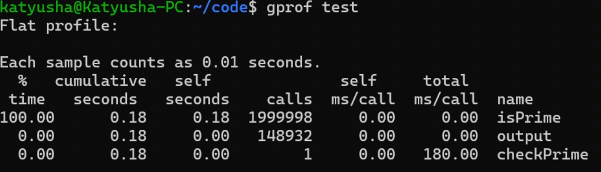
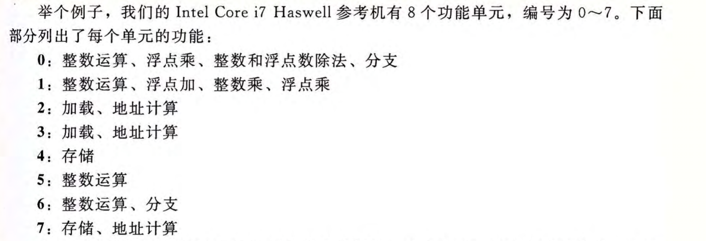
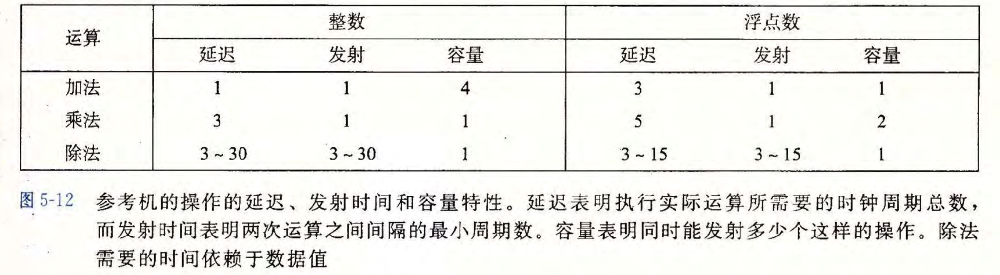
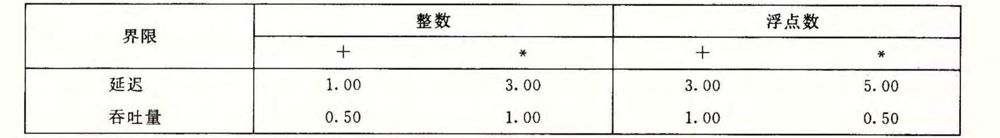
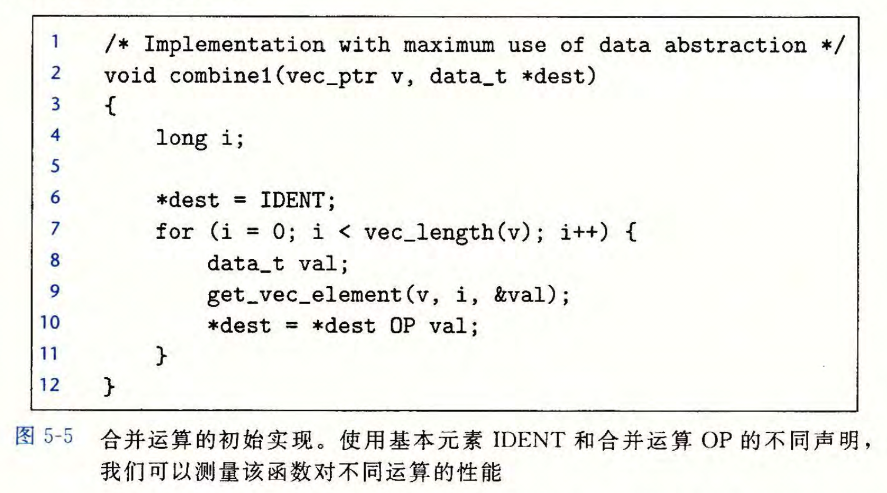
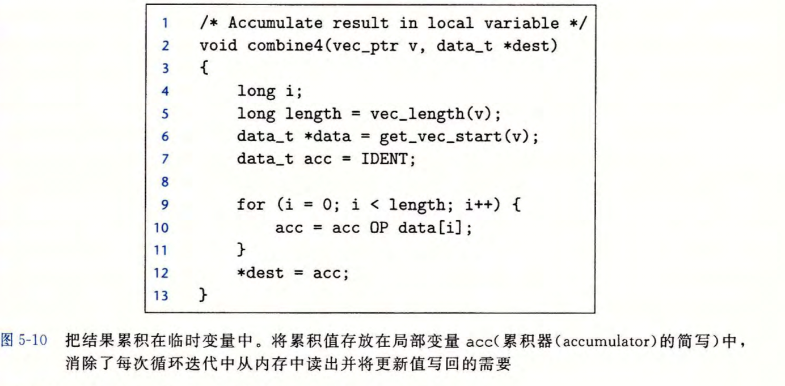
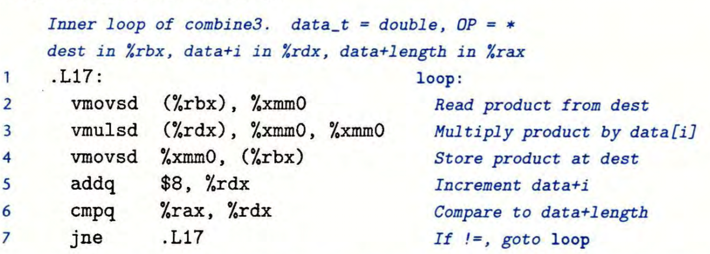
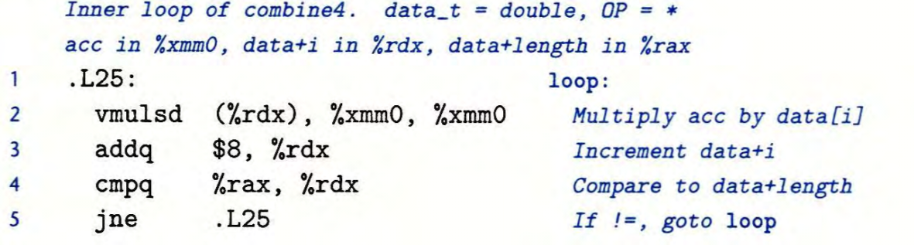
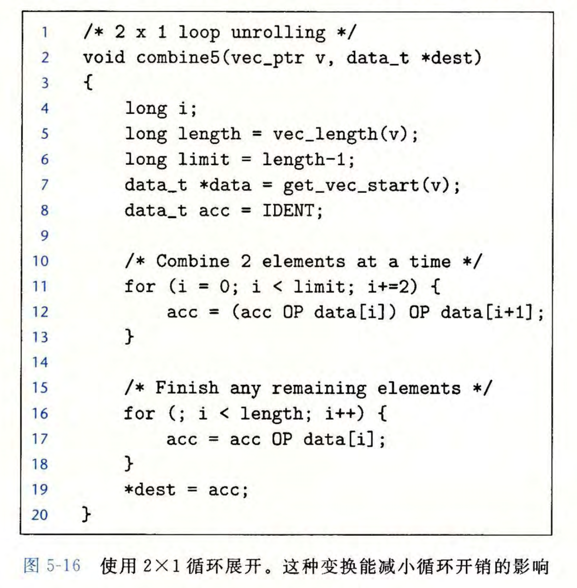

## 优化程序性能

### 程序剖析
linux下可以使用$GPROF$定量衡量程序中函数的运行时间

在编译的时候，使用`linux> gcc -Og -pg test.c -o test`，避免优化导致剖析失真，得到为剖析而编译和链接的可执行文件
`linux> ./test`会运行该文件并生成`gmon.out`的相关数据文件，通过`linux> gprof test`进行分析





从左到右的每一列分别为函数运行时间占比，总累积运行时间，当前函数累积运行时间，被调用次数，每次调用平均运行时间

### 程序优化的基本原则
1.选用合适的算法与数据结构
2.以编译器更容易优化的形式编写程序
3.将一个任务分成多个部分，并行地计算

### 编译器级别的优化
#### 指定优化等级
以`GCC`为例，编译时命令行选项从`-Og -O1 -O2 -O3`优化等级逐步提高，编译器会在行为一致的情况下，对程序进行安全的优化
#### 函数内联优化
当使用`-O1`以及更高的优化或者`-finline`的时候，编译器会使用内联函数替换来减少函数的调用
例：
```cpp
int cnt = 0;
int f() {
	return cnt++;
}
int f1() {
	return f() + f() + f() + f();
}
```
采用循环展开后，会被优化为
```cpp
int f1() {
	int ret = cnt * 4 + 6;
	cnt += 4;
	return ret;
}
```
#### 编译器级别优化的局限性
编译器对于程序只使用安全的优化，在有**内存别名使用** (两个指针指向同一个地址)或者**全局变量修改**时，一些激进的优化可能导致程序行为发生改变，编译器不会采用这些优化
```cpp
void f1(int *p1, int *p2) {
	*p1 += *p2;
	*p1 += *p2;
}

void f2(int *p1, int *p2) {
	*p1 += 2 * *p2;
}
```
在p1,p2指向同一个地址时，若初始值为$x$，`f1`会先变为$2x$再变为$4x$，而`f2`会变为$3x$
```cpp
int cnt = 0;
int f() {
	return cnt++;
}
int f1() {
	return f() + f() + f() + f();
}
int f2() {
	return 4 * f();
}
```
编译器无法判断f函数是否会对全局变量造成影响，所以为了保证正确性，不会将f1优化为f2
可见编译器只会进行最基本的优化，我们需要通过改变编写程序的方式来激发其性能

### 程序的性能

#### 程序性能的衡量
程序的效率 **CPE**：**Cycles Per Element** 每元素周期数
其中的元素为程序处理的基本数据单元，可以是一个整数，也可能是字符，像素等
显然CPE越小，程序越高效

#### 对现代处理器的理解
处理器的效率用其时钟频率决定，通用单位为千兆赫兹**GHZ**，即十亿周期每秒
现代处理器通过乱序处理实现指令级并行，即多条指令可以并行地执行，但同时又呈现出顺序执行的表象
更具体地说，现代处理器中有多个功能单元，不同功能单元被设计处理不同的操作，以下是一个例子





处理器为了乱序执行的正确性，会在一条指令的所有源操作数都准备就绪，且所需要的功能单元有空闲的时候，将其用调度器发送出去并执行
因此，指令的执行顺序与程序顺序无绝对关系，而与数据就绪时间有关

#### 功能单元的性能

延迟：完成一个运算所需要的总时钟周期
发射时间：两个同类型的运算间需要间隔的最小时钟周期。当发射时间为1时，我们称该功能单元运算完全流水化，即该运算的每个阶段逻辑上独立
容量：能执行该运算的功能单元数量
最大吞吐量：发射时间的倒数





延迟界限给出了单个操作CPE的下界，而吞吐量界限给出的是处理一系列操作时CPE的下界



如整数乘法只有一个乘法单元，故吞吐量界限为1
整数加法虽然有四个加法单元，但是受限于只有两个加载单元，导致每个时钟周期最多取两个数据，所以吞吐量界限为0.5

### 代码级别的优化

以下代码以数组变量累积为例，给出最原始的版本





#### 减少重复的运算和调用


##### 代码移动
由于循环没有对向量内容进行修改，我们可以提前保存向量的长度这个值，避免反复调用函数造成不必要的开销
该技巧被称为**代码移动**，因为编译器无法确认函数内部是否会对全局状态造成影响，所以默认不会优化
致敬某传奇OI教练在当年重邮打ACM时候写出的`for (int i = 1; i <= strlen(s); i++)`

##### 保存常量
在$get\_vec\_element$函数内部，有边界检查，因为循环确保了不会出现数组越界，我们可以直接用数组下标访问元素，减少了过程调用
但是实际上这段代码数组越界与否，是高度可预测的，所以性能并没有产生显著的提升

##### 减少内存引用
我们可以使用局部变量保存累积运算的结果，在循环结束的时候再将该值赋给`*dest`
有意思的是，程序性能却提高了2-5倍，有了极为显著的提升
修改后的C代码如下





优化前后代码编译生成的汇编代码如下








可以发现，优化后的代码通过将局部变量存放在寄存器中，避免了对于指针指向内存的频繁访问与写回
同样的，因为指针可能指向向量中的元素，这种情况下优化前后的两段代码运行结果存在差异，所以编译器不会进行优化

##### 循环展开
对于一个循环，按任意因子$k$进行循环展开，称为$k \times 1$循环展开
以下是源代码$2\times1$循环展开后得到的代码





循环展开减少了循环开销操作，即减少了对于条件判断和循环变量增加的次数进而提高性能
但是提升有限，因为循环运行时间的瓶颈往往在循环内的操作，而非循环本身

#### 提高并行性

##### 使用多个累积变量
我们可以将一组运算分割成两个或者更多个部分，最后进行合并得到结果，我们将循环展开$k$次，并用$k$个变量记录累积值，称为$k \times k$循环展开


在设置累积变量后，程序性能有了显著的提高，甚至打破了延迟界限
通过累积变量，我们将单个寄存器参与运算变成了多个寄存器都参与运算，减少了数据相关
更进一步地，对于延迟为$L$，容量为$C$的操作来说，在循环展开因子$k \geq L \times C$，同时又不过大导致寄存器溢出(所需寄存器过多，导致处理器将局部变量存放在内存上，反而降低了性能)时，执行该操作的功能单元流水线能被填满
理解：取$k=L \times C$，每个时钟周期会启动$C$个操作，经过$L$个时钟周期后，最先被启动的前$C$个操作已经完成，不会再有数据依赖，刚好可以zai在下一轮循环开始时直接无依赖地启动前$C$个操作

注意：对无符号整数或按补码位模式理解的整数加法和乘法，采用多个累积变量与不采用累积变量只循环展开在模$2^w$意义下是等价的；但C语言中的有符号整数溢出是未定义行为，浮点数也会因为舍入和溢出而不满足这种等价

##### 重新结合变换
我们将`acc = acc OP data[i] OP data[i + 1];`
改为`acc = acc OP (data[i] OP data[i + 1]);`
发现其$CPE$与$2\times2$循环展开相当
简单来说，第一种实现将两次运算连续作用与acc,构成了一条更长的依赖链；而第二种实现先对两个数据运算后，再与acc进行运算，拆分成了两个可以并行的短链，减少了对于同一个寄存器的连续修改

##### 使用向量指令
**SIMD**：单指令多数据，用单条指令对整个向量进行操作
流SIMD扩展(SSE)以及后续的**AVX**，可以对向量寄存器中的多个数据元素并行地进行运算；以256位AVX寄存器为例，一次可容纳8个32位元素或4个64位元素

